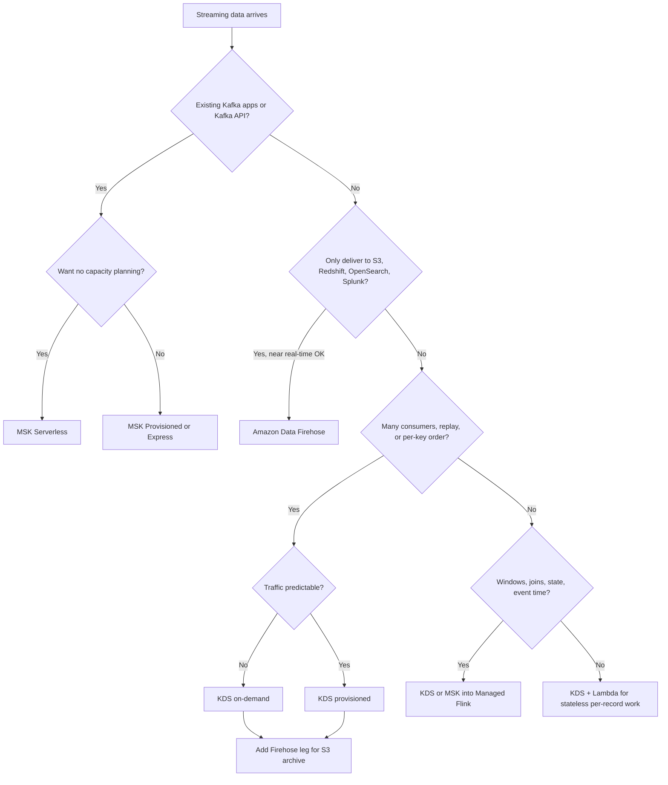
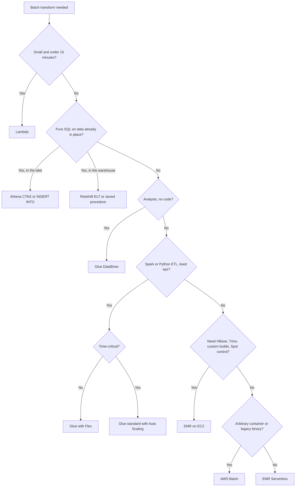
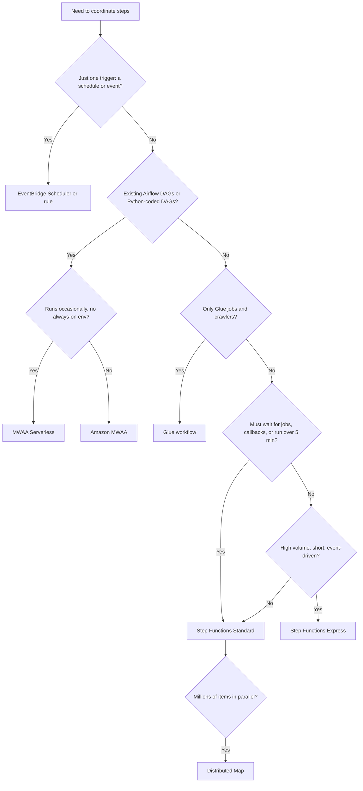
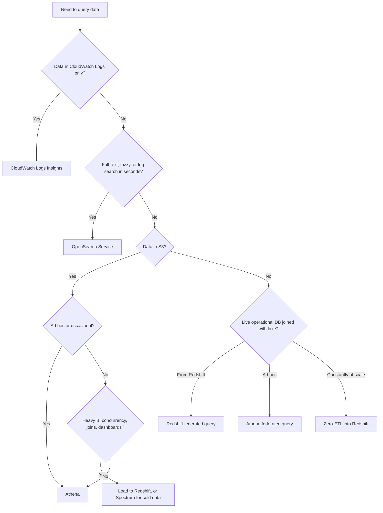
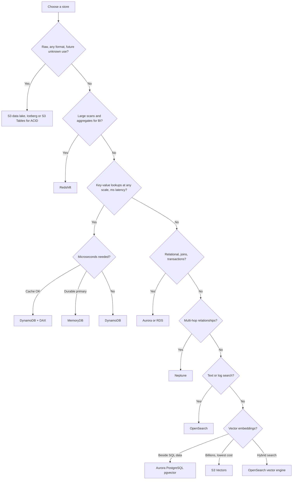
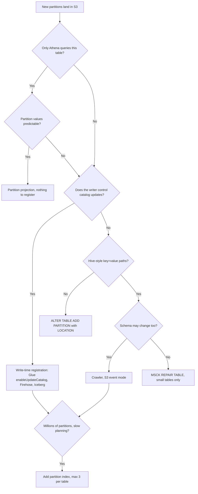
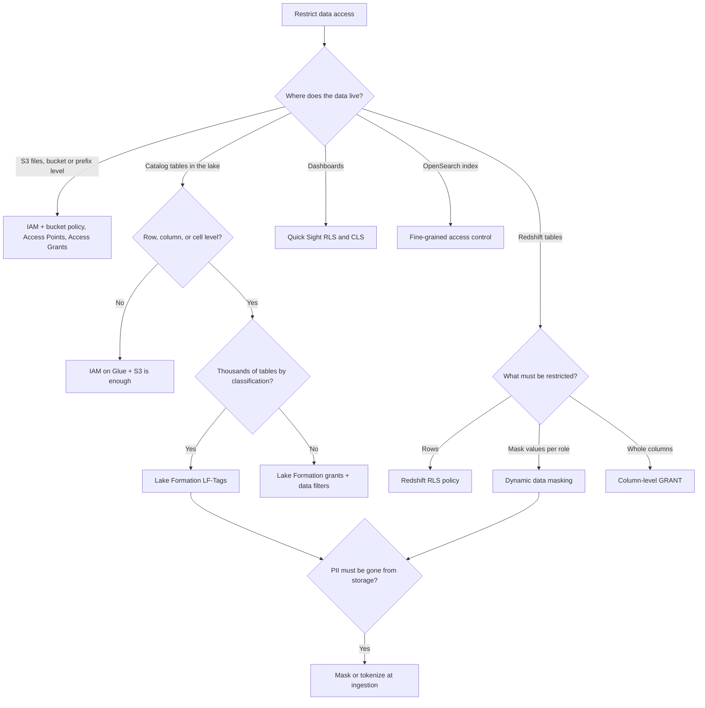
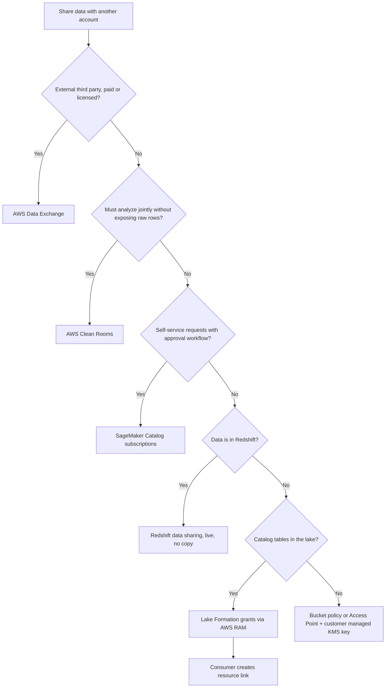

# Decision Flowcharts — the eight big choices

Most DEA-C01 questions come down to one fork in the road. Each tree below starts at the first question worth asking and stops at the answer the exam wants. Read top to bottom. When a question stem includes a signal from a diamond, take that branch.

The charts are simplified on purpose. When two answers both fit, the qualifier decides (*least operational overhead*, *most cost-effective*, *lowest latency*). See [Guide 47 — Exam Traps & Key Patterns](../topic-guides/47-Exam-Traps-Key-Patterns.md) for how qualifiers work, and [Guide 45 — Service Selection](../topic-guides/45-Service-Selection-Decision-Guide.md) for the full matrices.

---

## 1. Streaming ingestion

Pick the pipe by what happens after the data arrives: delivery only, replay by many apps, Kafka compatibility, or stateful analytics. Owners: [Guide 06](../topic-guides/06-Kinesis-Data-Streams.md), [07](../topic-guides/07-Amazon-Data-Firehose.md), [08](../topic-guides/08-Amazon-MSK-Kafka.md), [09](../topic-guides/09-Managed-Service-for-Apache-Flink.md).

## 2. Batch processing engine

Start with size and runtime, then with how much control you need. Owners: [Guide 12](../topic-guides/12-AWS-Glue-ETL.md), [15](../topic-guides/15-Amazon-EMR.md), [17](../topic-guides/17-Lambda-for-Data-Pipelines.md), [18](../topic-guides/18-Containers-Batch-EC2-Compute.md).

## 3. Orchestration service

The question to ask is what the workflow has to call and who already owns the code. Owners: [Guide 20](../topic-guides/20-Step-Functions.md), [21](../topic-guides/21-MWAA-Glue-Workflows.md), [22](../topic-guides/22-EventBridge-SNS-SQS.md).

## 4. Query engine

Where the data lives and how often you query it decide the engine. Owners: [Guide 26](../topic-guides/26-Amazon-Athena.md), [24](../topic-guides/24-Redshift-Loading-Integration-Sharing.md), [29](../topic-guides/29-OpenSearch-Service.md), [32](../topic-guides/32-Monitoring-Logging-Troubleshooting.md).

## 5. Data store by access pattern

Start from how the data is read, not from what it looks like. Owners: [Guide 27](../topic-guides/27-DynamoDB.md), [28](../topic-guides/28-RDS-Aurora-Purpose-Built-DBs.md), [23](../topic-guides/23-Redshift-Architecture-Table-Design.md), [05](../topic-guides/05-S3-Data-Lake-Storage.md), [19](../topic-guides/19-GenAI-LLMs-Vectors.md).

## 6. Partition-sync method

New S3 folders are invisible until the catalog knows about them. The choice depends on engines and layout. Owners: [Guide 13](../topic-guides/13-Glue-Data-Catalog-Crawlers.md), [26](../topic-guides/26-Amazon-Athena.md).

## 7. Access control layer

Pick the layer closest to the data being protected. Owners: [Guide 37](../topic-guides/37-IAM-for-Data-Engineers.md), [40](../topic-guides/40-Lake-Formation.md), [25](../topic-guides/25-Redshift-Performance-Operations-Security.md), [42](../topic-guides/42-Privacy-PII-Masking-Sovereignty.md).

## 8. Cross-account data sharing

Live sharing beats copies. The engine the consumer uses decides the mechanism. Owners: [Guide 41](../topic-guides/41-SageMaker-Unified-Studio-Catalog-Governance.md), [40](../topic-guides/40-Lake-Formation.md), [24](../topic-guides/24-Redshift-Loading-Integration-Sharing.md).

---

Related sheets: [keyword-to-service.md](keyword-to-service.md) · [numbers-to-know.md](numbers-to-know.md)
