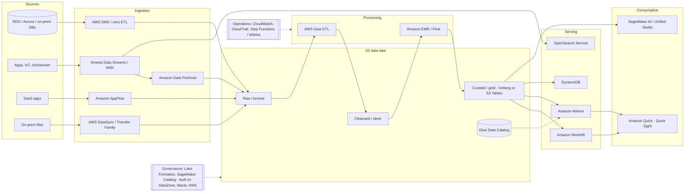

# 02 · Data Engineering Fundamentals — the physics under every scenario question

> **Exam map:** D1 · Task 1.1, 1.2, 1.4 — D3 · Task 3.2 — D4 · Task 4.1 · **Skills:** 1.1.10, 1.1.11, 1.1.12, 1.2.9, 1.4.10, 1.4.11, 3.2.5, 4.1.6 · **Weight:** 🔥🔥 Medium · **Read time:** ~28 min

## The idea

Most DEA-C01 questions look like service trivia ("Kinesis or SQS?", "Glue or EMR?"), but underneath they test a small set of engineering ideas: how fresh the data must be, whether a step needs memory of earlier records, what happens when a message arrives twice, whether you can re-run yesterday, and who is on the hook for patching servers. Learn the ideas once and dozens of service questions start answering themselves.

The analogy for this guide is a **city water utility**. Water comes from many **sources** (rivers, wells, rain). It is pumped through **intakes** into a **reservoir** where it sits in its natural, untreated form — that is your **data lake**. A **treatment plant** filters and purifies it (cleansing and transformation), and a **bottling plant** produces labelled, uniform bottles on a shelf, ready for a specific customer — that is your **data warehouse**. Water arrives either by **tanker truck** on a schedule (batch) or through a **continuously flowing pipe** (streaming). Keep the untreated reservoir water and you can always re-treat it if the plant made a mistake (replayability). Many streams merging into one river is **fan-in**; one main splitting to every neighbourhood is **fan-out**.

We will keep coming back to that utility. By the end you should be able to crack questions about lake vs warehouse vs lakehouse, ETL vs ELT, latency tiers, full vs incremental loads, stateful vs stateless processing, at-least-once vs exactly-once, replay, fan-in/fan-out, distributed computing, data structures, managed vs serverless, and provisioned vs serverless trade-offs.

## Lake, warehouse, lakehouse, mart

| | Data lake | Data warehouse | Lakehouse | Data mart |
|---|---|---|---|---|
| Utility analogy | Reservoir (raw water) | Bottling plant shelf | Reservoir with treated, labelled taps built on it | One shop's shelf of bottles |
| Data | Anything: structured, semi-, unstructured | Structured (plus semi-structured, e.g. Redshift `SUPER`) | Open files + table format (Iceberg) + catalog | Subset for one team/domain |
| Schema | **Schema-on-read** — applied at query time | **Schema-on-write** — enforced at load | Schema managed by table format; enforced on write, evolvable | Schema-on-write |
| AWS | **S3** + Glue Data Catalog + Athena/EMR | **Amazon Redshift** | S3 (or **S3 Tables**) + Iceberg + Glue Data Catalog + Lake Formation, queried by Athena/Redshift/EMR; SageMaker Unified Studio lakehouse | Redshift schema or a separate cluster/serverless workgroup; Redshift data sharing |
| Strength | Cheap, any format, keeps raw history | Fast, concurrent SQL, BI | One copy of data, many engines, ACID on the lake | Focused, simpler, access-scoped |

- **Schema-on-read**: store first, interpret later. Great for exploration and for data whose use is not known yet. The cost: every reader must agree on how to parse it (the Glue Data Catalog is that agreement).
- **Schema-on-write**: validate and shape before storing. Great for trusted reporting; the cost is upfront modelling and rework when sources change.
- A **lakehouse** answers *"one copy of the data, queryable by several engines, with transactions and updates"* → open table format on S3. See [Guide 04 — Open Table Formats & S3 Tables](04-Open-Table-Formats-S3-Tables.md).

**THE trap:** *"store raw clickstream, images and JSON cheaply for future unknown analysis"* → **S3 data lake**, not Redshift. A warehouse wants known structure; the lake takes anything.

## OLTP vs OLAP (in one table)

| | OLTP (transactions) | OLAP (analytics) |
|---|---|---|
| Workload | Many small reads/writes by key, high concurrency | Few big scans + aggregations |
| Shape | Normalized, row-oriented | Denormalized (star schema), columnar |
| AWS | RDS, Aurora, DynamoDB | Redshift, Athena, EMR |
| Exam signal | *"order checkout"*, *"single-digit ms by key"* | *"aggregate billions of rows"*, *"BI dashboards"* |

**THE trap:** running heavy analytics directly on the production OLTP database. Replicate out (read replica, DMS CDC, or a zero-ETL integration into Redshift) instead. Row vs columnar storage is detailed in [Guide 03](03-Data-Formats-Compression.md).

## ETL vs ELT (and reverse ETL)

- **ETL** (extract, transform, load): transform in a separate engine *before* the target — **AWS Glue**, **Amazon EMR**, Lambda. Pick it when data needs heavy cleansing, PII masking before it lands, format conversion, or when the target is the lake itself.
- **ELT** (extract, load, transform): land raw data in the target first, then transform with the target's own engine — e.g. `COPY` into Redshift staging tables, then SQL `MERGE`/`INSERT ... SELECT`, stored procedures, or materialized views. Pick it when the warehouse has spare MPP power, the team is SQL-first, and you want raw data available in the warehouse for re-transforming.
- **Reverse ETL**: push curated warehouse results back into operational tools (CRM, marketing apps, DynamoDB for an app) — one line on the exam at most.

Signal words: *"transform with SQL inside the warehouse"*, *"take advantage of Redshift's compute"* → ELT. *"mask PII before it is stored"*, *"convert to Parquet before loading"* → ETL.

## Batch, micro-batch, streaming — the latency tiers

The single most decisive word in an ingestion question is how fresh the data must be.

| Tier | Typical wording | AWS answer (typical) |
|---|---|---|
| **Sub-second / milliseconds** | *"real time"*, *"immediately"*, per-event reaction | Kinesis Data Streams or MSK + Lambda / Managed Service for Apache Flink (formerly Kinesis Data Analytics); DynamoDB Streams + Lambda |
| **Seconds** | *"within seconds"* | Kinesis/MSK consumers, Flink, Redshift streaming ingestion, OpenSearch Ingestion |
| **~1 minute to a few minutes** | *"near real-time"*, *"least operational overhead"* into S3/Redshift/OpenSearch | **Amazon Data Firehose** (formerly Kinesis Data Firehose) — buffers by size or time (buffer interval configurable **0–900 s**, default **300 s** for S3); Glue streaming / Spark Structured Streaming micro-batches |
| **Minutes to hours** | *"hourly"*, *"every 15 minutes"* | Scheduled Glue jobs, EMR steps, Redshift `COPY` jobs, DMS CDC, EventBridge Scheduler |
| **Hours / daily** | *"nightly"*, *"end of day"* | Batch Glue/EMR, Athena CTAS, Step Functions or MWAA orchestration |

- **Batch**: process a bounded chunk (yesterday's files). Cheapest per record, highest latency. The tanker truck.
- **Micro-batch**: small batches every few seconds/minutes (Spark Structured Streaming, Glue streaming jobs, Firehose buffering). The truck on a very tight loop.
- **Streaming**: unbounded, record-by-record (Flink, Kinesis consumers). The pipe.

**THE trap:** older questions say Firehose's minimum buffering is 60 seconds. Firehose now supports buffer intervals down to **0 seconds** (not with dynamic partitioning), but it is still the *"near real-time"* answer — for true per-event, sub-second processing pick Kinesis Data Streams/MSK with Lambda or Flink. Details in [Guide 07 — Amazon Data Firehose](07-Amazon-Data-Firehose.md).

### Ingestion patterns

- **Full load**: copy everything each run. Simple, idempotent, but expensive on big tables. Fine for small dimension tables.
- **Incremental load**: copy only what changed since last time.
  - **High-water mark (watermark) column**: remember the max `updated_at` (or increasing ID) loaded last run; next run pulls `WHERE updated_at > :last_mark`. Glue **job bookmarks** implement this for S3 and JDBC sources. Misses hard deletes and rows whose timestamp isn't updated.
  - **CDC (change data capture)**: read the database transaction log so inserts, updates *and deletes* arrive in order — **AWS DMS** full load + CDC, DynamoDB Streams, Debezium on MSK Connect. See [Guide 10 — DMS](10-DMS-Database-Ingestion.md).
- **Historical backfill**: a one-time load of old data before the incremental pipeline takes over (e.g., DMS full load, Snowball/DataSync for bulk files, then CDC). Plan it so backfill and live writes don't collide — idempotent writes help.
- **Data history**: keeping how a record looked over time — append-only raw zone, slowly changing dimensions (SCD Type 2, see [Guide 30](30-Data-Modeling-Schema-Evolution-Lineage.md)), or table-format snapshots.
- **Frequency**: driven by schedules (EventBridge Scheduler, Airflow, Glue triggers) or events (S3 Event Notifications, EventBridge rules) — see [Guide 22](22-EventBridge-SNS-SQS.md).

## Volume, velocity, variety

| V | Meaning | Design consequence |
|---|---|---|
| **Volume** | How much (GB → PB) | Distributed processing (EMR, Glue, Redshift MPP), columnar formats, partitioning |
| **Velocity** | How fast it arrives / must be served | Streaming services, capacity modes, buffering |
| **Variety** | How many shapes | Schema-on-read, catalogs, flexible formats, purpose-built stores |

Variety has three buckets the exam names explicitly:

- **Structured**: fixed rows and columns — relational tables, CSV with a stable header. Lives happily in RDS/Aurora/Redshift.
- **Semi-structured**: self-describing, nested, optional fields — **JSON, XML, Avro**, Parquet with nested types, log lines. Handled by Glue crawlers/DynamicFrames, Redshift `SUPER`, DynamoDB, DocumentDB, Athena with JSON SerDes.
- **Unstructured**: no tabular model — **images, PDFs, audio, video, free text**. Stored in S3; made useful by extracting structure (Amazon Textract, Transcribe, Bedrock Data Automation, embeddings — see [Guide 19](19-GenAI-LLMs-Vectors.md)).

## Lake zones (medallion) and staging

```
 raw / landing (bronze)  ->  cleansed / staged (silver)  ->  curated (gold)
 as-delivered, immutable     typed, deduped, validated       business-ready, aggregated,
 original format             Parquet/Iceberg, conformed      modelled for BI/ML
```

- **Raw**: exactly what arrived, never edited — the untreated reservoir. This is your replay insurance.
- **Cleansed/staged**: standardized types, deduplicated, quality-checked, converted to columnar.
- **Curated**: joined, aggregated, modelled (star schemas, feature tables), governed for consumers.
- **Intermediate staging** locations are scratch space inside a pipeline: an S3 `staging/` prefix a Glue job writes before an atomic swap, the S3 temp directory Glue/Spark uses when loading Redshift, or a **Redshift staging table** loaded by `COPY` and then `MERGE`d into the target. Put short lifecycle expiration rules on staging prefixes.
- Separate zones by bucket or prefix so each gets its own lifecycle rules, encryption keys and Lake Formation permissions — see [Guide 05](05-S3-Data-Lake-Storage.md).

## Stateful vs stateless (skill 1.1.12)

The exam guide's phrase *"stateful and stateless data transactions"* has two readings; know both.

**Reading 1 — processing.** Does handling this record require remembering previous records?

| Stateless | Stateful |
|---|---|
| Each record handled on its own: filter, mask a field, parse JSON, convert a format, enrich from a static lookup | Result depends on earlier records: **windowed aggregations**, running totals, **deduplication**, **sessionization**, joins between streams, pattern detection |
| Lambda transform on Firehose, Lambda on a Kinesis batch, simple Glue map | **Managed Service for Apache Flink** (keyed state + checkpoints), Spark Structured Streaming with state stores, Glue streaming with windows |
| Scales trivially — any worker can take any record | Needs durable state, checkpointing and records for the same key reaching the same worker |

Where state lives on AWS: **Flink keyed state** (checkpointed and snapshotted by the managed service), **KCL checkpoints** (the Kinesis Client Library records per-shard progress in a **DynamoDB lease table**), **Glue job bookmarks** (persisted progress between batch runs), Spark checkpoint locations in S3. The utility analogy: a stateless step is a filter that treats each litre the same; a stateful step is a **meter** that needs yesterday's reading to compute today's usage.

**THE trap:** *"count unique users per 5-minute window across the stream"* is stateful — Lambda alone (stateless, short-lived) is the wrong tool; Flink or a stateful streaming job is right. See [Guide 09](09-Managed-Service-for-Apache-Flink.md).

**Reading 2 — transactions.** A **stateful transaction** spans several operations that must succeed or fail together with **ACID** guarantees (atomicity, consistency, isolation, durability) — a relational database transaction, a DynamoDB `TransactWriteItems`, an Iceberg commit, a Redshift `BEGIN ... COMMIT`. A **stateless** interaction is a self-contained request carrying everything needed, independent of any session — a REST call, an idempotent `PUT` of an object to S3. Stateless requests are easy to retry and scale horizontally; stateful transactions protect multi-step consistency at the cost of locking and coordination (see locks in [Guide 25](25-Redshift-Performance-Operations-Security.md) and [Guide 28](28-RDS-Aurora-Purpose-Built-DBs.md)).

## Delivery semantics and idempotency

| Guarantee | Meaning | Where you meet it |
|---|---|---|
| **At-most-once** | Never duplicated, may be lost | Fire-and-forget; SNS to an endpoint that's down without retries/DLQ |
| **At-least-once** | Never lost, **may duplicate** | Kinesis Data Streams, Lambda event source mappings, SQS Standard, S3 Event Notifications, EventBridge, DynamoDB Streams consumers, Firehose retries |
| **Exactly-once** | Effect happens once | SQS FIFO (deduplication within a 5-minute window), Flink exactly-once state with transactional/idempotent sinks, Kafka transactions |

Distributed systems default to **at-least-once**, so pipelines must be **idempotent** — processing the same record twice leaves the same result.

- **Idempotent writes**: deterministic output keys (overwrite `s3://.../dt=2026-09-01/part-000.parquet` rather than append a random name), `PUT` by primary key in DynamoDB.
- **Natural or business keys + dedup**: carry a unique event ID from the producer; drop repeats with `ROW_NUMBER() OVER (PARTITION BY event_id ...) = 1`, or a DynamoDB conditional write (`attribute_not_exists`).
- **MERGE/upsert**: Redshift `MERGE`, Iceberg `MERGE INTO`, Hudi upserts — replays update instead of duplicating.
- **Checkpoint after the write**, not before, so a crash re-processes rather than skips.

**THE trap:** *"exactly-once"* for a Kinesis → Lambda pipeline cannot come from Kinesis settings alone — retries and producer re-sends duplicate records. The answer is idempotent processing (unique IDs + conditional writes/MERGE), or Flink with exactly-once checkpointing and a suitable sink.

## Replayability (skill 1.1.11)

Replay = re-running a pipeline over data it has already seen, to fix a bug, rebuild a table, or feed a new consumer. The golden rule: **keep immutable raw data in S3** — the reservoir that lets you re-treat any day's water.

| Source | Replay capability |
|---|---|
| **S3 raw zone** | Unlimited — re-run jobs over any prefix; versioning adds protection |
| **Kinesis Data Streams** | Retention **24 h default, up to 365 days**; restart consumers from `TRIM_HORIZON`, `AT_TIMESTAMP` or a sequence number |
| **Amazon MSK / Kafka** | Retention by time or size (tiered storage makes long retention cheap); reset consumer-group offsets |
| **EventBridge** | **Archive** events (indefinitely or for a set period) and **replay** them to the bus |
| **DynamoDB Streams** | Only **24 hours** — not a long-term replay source (use Kinesis Data Streams for DynamoDB for longer retention, or export to S3) |
| **SQS** | **No replay** — a deleted message is gone (retention up to 14 days only while undeleted); DLQ redrive only returns failed messages |
| **SNS** | Stores nothing (unless delivered to SQS/Firehose; FIFO topics offer archive & replay) |
| **Glue job bookmarks** | **Reset** (or rewind) the bookmark to reprocess data already processed |
| **Iceberg/Hudi/Delta** | **Time travel** to an old snapshot; rollback a bad write |
| **Firehose** | No replay of its own — replay from the source stream or the S3 backup |

**THE trap:** *"must be able to reprocess the last 7 days of events"* rules out SQS and DynamoDB Streams → Kinesis Data Streams with extended retention (or MSK), plus raw copies in S3.

## Fan-in and fan-out (skill 1.1.10)

- **Fan-in**: many producers → one stream/queue/bucket. Thousands of devices writing to one Kinesis stream (partition key spreads load across shards), many services sending to one SQS queue, many accounts' logs into one central bucket, CloudWatch Logs subscriptions from many log groups into one Firehose. Watch for hot shards/partitions when keys are skewed.
- **Fan-out**: one source → many independent consumers.

| Mechanism | How fan-out works |
|---|---|
| **Kinesis shared throughput** | All consumers share **2 MB/s per shard** reads |
| **Kinesis enhanced fan-out (EFO)** | Each registered consumer gets its own dedicated **2 MB/s per shard**, push delivery, lower latency (up to **20** EFO consumers per stream; **50** for streams in the newer On-demand Advantage mode, Nov 2025) |
| **SNS → SQS** | One publish copied to many queues; each queue buffers for its own consumer (add filter policies) |
| **Kafka / MSK consumer groups** | Every group receives the full stream; partitions are split among members inside a group |
| **EventBridge** | One event matched by many rules; each rule up to **5 targets** |
| **DynamoDB Streams** | Limited readers per shard — for many consumers, pipe it to Kinesis or EventBridge |

**THE trap:** *"several applications read the same stream and are being throttled / latency grew as consumers were added"* → **enhanced fan-out**, not more shards alone. Depth: [Guide 06](06-Kinesis-Data-Streams.md), [Guide 08](08-Amazon-MSK-Kafka.md), [Guide 22](22-EventBridge-SNS-SQS.md).

## Distributed computing (skill 1.4.10)

A distributed system splits data and work across many machines that cooperate over a network. The ideas that show up on the exam:

- **Vertical vs horizontal scaling**: bigger machine (scale up — limited, may need downtime) vs more machines (scale out — near-linear, needs partitioning). Redshift adds nodes/RPUs, EMR adds task nodes, Kinesis adds shards.
- **Partitioning / sharding**: split data by a key so each worker owns a slice — Kinesis shards, Kafka partitions, DynamoDB partitions, Redshift slices by distribution key, Spark partitions. A bad key creates **skew** (one worker does most of the work) — see [Guide 16](16-Apache-Spark-Essentials.md) and [Guide 33](33-Data-Quality.md).
- **MPP (massively parallel processing)**: a leader plans the query, compute nodes execute pieces in parallel on their own data — Redshift.
- **MapReduce**: *map* each record to key/value pairs in parallel, *shuffle* by key, *reduce* each key's values. Spark generalises it.
- **Shuffle**: moving data between workers so matching keys meet (joins, `GROUP BY`). The most expensive step — network + disk. Broadcast small tables and co-locate join keys to avoid it.
- **Data locality**: move compute to data. Classic HDFS on EMR core nodes; modern AWS decouples storage (S3/EMRFS, Redshift RA3 managed storage) and compensates with columnar formats, pruning and caching.
- **Replication for fault tolerance**: copies across nodes/AZs — HDFS replication, Kafka replication factor, S3 storing across multiple AZs, Kinesis replicating across three AZs.
- **Leader/worker (coordinator/worker)**: Spark driver + executors, EMR primary + core/task nodes, Redshift leader + compute nodes. The leader is a single point of coordination.
- **CAP (brief)**: during a network partition a system chooses consistency or availability. DynamoDB reads are eventually consistent by default (strongly consistent optional); S3 gives strong read-after-write consistency.

## Data structures and algorithms (skill 1.4.11)

| Structure | Idea | Where it shows up on AWS |
|---|---|---|
| **Graph** (nodes + edges) | Relationships are first-class | **Amazon Neptune** (Gremlin, openCypher, SPARQL) for fraud rings, social, knowledge graphs; HNSW vector indexes are graphs ([Guide 19](19-GenAI-LLMs-Vectors.md)) |
| **DAG** (directed acyclic graph) | Tasks with dependencies, no cycles | **Airflow DAGs** in MWAA, Spark's execution plan (stages), data lineage graphs |
| **Tree** | Hierarchy parent → children | Nested JSON/XML documents; Iceberg metadata tree (metadata file → manifest list → manifests → data files) |
| **B-tree / B+tree** | Balanced sorted tree, O(log n) lookups and range scans | Indexes in RDS/Aurora (PostgreSQL, MySQL) |
| **Hash table** | Key → bucket in O(1) | **DynamoDB** hashes the partition key to pick a partition; **hash joins**; Kinesis hashes partition keys to shards |
| **LSM tree** (log-structured merge) | Buffer writes in memory, flush sorted immutable files, merge (compact) later — write-optimized | Apache Cassandra (the API Amazon Keyspaces is compatible with), HBase, RocksDB state backends in Flink |
| **Bloom filter** | Tiny probabilistic set: *"definitely not here"* or *"maybe here"* | ORC and Parquet can store bloom filters so engines skip row groups/stripes; LSM stores use them to skip files |

Exam-level rules: point lookups on a key → hash; range queries and sorted access → B-tree/sort keys; many-hop relationship queries → graph database; write-heavy time-series or IoT → LSM-style stores (Keyspaces).

## Managed vs unmanaged vs serverless (skill 4.1.6)

Back to the utility: you can **dig your own well** (unmanaged), **lease a well the utility maintains** (managed), or **just open the tap and pay per litre** (serverless).

| | Unmanaged (self-managed on EC2) | Managed (provisioned) | Serverless |
|---|---|---|---|
| Kafka example | Kafka on EC2 | **Amazon MSK** provisioned (you pick broker type/count) | **MSK Serverless** |
| Hadoop/Spark | Hadoop on EC2 | **EMR on EC2** | **EMR Serverless**, Glue |
| Database | PostgreSQL on EC2 | **RDS / Aurora provisioned** | **Aurora Serverless v2**, DynamoDB on-demand |
| OS & software patching | **You** | AWS (you choose maintenance windows/versions) | AWS |
| Capacity planning & scaling | **You** | **You** choose size; some auto scaling | Automatic |
| Backups, HA, replication | **You** build them | Built-in options you configure | Built-in |
| Control / tuning | Maximum | High | Least |
| Billing | EC2 + EBS per hour, always on | Per node/broker-hour | Per use (requests, GB, RPU/DPU-seconds) |

Under the **shared responsibility model**, AWS always owns the physical infrastructure; the more managed the service, the more of the software stack AWS also owns. You **always** own your data, IAM permissions, encryption choices, network exposure and classification. *"Least operational overhead"* almost always points right in this table; *"needs a custom Kafka plugin / OS-level agent / specific kernel tuning"* points left.

## Provisioned vs serverless trade-offs (skill 3.2.5)

**Rule:** steady, predictable, always-on load → **provisioned** (and buy reservations/savings plans). Spiky, unknown, intermittent or dev/test load → **serverless / on-demand**.

| Service pair | Provisioned | Serverless / on-demand |
|---|---|---|
| **Redshift** | RA3 clusters; reserved nodes; pause/resume; you size nodes | **Redshift Serverless**: RPUs, pay per second while queries run, auto scales, nothing to size |
| **EMR** | EMR on EC2: full control, Spot, long-running clusters, HBase/custom apps | **EMR Serverless**: submit Spark/Hive jobs, per-second vCPU/GB billing, pre-initialized capacity for warm starts |
| **MSK** | Choose brokers and storage; full Kafka config control; Express brokers for faster scaling | **MSK Serverless**: no brokers to size, auto scales partitions/throughput, fewer config knobs |
| **Kinesis Data Streams** | Provisioned shards; cheapest for steady known throughput; you reshard | **On-demand** (Standard, or the account-level On-demand Advantage pricing mode): auto scales, pay per GB of throughput; best for unknown/spiky traffic |
| **DynamoDB** | Provisioned RCU/WCU + auto scaling + reserved capacity; cheapest for steady load | **On-demand**: pay per request, instant for unpredictable spikes |
| **Aurora** | Provisioned instances, reserved instances | **Aurora Serverless v2**: scales in fine-grained ACUs; can auto-pause to zero ACUs when idle |
| **OpenSearch** | Managed domains: choose instances, UltraWarm/cold tiers | **OpenSearch Serverless**: collections scale in OCUs, no cluster management (still a baseline charge — it doesn't drop to zero) |
| **Glue / Athena / Lambda** | — | Serverless only (Athena also offers provisioned capacity reservations) |

Trade-offs to state in an answer: serverless removes idle cost and capacity planning but can cost more **per unit** at sustained high utilization, has cold/warm-up behaviour, and exposes fewer tuning knobs. Provisioned gives predictable price with commitments and deep control, but you pay for idle capacity and must plan scaling. Full cost levers in [Guide 44](44-Cost-Optimization.md).

**THE trap:** *"runs 24/7 at a steady, well-understood load; minimize cost"* → provisioned + reserved capacity, not serverless. Serverless wins on *"intermittent"*, *"unpredictable"*, *"a few hours per week"*, *"no capacity planning"*.

## A modern AWS data platform at a glance



Read it left to right as the utility: intakes (DMS, Kinesis, Firehose, AppFlow, DataSync) fill the reservoir (S3 zones, catalogued in the Glue Data Catalog), treatment plants (Glue, EMR) purify it, the bottling and tap network (Redshift, Athena, OpenSearch, DynamoDB) serves it, and customers (Amazon Quick — its BI component Quick Sight, formerly Amazon QuickSight — and SageMaker) drink it, with governance (Lake Formation, Amazon SageMaker Catalog) and operations (CloudWatch, CloudTrail) wrapped around everything. [Guide 45](45-Service-Selection-Decision-Guide.md) turns this picture into decision matrices.

## Question patterns

> *"A company must keep all raw source data for possible future use cases that are not yet defined, including JSON logs, CSV exports and PDF scans, at the lowest cost."* → **S3 data lake (raw zone), schema-on-read with the Glue Data Catalog** (unknown future use + mixed variety = lake; Redshift wants known structure and costs more for cold raw data)

> *"Analysts are skilled in SQL. Data is loaded nightly into Amazon Redshift and must be transformed into reporting tables with the LEAST additional infrastructure."* → **ELT: `COPY` into staging tables, then SQL/stored procedures (or materialized views) inside Redshift** (a separate Glue/EMR ETL layer adds infrastructure the warehouse already covers)

> *"Clickstream events must be available in S3 for Athena queries within a few minutes, with no custom code and minimal operations."* → **Amazon Data Firehose to S3** (near real-time + no code; Kinesis Data Streams + custom consumers is more work for no benefit)

> *"A fraud model must react to each card transaction within one second."* → **Kinesis Data Streams (or MSK) with Lambda or Managed Service for Apache Flink** (sub-second per-event — Firehose buffering and batch Glue are the wrong tiers)

> *"A nightly job copies a 2-billion-row orders table in full; only ~1% of rows change each day, and deleted orders must also disappear downstream."* → **CDC with AWS DMS (full load once, then ongoing replication)** (a watermark column would miss hard deletes; full reloads waste time)

> *"A streaming job must count distinct users per 10-minute window and emit results continuously."* → **Managed Service for Apache Flink (stateful windowed aggregation with checkpoints)** (Lambda per batch is stateless and can't hold window state across invocations reliably)

> *"A Lambda consumer of a Kinesis stream occasionally writes the same order twice to DynamoDB after retries. Ensure each order is stored once."* → **Make the write idempotent: use the order ID as key with a conditional write (or upsert)** (Kinesis + Lambda is at-least-once; no stream setting gives exactly-once)

> *"A bug corrupted curated tables for the last 5 days. The team must rebuild them from the original events."* → **Replay from the immutable raw zone in S3 (or Kinesis with extended retention) after resetting the Glue job bookmark** (SQS and DynamoDB Streams can't replay 5 days)

> *"Five applications consume the same Kinesis stream; after the fourth was added, consumers report read throttling and rising latency."* → **Register consumers with enhanced fan-out** (each gets dedicated 2 MB/s per shard; the shared 2 MB/s per shard is split among all readers)

> *"An order event must be processed independently by billing, shipping and analytics, and no team may miss events during its own outage."* → **SNS topic fanning out to one SQS queue per team** (queues buffer during outages; SNS alone stores nothing)

> *"A team runs self-managed Kafka on EC2 and spends significant time patching brokers and replacing failed nodes. Throughput is steady and they need specific broker configurations."* → **Amazon MSK provisioned** (managed patching/recovery while keeping broker-level control; MSK Serverless removes knobs they need)

> *"A reporting warehouse is queried only for a few hours at month-end; the rest of the month it is idle."* → **Amazon Redshift Serverless** (intermittent use = pay per RPU-second; a provisioned cluster bills while idle)

> *"A Redshift cluster runs at high utilization 24/7 with predictable growth. Minimize cost."* → **Provisioned RA3 with reserved nodes** (steady load is where commitments beat serverless per-unit pricing)

> *"A social platform needs to find friends-of-friends-of-friends and shared interests in milliseconds."* → **Amazon Neptune (graph database)** (multi-hop relationship queries are graph traversals; relational self-joins explode)

> *"Joining a 2 TB fact table with a 50 MB country dimension in Spark causes a very slow shuffle stage."* → **Broadcast the small table (broadcast join)** (avoids shuffling the big table across the network; see Guide 16)

## Pocket card

| Keyword / signal | Answer |
|---|---|
| Store any format cheaply, future unknown use | S3 data lake, schema-on-read |
| Trusted BI, enforced structure | Data warehouse (Redshift), schema-on-write |
| One copy, many engines, ACID on S3 | Lakehouse: Iceberg / S3 Tables + Glue Data Catalog |
| Many small key reads/writes | OLTP (RDS, Aurora, DynamoDB) |
| Big scans + aggregates | OLAP (Redshift, Athena) |
| Transform inside the warehouse with SQL | ELT |
| Cleanse/mask/convert before landing | ETL (Glue, EMR) |
| Sub-second per event | Kinesis/MSK + Lambda or Flink |
| "Near real-time", no code, into S3 | Firehose (buffer 0–900 s, default 300 s) |
| Nightly / hourly | Scheduled Glue/EMR/COPY via Scheduler, MWAA, Step Functions |
| Incremental by `updated_at` | High-water mark / Glue job bookmarks |
| Inserts + updates + **deletes** from a DB | CDC (DMS, DynamoDB Streams, Debezium) |
| JSON, XML, Avro | Semi-structured |
| Images, PDFs, audio | Unstructured (S3 + extraction) |
| Raw → cleansed → curated | Bronze / silver / gold zones |
| Filter, mask, convert per record | Stateless (Lambda, Firehose transform) |
| Windows, dedup, sessions, running totals | Stateful (Flink, Spark streaming) |
| Duplicates possible | At-least-once → idempotent writes, natural keys, MERGE |
| No duplicates, ordered queue | SQS FIFO (5-minute dedup window) |
| Reprocess last N days | Raw S3 + Kinesis retention (≤ 365 d) / MSK retention |
| Replay events on a bus | EventBridge archive & replay |
| DynamoDB Streams retention | 24 hours |
| SQS replay | None after delete |
| Reprocess with Glue | Reset/rewind job bookmark |
| Query past table state | Iceberg time travel |
| Many consumers, dedicated throughput | Kinesis enhanced fan-out (2 MB/s/shard each) |
| Durable one-to-many | SNS → multiple SQS |
| Each app gets full Kafka stream | Separate consumer groups |
| Slow join, huge network transfer | Shuffle → broadcast small table |
| One worker much slower than others | Data skew → better key / salting |
| Multi-hop relationships | Graph → Neptune |
| Pipeline task dependencies | DAG (Airflow/MWAA) |
| Point lookup by key | Hash (DynamoDB partition key) |
| Range scans in RDBMS | B-tree index |
| Write-heavy wide-column | LSM tree (Cassandra / Keyspaces) |
| Skip row groups that can't match | Min/max stats + Bloom filters (Parquet/ORC) |
| Least operational overhead | Serverless / managed over EC2 |
| Need OS/broker-level control | Self-managed on EC2 or provisioned managed |
| Steady 24/7 load, minimize cost | Provisioned + reservations |
| Spiky / intermittent / unknown | Serverless / on-demand |

With these fundamentals in place, the next step is the physical layer they all sit on: how bytes are laid out in files — continue with [Guide 03 — Data Formats & Compression](03-Data-Formats-Compression.md).
