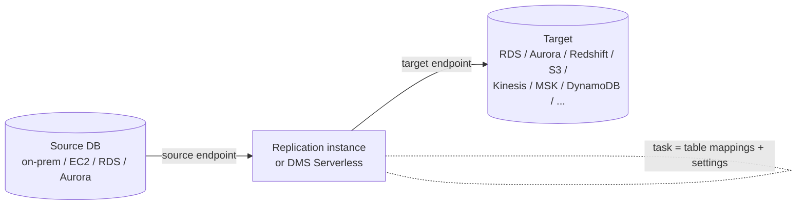

# 10 · AWS DMS & Database Ingestion — move the house, then forward the mail

> **Exam map:** D1 · Task 1.1 — D2 · Task 2.1, 2.4 · **Skills:** 1.1.1, 1.1.2, 1.1.9, 2.1.5, 2.4.3 · **Weight:** 🔥🔥🔥 High · **Read time:** ~22 min

## The idea

Getting data out of an operational database is like **moving house while the family still lives there**. You can't lock the doors for a week; people keep cooking, ordering, and receiving letters. So a good moving company does two things: it ships the furniture that exists today (the **full load**), and it sets up **mail forwarding** so every new letter that arrives at the old address is redirected to the new one (**change data capture**, CDC — reading the database's own transaction log and replaying each insert, update and delete on the target).

**AWS Database Migration Service (DMS)** is that moving company. Its truck is the **replication instance** (or a **DMS Serverless** replication that sizes the truck for you). The pickup and delivery addresses are **endpoints** (source and target connection definitions). The job order — what to move, how, and whether to keep forwarding mail — is the **replication task**. When the building's architecture changes on the way (Oracle to PostgreSQL, say), you first need a translator for the blueprints: **AWS Schema Conversion Tool (SCT)** or its managed successor **AWS DMS Schema Conversion**.

And sometimes you don't need movers at all: a **zero-ETL integration** is a pneumatic tube AWS installs straight from the operational database (Aurora, RDS, DynamoDB…) into the warehouse (Redshift) or lakehouse — nothing to build, nothing to babysit.

This guide lets you crack: *which migration type*, *which CDC prerequisite is missing*, *why LOBs got truncated*, *what those I/U/D letters are in the S3 files*, *DMS vs zero-ETL vs snapshot export*, *how to stop hammering a production RDS instance*, and *SCT vs DMS Schema Conversion*.

## DMS architecture — truck, addresses, job order



| Component | What it is | Exam-relevant facts |
|---|---|---|
| **Replication instance** | A managed EC2 instance that runs your tasks | You pick class and storage. **Multi-AZ** adds a synchronous standby in another AZ — recommended for long-running CDC. Several tasks can share one instance |
| **DMS Serverless** | Replication capacity provisioned and scaled for you | Capacity unit = **DCU (DMS Capacity Unit) = 2 GB RAM**; you set min/max from **1, 2, 4, 8, 16, 32, 64, 128, 192, 256, 384** DCU (min defaults to 1). Scales between them after sustained high/low utilization; **cannot scale down during full load**. Multi-AZ option. Supports a subset of endpoints, **no views**, **no custom CDC start points**, and needs **VPC endpoints** for S3, Kinesis, Secrets Manager, DynamoDB, Redshift, OpenSearch |
| **Endpoints** | Connection info for source/target | Credentials can live in **AWS Secrets Manager**; SSL/TLS per endpoint; endpoint settings (formerly "extra connection attributes") tune engine behavior |
| **Task** | The job: migration type + table mappings + task settings | Monitored in CloudWatch; logs in CloudWatch Logs |

Decision: **"migrate/replicate without sizing or patching replication instances," "unpredictable change volume"** → **DMS Serverless**. **Need an unsupported endpoint, views, or a specific CDC start position** → provisioned replication instance.

**THE trap:** DMS is not a transformation engine. It can rename, filter, add or drop columns (table-mapping transformation rules), but joins, aggregations and business logic belong downstream in Glue, EMR or Redshift ([Guide 12 — AWS Glue ETL](12-AWS-Glue-ETL.md)).

## Migration types and CDC mechanics

| Migration type | Does | Pick when |
|---|---|---|
| **Full load** | Copies existing rows once | One-time copy, the source can be quiesced, or you just need a snapshot |
| **Full load + CDC** | Copies existing rows, caches changes made during the load, applies them, then keeps replicating | *"Minimal downtime"* migration, or an ongoing feed into a lake/warehouse |
| **CDC only** | Replicates changes from a start point | The bulk copy came another way (native dump, snapshot restore) and you only need ongoing changes |

CDC reads the **transaction log**, so the source must be configured to keep one DMS can read. This is the most-tested DMS detail — *"CDC task fails / captures nothing"* means a prerequisite is missing:

| Source | CDC prerequisite |
|---|---|
| **MySQL / MariaDB / Aurora MySQL** | Binary logging on with **`binlog_format = ROW`** and **`binlog_row_image = FULL`**. On RDS, binlogs exist only when **automated backups are enabled**; raise retention, e.g. `call mysql.rds_set_configuration('binlog retention hours', 24);` (RDS purges binlogs quickly by default). User needs REPLICATION CLIENT + REPLICATION SLAVE |
| **PostgreSQL / Aurora PostgreSQL** | Logical replication: set **`rds.logical_replication = 1`** in the (cluster) parameter group — static, **reboot required**. DMS uses a logical replication slot (**test_decoding**, or **pglogical** if installed). Tables need **primary keys** for UPDATE/DELETE capture (or REPLICA IDENTITY FULL workaround). Idle slots keep WAL → **disk fills up**; alarm on storage |
| **Oracle** | **ARCHIVELOG mode** + **supplemental logging** (database-level minimal, plus primary-key or all-column logging per table). Reader: **LogMiner (default)** or **Binary Reader** (reads redo directly — better for high change volume, RAC, ASM, lower source CPU/I/O). On RDS for Oracle keep archived logs, e.g. `rdsadmin.rdsadmin_util.set_configuration('archivelog retention hours',24)` |
| **SQL Server** | Full (or bulk-logged) recovery model and a full backup first. Self-managed: **MS-Replication** for tables **with** primary keys, **MS-CDC** for tables **without**. **RDS for SQL Server supports only MS-CDC** (`msdb.dbo.rds_cdc_enable_db`, then `sys.sp_cdc_enable_table`) |

**THE trap:** changing `binlog_format` to ROW on a running MySQL only affects **new sessions** — restart sessions/instance or some changes are still logged MIXED and missed. And PostgreSQL's `rds.logical_replication` needs a **reboot**.

**THE trap:** *"Use a read replica as the CDC source to protect the primary"* is only partly true. RDS for MySQL replicas work (enable backups on the replica and `log_slave_updates`), but **Aurora MySQL replicas are full-load only**, and replica lag can drop transactions at the full-load/CDC boundary. When the question stresses correctness, point CDC at the primary (or writer) and throttle DMS instead.

## Task settings that decide exam answers

**Target table preparation mode** (`TargetTablePrepMode`) — what happens to existing target tables at full-load start:

| Mode | Behavior | Use when |
|---|---|---|
| `DROP_AND_CREATE` | Drop and recreate the table | Target is disposable; let DMS build basic tables |
| `TRUNCATE_BEFORE_LOAD` | Keep the table definition, delete the rows | You **pre-created** tables (partitioning, keys, engine) and want a clean reload |
| `DO_NOTHING` | Touch nothing | Pre-created tables that must keep existing data |

DMS creates only what it needs to move data (tables, primary keys) — **secondary indexes, foreign keys, defaults, triggers and sequences are not created** in DROP_AND_CREATE. For a faithful schema, convert it first (SCT / DMS Schema Conversion), then load with TRUNCATE or DO_NOTHING.

**LOB modes** — large objects (BLOB/CLOB/TEXT) are the classic performance and truncation trap:

| Mode | How it works | Trade-off |
|---|---|---|
| **Limited LOB mode** (recommended) | You set **Max LOB size** (up to **100 MB**); DMS pre-allocates memory and bulk-loads | Fast; LOBs **larger than the max are truncated** (warning in the log) |
| **Full LOB mode** | Every LOB moved piece by piece (`LobChunkSize`, 64 KB recommended), any size | Never truncates; **slow** |
| **Inline LOB mode** | LOBs ≤ `InlineLobMaxSize` go inline, bigger ones fall back to full LOB lookup | Best when most LOBs are small but a few are huge; not supported for S3/Redshift targets |

*"Some large text columns arrived cut off"* → limited LOB mode with too small a max LOB size. *"Migration of a table with big BLOBs is extremely slow"* → you are in full LOB mode; measure the real max and use limited (or inline).

**Speed and scale knobs:**
- **`MaxFullLoadSubTasks`** — tables loaded in parallel: default **8**, max **49**.
- **Parallel load** (`table-settings` rule with `parallel-load`: partitions-auto, subpartitions-auto, or ranges) — split one huge table into segments loaded concurrently.
- **`CommitRate`** — rows per batch in full load: default 10,000, max 50,000.
- **`BatchApplyEnabled`** — apply CDC in batches; essential for **Redshift** targets (needs primary keys on source and target).
- **`ParallelApplyThreads`** — multithreaded CDC apply for Kinesis, Kafka, OpenSearch, DynamoDB, Redshift targets.

**Table mappings** are JSON: **selection rules** (include/exclude schemas and tables, optional row filters) and **transformation rules** (rename, add prefix, lowercase, add/remove column, change data type):

```json
{"rules": [
  {"rule-type": "selection", "rule-id": "1", "rule-name": "sales",
   "object-locator": {"schema-name": "sales", "table-name": "%"},
   "rule-action": "include"},
  {"rule-type": "transformation", "rule-id": "2", "rule-name": "lower",
   "rule-target": "table",
   "object-locator": {"schema-name": "sales", "table-name": "%"},
   "rule-action": "convert-lowercase"}
]}
```

**Quality and readiness:**
- **Premigration assessment runs** check the task *before* it runs — unsupported data types, tables without primary keys, missing CDC prerequisites, LOB settings; results can land in S3. The older **data type assessment** is the legacy single-check version.
- **Data validation** (`EnableValidation`) compares source and target **row by row** after full load and continuously during CDC. It needs a **primary key or unique index**, adds query load on both sides, and records mismatches in `awsdms_validation_failures_v1` on the target. **Validation-only tasks** check without moving data. More in [Guide 33 — Data Quality](33-Data-Quality.md).
- **CloudWatch metrics:** **`CDCLatencySource`** (lag reading the source log — source-side problem: log access, source load, network) vs **`CDCLatencyTarget`** (lag applying to the target — no PKs/indexes on target, undersized target, not batching). If both are high, **investigate source first**. Also `CDCIncomingChanges`, throughput rows/bandwidth, and `CapacityUtilization` for Serverless. Playbooks live in [Guide 32 — Monitoring, Logging & Troubleshooting](32-Monitoring-Logging-Troubleshooting.md).

## Targets — where the truck can deliver

| Target | How DMS writes | Watch-outs |
|---|---|---|
| **Amazon S3** | CSV by default or **Parquet** (`DataFormat: parquet`); a folder per table; full-load files `LOAD00000001.csv…`, CDC files timestamp-named | See the CDC file format below |
| **Kinesis Data Streams** | Each change as a **JSON** record (data + metadata) | Feed real-time consumers; not cross-Region |
| **Apache Kafka / Amazon MSK** | JSON messages to a topic | Streaming CDC fan-out ([Guide 08 — Amazon MSK](08-Amazon-MSK-Kafka.md)) |
| **Amazon Redshift** | Writes CSV to an **intermediate S3 bucket**, then runs **COPY** | Redshift must be in the **same account and Region** as the replication instance; turn on BatchApplyEnabled; LOBs become VARCHAR (max 64 KB) |
| **DynamoDB** | Object mapping rules map columns to items/keys | Not cross-Region |
| **OpenSearch Service** | Rows become documents | Not cross-Region |
| **RDS / Aurora / self-managed engines** | Standard relational apply | Migrations and replication between engines |
| **DocumentDB, Neptune, Redis OSS, Timestream, Babelfish, Db2** | Specialized mappings | Know they exist |

**The S3 CDC file format** — memorize it, it appears in lake-ingestion questions:
- For CDC loads, the **first column is the operation: `I` (insert), `U` (update), `D` (delete)**. `IncludeOpForFullLoad = true` adds `I` to full-load rows too, so every file has the same shape. `CdcInsertsOnly` / `CdcInsertsAndUpdates` drop deletes for append-only lakes.
- **`TimestampColumnName`** adds a column holding the source **commit timestamp** (full load: transfer time) — what you sort by to pick the latest version of each key.
- **`DatePartitionEnabled`** writes CDC files into date folders (`DatePartitionSequence`, default `YYYYMMDD`; delimiter default `/`).
- **`CdcMaxBatchInterval`** (default **60 s**) and **`CdcMinFileSize`** (default **32,000 KB**) — a file is written when either is reached: bigger values mean fewer, larger files (small-files cure), smaller values mean fresher data.
- **`ParquetTimestampInMillisecond`** for Athena/Glue compatibility; **`GlueCatalogGeneration`** can create Data Catalog tables for the output.

**THE trap:** DMS has **no native Apache Iceberg / S3 Tables target**. The standard lakehouse pattern is **DMS → S3 (CDC files with Op + timestamp) → Glue job (or EMR) `MERGE INTO` an Iceberg table**, or DMS → Kinesis → Managed Flink → Iceberg. Querying raw CDC files directly gives you duplicates and deleted rows ([Guide 04 — Open Table Formats](04-Open-Table-Formats-S3-Tables.md)).

## Homogeneous vs heterogeneous — and schema conversion (2.4.3)

- **Homogeneous** (same engine, e.g., on-prem MySQL → RDS for MySQL): schemas map directly. DMS's **homogeneous data migrations** feature uses the engine's **native tools** (for example pg_dump/pg_restore plus logical replication for PostgreSQL, mongodump/mongorestore for MongoDB) and runs serverless — supported for **PostgreSQL, MySQL, MariaDB, MongoDB → RDS/Aurora/DocumentDB** equivalents. Native options like a snapshot restore or engine replication are also valid.
- **Heterogeneous** (e.g., Oracle → Aurora PostgreSQL, SQL Server → Aurora MySQL): **step 1 convert the schema and code, step 2 move the data with DMS.**

| Tool | What it is | Exam signals |
|---|---|---|
| **AWS SCT** | **Downloadable desktop tool**. Produces a **database migration assessment report** (what converts automatically, what needs manual work), converts schemas plus code (procedures, functions, triggers), and has **data extraction agents** for large **data warehouse** migrations (Teradata, Netezza, Oracle DW, etc. → Redshift) | *"assessment report,"* *"convert stored procedures,"* *"migrate an on-prem data warehouse to Redshift"* |
| **AWS DMS Schema Conversion** | The **managed, in-console** successor: create a **migration project** and **instance profile**, assess and convert in the browser, nothing to install. Optional **generative-AI-assisted conversion** (opt-in, since Dec 2024) for hard code objects on **Oracle, SQL Server and SAP ASE → PostgreSQL / Aurora PostgreSQL** | *"without installing software,"* *"managed,"* *"least operational overhead"* schema conversion |

> ⚠️ **2026 status:** AWS SCT was **removed from the v1.1 in-scope service list**, yet skill 2.4.3 still names it next to DMS Schema Conversion. Know both; when the stem says *"managed"* or *"least operational overhead,"* prefer **DMS Schema Conversion**. (DMS Fleet Advisor, the old inventory tool, reached end of support on May 20, 2026 — don't pick it.)

**THE trap:** DMS alone does not convert stored procedures, views or triggers across engines. *"Oracle PL/SQL must run on Aurora PostgreSQL"* → schema conversion first, then DMS.

## Zero-ETL integrations — the pneumatic tube

A **zero-ETL integration** is a fully managed, CDC-based replication from an operational store into an analytics store: you create the integration, AWS seeds the data and keeps it in sync in **near real time**. Nothing to schedule, size or patch.

| Source | Target(s) |
|---|---|
| **Aurora MySQL**, **Aurora PostgreSQL** | **Redshift** (provisioned RA3 or Serverless); **SageMaker lakehouse** |
| **RDS for MySQL**, **RDS for PostgreSQL**, **RDS for Oracle** | **Redshift**; SageMaker lakehouse (RDS) |
| **DynamoDB** | **Redshift**; **SageMaker lakehouse**; **OpenSearch Service** (via OpenSearch Ingestion) |
| **DocumentDB** | OpenSearch Service |
| **SaaS apps** (Salesforce, SAP, ServiceNow, Zendesk, Meta/Instagram ads…) | Redshift / SageMaker lakehouse via **AWS Glue zero-ETL** ([Guide 12](12-AWS-Glue-ETL.md)) |
| **Self-managed MySQL, PostgreSQL, SQL Server, Oracle** (on-prem/EC2) | Redshift **provisioned** cluster, created in Glue using an existing **DMS source endpoint** |

Facts that show up: data lands in a **destination database** you create in Redshift from the integration; you can **filter** databases/tables; source and target must be in the **same Region**; default quotas are **5 integrations per source**, 50 per target, 100 per account; Aurora PostgreSQL integrations need at least one data filter and **primary keys** on replicated tables; DDL can trigger a table **resync**; Redshift **history mode** can keep change history. Loading-side detail is in [Guide 24 — Redshift Loading, Integration & Sharing](24-Redshift-Loading-Integration-Sharing.md).

**Decision: DMS vs zero-ETL vs everything else**

| Requirement | Answer |
|---|---|
| *"Near real-time analytics in Redshift on Aurora/RDS/DynamoDB data, **least operational overhead**"* | **Zero-ETL integration** |
| Transform/filter columns in flight, non-Redshift target (S3 lake, Kinesis, MSK, OpenSearch from a relational DB), cross-engine migration, or a source zero-ETL doesn't support | **DMS** |
| Query live RDS/Aurora data from Redshift occasionally without copying | **Redshift federated query** (2.1.5) |
| One-off or periodic analytics copy with **zero load on production** | **Snapshot export to S3** |

**THE trap:** building DMS → S3 → Glue → Redshift COPY for *"near real-time replication of an Aurora database into Redshift with minimal effort."* That was the 2021 answer; zero-ETL is the modern one.

## RDS/Aurora snapshot export to S3

**Export to Amazon S3** takes a DB snapshot (manual, automated, or AWS Backup), restores it in the background and writes **compressed Apache Parquet** to S3 — **no performance impact on the live database**. You can export everything or selected databases/schemas/tables; the task needs an **IAM role** (trusting `export.rds.amazonaws.com`), a **KMS key**, and a bucket **in the same Region**. Query the result with **Athena** or **Redshift Spectrum**. You **can't** restore an export back into a DB. Aurora can also **export live cluster data** via a clone (faster start than snapshot export). Signals: *"monthly analytics on a copy of production," "archive to the lake," "no load on the OLTP database."*

## Reading from RDS without melting it (1.1.9)

Relational sources throttle through **connections, CPU and I/O**, not API quotas. The toolkit:
- **Extract from a read replica** (or an Aurora reader endpoint) for batch full extracts; keep the writer for OLTP.
- **Parallel JDBC reads, bounded:** Glue `hashfield`/`hashpartitions`, Spark `partitionColumn` + `numPartitions` + bounds — enough parallelism to be fast, capped so you don't exhaust `max_connections` ([Guide 12](12-AWS-Glue-ETL.md)).
- **Incremental extraction** — Glue job bookmarks or a watermark column instead of full scans; CDC via DMS instead of repeated SELECT *.
- **RDS Proxy** — pools and reuses connections so **hundreds of concurrent Lambda functions** don't cause a connection storm ([Guide 17 — Lambda](17-Lambda-for-Data-Pipelines.md)).
- **Throttle the migrator** — fewer `MaxFullLoadSubTasks`/parallel-load segments, run full load off-peak, Serverless max DCU as a ceiling.
- **Retry with exponential backoff and jitter** on transient errors; move to snapshot export or zero-ETL when any extraction load is unacceptable.

## Application Migration Service & Application Discovery Service (brief)

- **AWS Application Migration Service (MGN)** — **lift-and-shift (rehost) of whole servers**: an agent performs continuous **block-level replication** to AWS, then you launch test and cutover instances. Signal: *"migrate the servers/VMs as-is with minimal downtime."* For a **database's data**, the answer is DMS or native tools, not MGN.
- **AWS Application Discovery Service** — inventories on-prem servers, utilization and dependencies to plan migrations.

> ⚠️ **2026 status:** Application Discovery Service closed to new customers on **Nov 7, 2025** (AWS now points to **AWS Transform** for discovery). It remains in the v1.1 in-scope list — know what it does; don't expect it to win "build a data pipeline" questions.

More on both in [Guide 46 — Gap-Fill Services](46-GapFill-Services.md).

## Question patterns

> *"A company must migrate a 5 TB on-premises Oracle database to Aurora PostgreSQL with minimal downtime. Stored procedures must be converted. Which approach?"* → **DMS Schema Conversion (or AWS SCT) to convert schema and code, then a DMS full load + CDC task, cut over when latency is near zero** (heterogeneous = convert first; "minimal downtime" = full load + CDC, not full load alone).

> *"A DMS full load + CDC task from RDS for MySQL completes the full load but never captures changes."* → **Enable automated backups (binary logging), set `binlog_format=ROW` and increase binlog retention** (RDS has no binlogs without backups; DMS can't read purged logs).

> *"CDC from Aurora PostgreSQL fails at task start; replication slot errors in the log."* → **Set `rds.logical_replication=1` in the cluster parameter group and reboot** (static parameter).

> *"After migration, long product descriptions in the target are cut off at 32 KB."* → **Increase Max LOB size in limited LOB mode (or use inline/full LOB mode)** (limited mode truncates anything above the max).

> *"Analysts need Aurora MySQL order data in Redshift within seconds for dashboards, with the LEAST operational overhead."* → **Aurora zero-ETL integration with Redshift** (DMS or Glue pipelines work but add ops; zero-ETL is managed CDC).

> *"Replicate changes from an on-premises SQL Server into an S3 data lake; downstream jobs must apply inserts, updates and deletes in order."* → **DMS full load + CDC to S3 with Parquet, the Op column and `TimestampColumnName`, then a Glue job MERGEs into Iceberg** (Op = I/U/D, timestamp orders versions; DMS has no Iceberg target).

> *"A DMS task shows high CDCLatencyTarget but low CDCLatencySource with a Redshift target."* → **Enable BatchApplyEnabled and ensure primary keys on target tables (tune ParallelApply)** (target-side apply bottleneck; source is keeping up).

> *"A data team needs a quarterly analytics copy of a production RDS for PostgreSQL database in S3 without any load on the instance."* → **Export a DB snapshot to S3 (Parquet) and query with Athena** (runs off a snapshot in the background; read replica extraction still costs resources).

> *"Replication volume is spiky and the team doesn't want to size, patch or monitor replication instances."* → **DMS Serverless with a high MaxCapacityUnits (DCU)** (pay for DCUs used; scales within min/max).

> *"Stream row-level changes from RDS for MySQL to several real-time consumers that each read the same change events."* → **DMS CDC with a Kinesis Data Streams (or MSK) target** (DMS publishes JSON change records; streams give fan-out and replay).

> *"Confirm that every row migrated from SQL Server to Aurora MySQL matches, and report mismatches, with no custom code."* → **Enable DMS data validation (or a validation-only task)** (row-by-row compare; results in `awsdms_validation_failures_v1`; needs PK/unique index).

> *"Before starting, the team wants to know which source tables lack primary keys and which data types won't migrate."* → **Run a DMS premigration assessment** (checks the task configuration against known limitations before it runs).

> *"Hundreds of concurrent Lambda functions writing to RDS for MySQL exhaust database connections."* → **RDS Proxy** (connection pooling; raising max_connections or instance size is the costly non-fix).

> *"A nightly Glue job reading a large RDS table over JDBC takes hours and spikes the primary's CPU."* → **Point the connection at a read replica and use bounded parallel reads (hashpartitions) plus incremental bookmarks** (offload + parallelize + read only new rows).

> *"Migrate an on-premises Teradata data warehouse to Redshift, including a large historical data extract."* → **AWS SCT with data extraction agents** (warehouse migrations are SCT's home turf; DMS doesn't read Teradata as a source).

> *"Rehost 40 on-premises application servers to EC2 with minimal changes."* → **AWS Application Migration Service** (block-level server replication; DMS moves database data, not servers).

## Pocket card

| Keyword / signal | Answer |
|---|---|
| Copy existing data once | Full load |
| Minimal-downtime migration / ongoing feed | Full load + CDC |
| Bulk copy done elsewhere, need changes only | CDC only |
| No instance sizing, spiky volume | DMS Serverless (DCU = 2 GB RAM, 1–384) |
| HA for long CDC | Multi-AZ replication instance / Multi-AZ serverless |
| MySQL CDC prerequisites | Automated backups, binlog_format=ROW, binlog_row_image=FULL, binlog retention hours |
| PostgreSQL CDC prerequisite | rds.logical_replication=1 + reboot; PKs; watch slot disk growth |
| Oracle CDC prerequisites | ARCHIVELOG + supplemental logging; LogMiner default, Binary Reader for high volume |
| SQL Server CDC | MS-Replication (PK tables), MS-CDC (no PK); RDS = MS-CDC only |
| Pre-created tables, clean reload | TRUNCATE_BEFORE_LOAD |
| Keep target data untouched | DO_NOTHING |
| LOBs truncated | Raise Max LOB size (limited mode, ≤100 MB) or full/inline LOB |
| LOB migration very slow | Leave full LOB mode → limited/inline |
| Tables loaded in parallel | MaxFullLoadSubTasks (default 8, max 49) + parallel-load |
| Row-level correctness check | Data validation / validation-only task |
| Check readiness before running | Premigration assessment |
| Source-side lag | CDCLatencySource (check first) |
| Target-side lag | CDCLatencyTarget → PKs, batch apply, parallel apply |
| S3 CDC op column | I / U / D first field (IncludeOpForFullLoad for full load) |
| Order versions of a row | TimestampColumnName (commit time) |
| Date folders in S3 | DatePartitionEnabled |
| Fewer, bigger S3 CDC files | Raise CdcMaxBatchInterval / CdcMinFileSize |
| DMS → Redshift mechanics | S3 staging + COPY; same account/Region; BatchApplyEnabled |
| Lakehouse with upserts/deletes | DMS → S3 → Glue MERGE into Iceberg (no native Iceberg target) |
| Convert schema + procedures, managed | DMS Schema Conversion (gen-AI assist, opt-in) |
| Assessment report / DW extraction agents | AWS SCT |
| Like-to-like with native tools | DMS homogeneous data migrations |
| Aurora/RDS/DynamoDB → Redshift, least ops | Zero-ETL integration |
| DynamoDB → search | Zero-ETL to OpenSearch (OpenSearch Ingestion) |
| SaaS → Redshift/lakehouse, no pipeline | Glue zero-ETL |
| Analytics copy, zero prod load | RDS snapshot export to S3 (Parquet) |
| Query live RDS from Redshift | Federated query |
| Lambda connection storm on RDS | RDS Proxy |
| Heavy extract load on primary | Read replica + bounded parallel JDBC + incremental reads |
| Rehost servers | Application Migration Service (MGN) |
| Discover on-prem servers | Application Discovery Service (⚠️ closed to new customers) |

Once the database rows are flowing, the next question is how to move everything that *isn't* a database — file shares, SFTP drops, SaaS apps and petabytes on a loading dock — which is [Guide 11 — DataSync, Transfer Family, Snow & AppFlow](11-DataSync-Transfer-Family-Snow-AppFlow.md).
