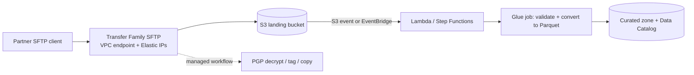
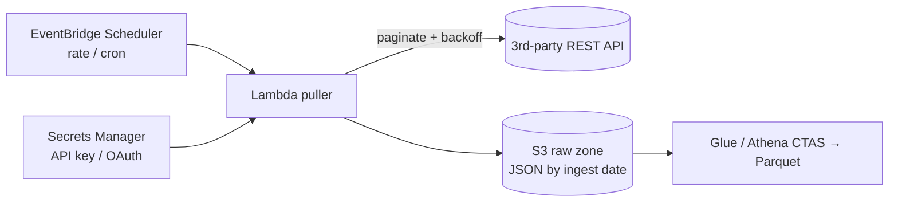

# 11 · DataSync, Transfer Family, Snow & AppFlow — pick the right delivery vehicle

> **Exam map:** D1 · Task 1.1 — D2 · Task 2.1 · **Skills:** 1.1.2, 1.1.3, 1.1.4, 1.1.8, 2.1.4 · **Weight:** 🔥🔥 Medium · **Read time:** ~18 min

## The idea

Think of AWS as a city and your data as **freight arriving from outside**. Different freight needs different vehicles:

- **AWS DataSync** is a **fleet of scheduled freight trains** on a fast private track: it hauls whole file shares and object stores (NFS, SMB, HDFS, other clouds) into S3, EFS or FSx, checks every car on arrival, and on the next run carries only what changed.
- **AWS Transfer Family** is the city's **loading dock with a guard at the gate**: partners keep backing up their own trucks (SFTP, FTPS, FTP, AS2 clients) exactly as before, but the dock unloads straight into S3 or EFS.
- **AWS Snowball Edge** is the **armored truck** you send when the road (your network) is too slow: AWS ships you an encrypted device, you fill it, ship it back, and the contents are loaded into S3.
- **Amazon AppFlow** is a **courier service with contracts at the SaaS offices** (Salesforce, SAP, ServiceNow, Zendesk…): no code, just "pick up these records on this schedule and drop them in S3 or Redshift."
- And for systems that only expose an HTTP **API**, you write your own little courier — usually Lambda on a schedule.

The exam gives you a freight description (how big, how often, from where, over which protocol, with what network) and asks for the vehicle. By the end you'll crack *online vs offline*, *DataSync vs Transfer Family vs AppFlow vs DMS*, *the Glacier trap*, *how partners get a fixed IP to allowlist*, and *how to pull a rate-limited REST API safely*.

## AWS DataSync — the freight train for files and objects

**What it moves:** on-premises **NFS, SMB, HDFS**, and self-managed **object storage**; other clouds (**Google Cloud Storage, Azure Blob Storage, Azure Files**, and S3-compatible stores such as Wasabi, Oracle Cloud Object Storage, Cloudflare R2, Backblaze B2); and between AWS services — **S3, EFS, FSx for Windows File Server / Lustre / OpenZFS / NetApp ONTAP**. It works in both directions (into and out of AWS, and AWS-to-AWS across Regions/accounts).

**Agent or not:**
- An **agent** (a VM you deploy on VMware/Hyper-V/KVM, or an EC2 instance) is required to read **on-premises** storage.
- **AWS-to-AWS** transfers need **no agent**.
- **Enhanced mode** (2025) parallelizes listing, preparing, transferring and verifying and removes Basic mode's file-count quotas. It covers S3/EFS/FSx for Lustre (no agent), **other clouds and object storage to/from S3 with no agent**, and on-premises **NFS/SMB/HDFS via an Enhanced-mode agent** (on-prem NFS/SMB to S3 added Dec 2025). **Basic mode** still covers every location type (e.g., FSx for Windows). Task mode can't be changed after creation.

**Task knobs the exam uses:**

| Need | Setting |
|---|---|
| Recurring sync, only changed data | **Scheduled task** + transfer mode "changed data only" — DataSync compares source and destination, so reruns are **incremental** |
| Move a subset | **Include/exclude filters** or a **manifest** listing exact files |
| Don't saturate the office link | **Bandwidth limit** (throttle per task) |
| Prove integrity | **Data verification** — checksums on transferred data (Enhanced verifies only transferred data; Basic can verify everything) |
| Keep traffic off the internet | **VPC (PrivateLink) endpoint** for the agent, optionally over **Direct Connect**; always **TLS** in transit |
| Go straight to cold storage | Choose the S3 storage class on the location (including Glacier classes) |
| Audit what moved | **Task reports** and CloudWatch Logs/metrics |

Signals: *"migrate an on-premises NAS/file share to S3 or EFS," "keep an on-prem NFS share in sync with S3 nightly," "move an HDFS data lake from an on-prem Hadoop cluster to S3," "copy from Azure Blob / GCS to S3," "online transfer with integrity validation and minimal scripting."*

**THE trap:** scripting `aws s3 sync` or `rsync` on a cron job. It works, but has no built-in verification, retries, scheduling UI, bandwidth control or parallel engine — DataSync is the *"least operational overhead"* answer for file-share migration and recurring sync.

**THE trap:** DataSync is for **files and objects**, not **databases**. Moving rows from Oracle or MySQL (with ongoing changes) is **DMS** ([Guide 10](10-DMS-Database-Ingestion.md)); copying the database's data files would give you an inconsistent mess.

## AWS Transfer Family — the loading dock for partners (2.1.4)

A fully managed server speaking **SFTP, FTPS, FTP and AS2** (plus browser-based **Transfer Family web apps**), backed by **S3 buckets or EFS file systems**. Partners keep their existing clients, scripts and keys; you get no servers to patch and your files land in the lake.

| Topic | What to know |
|---|---|
| **Identity providers** | **Service-managed** (users + SSH keys stored in the service — SFTP only); **AWS Directory Service for Microsoft AD**; **custom identity provider** via **Lambda** or **API Gateway** (Okta, Entra ID, Cognito, secrets in Secrets Manager) |
| **Access control** | Each user maps to an **IAM role** plus a home directory; **logical directories** (chroot) hide bucket structure; session policies scope users to their prefix |
| **Endpoint types** | **Public** (AWS-owned, changing IPs, no security groups); **VPC internal**; **VPC internet-facing with Elastic IPs** — **static IPs** partners can allowlist, plus **security groups** to restrict source IPs |
| **FTP** | Unencrypted, so allowed **only on a VPC internal endpoint** — never on the internet. FTP/FTPS data channel uses ports 8192–8200 |
| **Managed workflows** | Post-upload steps with no servers: **copy, tag, delete, decrypt (PGP)**, and **custom steps in Lambda**, with an exception-handling path |
| **Outbound** | **SFTP connectors** push/pull files to/from a **partner's** remote SFTP server; **AS2 connectors** send AS2 messages (B2B/EDI) |
| **Web apps** | Browser-based upload/download to S3 for business users (integrates with IAM Identity Center and S3 Access Grants) |
| **Logging/security** | CloudWatch Logs per session; KMS encryption at rest in S3/EFS |

**Integrating it into a pipeline:**

The upload is just an S3 object, so everything in [Guide 22 — EventBridge, SNS & SQS](22-EventBridge-SNS-SQS.md) applies: S3 Event Notifications or EventBridge rules start Lambda, Step Functions or a Glue workflow.

**THE trap:** running your own SFTP server on EC2 "because partners need SFTP." The managed answer is **Transfer Family**; the EC2 answer adds patching, scaling and HA work.

**THE trap:** giving partners the **public endpoint** when they must allowlist your IPs — its IPs aren't yours and can change. Use a **VPC-hosted, internet-facing endpoint with Elastic IPs**.

## AWS Snow Family — the armored truck

> ⚠️ **2026 status:** **Snowball Edge (Storage Optimized and Compute Optimized) is closed to new customers since Nov 7, 2025**; AWS now points new customers to **DataSync** (online), **AWS Data Transfer Terminal** (physical), or partners. **Snowcone** and **Snowmobile** were retired earlier. The Snow Family is still on the v1.1 in-scope list, so expect it in offline-transfer questions — the concepts below still decide answers.

| Device | Key specs | Use |
|---|---|---|
| **Snowball Edge Storage Optimized** | **210 TB** usable NVMe, 104 vCPUs | Bulk offline migration; order several devices for petabytes |
| **Snowball Edge Compute Optimized** | 104 vCPUs, up to **416 GB** usable memory, **28 TB** NVMe | Edge processing in disconnected/remote sites, with local storage |

How it works: create a job → AWS ships the device → you copy data locally (S3-compatible interface or NFS) → ship it back → AWS imports into **your S3 bucket** → the device is securely erased. Data is **encrypted with KMS keys you choose** (keys never stored on the device); tamper-evident hardware and a trusted platform module protect it in transit.

**Online vs offline — do the arithmetic.** 1 Gbps moves at most ~**10.8 TB/day** (1 Gb/s × 86,400 s ÷ 8), realistically ~8 TB/day at 80% utilization.

Approximate transfer time at ~80% link utilization:

| Data size | 100 Mbps link | 1 Gbps link | 10 Gbps link |
|---|---|---|---|
| 10 TB | ~12 days | ~1.2 days | ~3 hours |
| 100 TB | ~4 months | ~12 days | ~1.2 days |
| 1 PB | years | ~4 months | ~12 days |

Rule of thumb: if the online transfer would take **longer than about a week**, or the link is shared with production and can't be saturated, go offline. If the link is fast enough, **DataSync** wins (no shipping, incremental reruns).

**THE trap:** *"Import archive data directly into S3 Glacier Deep Archive with Snowball."* Snowball imports land in **S3**; an **S3 Lifecycle rule** then transitions them to Glacier Flexible Retrieval or Deep Archive ([Guide 31 — Data Lifecycle](31-Data-Lifecycle-Retention-Resiliency.md)). (DataSync, by contrast, *can* write to a Glacier storage class directly.)

**THE trap:** Snowball for **ongoing** replication. It's a one-shot (or periodic bulk) mover; continuous sync is DataSync or DMS.

**AWS Data Transfer Terminal** (Dec 2024) — reservable physical facilities (e.g., Los Angeles, New York area, Bay Area, Seattle, London, Munich, Tokyo, Sydney) where you **bring your own storage devices** and upload over high-speed links (at least two 100G connections) to S3 or EFS. Currently for Enterprise Support customers. It's newer than most question pools; treat it as the modern "physical transfer without ordering a device" option.

## Amazon AppFlow — the SaaS courier (1.1.2, 1.1.3)

**AppFlow** moves data between **SaaS applications** and AWS with no code: sources such as **Salesforce, SAP (OData), ServiceNow, Zendesk, Slack, Google Analytics, Marketo, Datadog**, and many more; destinations such as **S3, Redshift, Snowflake**, and back into SaaS (e.g., Salesforce). A **flow** = source + destination + trigger + field mapping + transformations.

| Feature | Details |
|---|---|
| **Triggers** | **On demand**, **on schedule** (with **incremental** "new/changed data only" pulls based on a timestamp field), or **on event** (e.g., **Salesforce change events** — near real time) |
| **Transformations** | Field **mapping**, **filters** (only records matching conditions), **validations** (drop the record or fail the flow on bad values), **masking/truncating** sensitive fields, merging fields, arithmetic |
| **S3 output** | **JSON, CSV or Parquet**; **aggregate** records into fewer files or one file per run; **partition** output folders by run date/time or field values — ready for Athena |
| **Security** | Encrypted with **KMS** (AWS managed or your key); **AWS PrivateLink** for supported SaaS sources (e.g., Salesforce, Snowflake) so traffic avoids the public internet; OAuth credentials stored for you |
| **Extensibility** | **Custom Connector SDK** to build connectors for any API (runs in Lambda) |

Signals: *"ingest Salesforce opportunities into S3 daily, no code," "replicate new ServiceNow incidents," "trigger when a Salesforce record changes."*

**AppFlow vs the alternatives:** for SaaS data headed into **Redshift or a SageMaker lakehouse with ongoing CDC**, **Glue zero-ETL** integrations (Salesforce, SAP, ServiceNow, Zendesk…) are the other managed answer; for heavy transformation during ingestion, **Glue's SaaS connectors** in a Glue job ([Guide 12 — AWS Glue ETL](12-AWS-Glue-ETL.md)). AppFlow wins for straightforward scheduled/event flows with light mapping and masking.

**THE trap:** writing Lambda code against the Salesforce API when the question says *"least development effort"* and AppFlow has a connector.

## Consuming data APIs (1.1.4)

When the source is a third-party REST API without a connector, build a small, polite puller:

- **Schedule** with **EventBridge Scheduler** (or an EventBridge rule).
- **Credentials** in **Secrets Manager** (rotation), never in code or environment variables in plain text.
- **Pagination:** follow the `next` token/cursor until done; persist the last cursor/timestamp (DynamoDB or SSM Parameter Store) for **incremental** pulls.
- **Rate limits:** respect `429 Too Many Requests` and `Retry-After`; **exponential backoff with jitter**; cap concurrency (Lambda **reserved concurrency** = a simple rate limiter, [Guide 17](17-Lambda-for-Data-Pipelines.md)).
- **Land raw first:** write untouched JSON to S3 (replayable), transform later.
- **Too long for Lambda's 15 minutes?** Fan pages out with **Step Functions (Map state)**, or use a Glue Python shell job / ECS task.
- **Connector exists?** Use **AppFlow** (or its Custom Connector SDK) or a Glue connector instead of hand-rolled code.

**Receiving data through an API (the reverse):** **API Gateway** can be an **ingestion front door** with **direct service integrations** to **Kinesis Data Streams** (PutRecord) or **Firehose** (PutRecordBatch) — no Lambda in the middle — adding auth (IAM, Cognito, API keys), throttling/usage plans and WAF. Details in [Guide 36](36-Programming-IaC-CICD.md) and [Guide 46](46-GapFill-Services.md).

## IP allowlisting (1.1.8)

Firewalls allowlist **source IPs**, and serverless services don't have stable ones by default. The patterns:

| Situation | Answer |
|---|---|
| **Your** Glue job / Lambda must call a partner database or API that allowlists IPs | Run it **in private subnets** routed through a **NAT gateway with an Elastic IP**; give the partner that EIP |
| **Partners** must reach **your** SFTP endpoint from allowlisted networks | **Transfer Family VPC internet-facing endpoint with Elastic IPs** + security group allowing their CIDRs |
| **Firehose** delivering to a Redshift cluster or Splunk | Destination must be reachable and **allow the Region's Firehose CIDR block** ([Guide 07](07-Amazon-Data-Firehose.md)) |
| On-prem database accepts only known IPs from DMS | Replication instance in a subnet with NAT/EIP, or private connectivity (VPN / Direct Connect) |
| Restrict who can call your API / bucket | API Gateway **resource policy** with `aws:SourceIp`; S3 bucket policy with `aws:SourceIp` (internet) or **`aws:SourceVpce`** (VPC endpoint) |

**THE trap:** assigning an Elastic IP directly to a Lambda or Glue ENI. Egress goes through the **NAT gateway's EIP**; the functions themselves stay private. Networking depth: [Guide 38 — Networking for Data Pipelines](38-Networking-for-Data-Pipelines.md).

## Decision table — which vehicle?

| Service | Moves | Online/offline | Pick when |
|---|---|---|---|
| **DataSync** | Files/objects: NFS, SMB, HDFS, object stores, other clouds, AWS storage | Online (agent for on-prem) | File-share migration or **recurring incremental sync** with verification |
| **Transfer Family** | Files over **SFTP/FTPS/FTP/AS2** | Online | **External partners** keep their protocols/clients; land in S3/EFS |
| **Snowball Edge** | Bulk data on a shipped device | **Offline** | Tens of TB to PBs, **slow or no network**, remote sites (⚠️ closed to new customers) |
| **Data Transfer Terminal** | Your own drives, at an AWS facility | Physical, high-speed | Physical transfer without ordering devices |
| **Direct Connect** | Private dedicated network link | Network path | Consistent, high-bandwidth **hybrid connectivity** for ongoing transfers (weeks to provision; pair with DataSync/DMS) |
| **S3 Transfer Acceleration** | S3 uploads via edge locations | Online | Clients **far from the bucket's Region** uploading over the internet |
| **AppFlow** | SaaS records | Online | Salesforce/SAP/ServiceNow/… to S3/Redshift, **no code** |
| **DMS** | Database rows + CDC | Online | Relational/NoSQL **database** migration or replication ([Guide 10](10-DMS-Database-Ingestion.md)) |
| **Kinesis / Firehose / MSK** | Event streams | Online | Continuous events and logs ([Guides 06](06-Kinesis-Data-Streams.md)–[08](08-Amazon-MSK-Kafka.md)) |

## Question patterns

> *"A company must move 300 TB from an on-premises NAS to S3. Its 1 Gbps internet link is shared with production traffic, and the migration must finish within three weeks."* → **Snowball Edge Storage Optimized devices** (300 TB at a realistic 8 TB/day on a dedicated link is already ~5 weeks; shared link makes it worse; for new customers the equivalent is Data Transfer Terminal or a partner).

> *"An on-premises NFS share receives new files all day; they must be copied to S3 every night with integrity checks and without saturating the WAN, with the LEAST operational overhead."* → **DataSync scheduled task with a bandwidth limit and verification** (incremental, managed; cron + `aws s3 sync` adds ops).

> *"Migrate a 200 TB HDFS data lake from an on-premises Hadoop cluster to S3 over a 10 Gbps Direct Connect link."* → **DataSync with an HDFS location** (≈2–3 days online; no need for devices).

> *"External vendors upload CSV files over SFTP using existing scripts. Files must land in S3 and trigger validation and conversion to Parquet."* → **Transfer Family SFTP server backed by S3, then S3 event/EventBridge → Lambda or Step Functions → Glue job** (managed dock + event-driven pipeline).

> *"A partner's firewall only permits connections to specific, fixed IP addresses of your SFTP service."* → **Transfer Family VPC endpoint (internet-facing) with Elastic IPs** (the public endpoint has no static IPs).

> *"Uploaded files arrive PGP-encrypted and must be decrypted and tagged before processing, without managing servers."* → **Transfer Family managed workflow with a decrypt step and tag step** (built-in steps; custom logic via Lambda step).

> *"Archive 80 TB of cold research data into S3 Glacier Deep Archive using Snowball Edge."* → **Import to S3 with Snowball, then an S3 Lifecycle rule transitioning to Deep Archive** (Snowball imports don't target Glacier directly).

> *"Sales wants Salesforce opportunity data in S3 as Parquet every hour, only new or changed records, with no custom code."* → **Amazon AppFlow scheduled flow with incremental transfer and Parquet output** (Lambda + API code is more effort).

> *"Account updates in Salesforce must reach the data lake within minutes of the change."* → **AppFlow event-triggered flow on Salesforce change events** (event trigger instead of polling schedule).

> *"SaaS data must flow from Salesforce over a private connection that never traverses the public internet."* → **AppFlow with AWS PrivateLink** (supported for Salesforce and other connectors).

> *"A Glue job must read from a partner's on-premises database that only allowlists known IP addresses."* → **Glue connection in private subnets with a NAT gateway Elastic IP, allowlisted by the partner** (serverless workers have no fixed IPs).

> *"A third-party REST API returns paginated JSON and throttles clients with HTTP 429. Pull it hourly into S3 cost-effectively."* → **EventBridge Scheduler → Lambda that paginates with exponential backoff and jitter, API key in Secrets Manager, raw JSON to S3** (serverless, cheap, polite).

> *"Mobile clients POST JSON events to an HTTPS endpoint; events must land in S3 in near real time without managing servers or writing code between the API and the stream."* → **API Gateway direct integration to Firehose (S3 destination)** (no Lambda glue needed).

> *"Copy 500 TB from Azure Blob Storage to S3 without deploying any agents."* → **DataSync Enhanced mode with an Azure Blob location** (agentless cross-cloud; Transfer Family and Snowball don't fit).

> *"Users worldwide upload large files to a single S3 bucket in us-east-1 and uploads are slow."* → **S3 Transfer Acceleration (with multipart upload)** (edge ingestion over the AWS backbone; DataSync is for storage systems, not end-user uploads).

## Pocket card

| Keyword / signal | Answer |
|---|---|
| NAS / NFS / SMB share → S3/EFS/FSx | DataSync |
| Recurring incremental file sync + verification | DataSync scheduled task |
| HDFS → S3 migration | DataSync HDFS location |
| Azure Blob / GCS / S3-compatible cloud → S3 | DataSync (Enhanced mode, agentless to S3) |
| On-prem source requires | DataSync agent (VM or EC2) |
| Don't saturate the link | DataSync bandwidth limit |
| Unlimited file counts, parallel transfer | DataSync Enhanced mode |
| cron + aws s3 sync | Trap → DataSync |
| Partners use SFTP / FTPS / AS2 | Transfer Family |
| FTP (unencrypted) | Transfer Family VPC internal endpoint only |
| Partner must allowlist your IPs | Transfer Family VPC endpoint + Elastic IPs |
| Existing Active Directory users | Directory Service identity provider |
| Okta / Entra ID / custom auth | Custom IdP (Lambda or API Gateway) |
| Post-upload decrypt / tag / copy | Transfer Family managed workflow |
| Push files to partner's SFTP | SFTP connector |
| Browser upload for business users | Transfer Family web apps |
| Upload → process | S3 event / EventBridge → Lambda / Step Functions / Glue |
| Online takes > ~1 week / no network | Snowball Edge (⚠️ closed to new) / Data Transfer Terminal |
| 1 Gbps capacity | ~10.8 TB/day theoretical, ~8 TB/day realistic |
| Snowball Edge Storage Optimized | 210 TB NVMe |
| Snowball Edge Compute Optimized | 104 vCPU, 416 GB RAM usable, 28 TB NVMe |
| Snowball → Glacier | S3 first, then Lifecycle rule |
| Snow encryption | KMS key you choose; keys not on device |
| Bring your own drives to AWS | Data Transfer Terminal |
| Private dedicated hybrid bandwidth | Direct Connect |
| Global end-user uploads to one bucket | S3 Transfer Acceleration |
| SaaS → S3/Redshift, no code | AppFlow |
| SaaS change → near real time | AppFlow event trigger (e.g., Salesforce) |
| SaaS private path | AppFlow + PrivateLink |
| SaaS → Redshift/lakehouse CDC, managed | Glue zero-ETL |
| No connector for the API | AppFlow Custom Connector SDK or Lambda puller |
| REST API pull | EventBridge Scheduler → Lambda, Secrets Manager, backoff, S3 raw |
| HTTP 429 | Exponential backoff + jitter; cap concurrency |
| API → stream, no Lambda | API Gateway service integration → Kinesis / Firehose |
| Serverless egress needs fixed IP | Private subnet + NAT gateway Elastic IP |
| Firehose → Redshift/Splunk allowlist | Region's Firehose CIDR |
| Database rows + CDC | DMS (not DataSync) |

Once files and SaaS records have landed in the raw zone, somebody has to transform them — for small, event-driven work that's usually Lambda, covered in [Guide 17 — Lambda for Data Pipelines](17-Lambda-for-Data-Pipelines.md), and for heavy lifting it's [Guide 12 — AWS Glue ETL](12-AWS-Glue-ETL.md).
