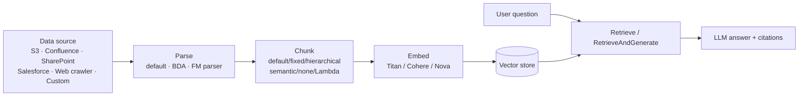

# 19 · GenAI, LLMs & Vectors — teaching your pipeline to read

> **Exam map:** D1 · Task 1.2 — D2 · Task 2.1, 2.4 — D4 · Task 4.5 (PII filters) · **Skills:** 1.2.10, 2.1.3, 2.1.8, 2.4.6 · **Weight:** 🔥🔥 Medium · **Read time:** ~22 min

> 🆕 **New in exam guide v1.1:** skills 1.2.10 (LLMs for data processing), 2.1.8 (vector index types), 2.4.6 (vectorization / Bedrock knowledge bases), and 2.1.3's new HNSW + MemoryDB wording. Amazon Bedrock, Amazon Kendra and Amazon Q were added to the in-scope service list. Most prep material written before 2026 has none of this.

## The idea

For twenty years, data pipelines only "understood" data that already had a shape: columns, types, keys. Everything else (support emails, contracts, call transcripts, PDFs, product photos) was dumped in S3 and ignored. Large language models (**LLMs**) change that. An LLM is a model trained on huge amounts of text that can read messy input and produce structured output on request. To a data engineer it's just another **transformation step**, like a Glue job that happens to understand English.

The analogy for this whole guide is a **map of meaning**. An **embedding model** reads a piece of text (or an image) and gives it **coordinates on a huge map**: a list of hundreds or thousands of numbers, called a **vector**. Texts that mean similar things get placed **near each other**. "Refund my order" and "I want my money back" end up as neighbours even though they share no words. A **vector store** is the city that keeps all those addresses. A **vector index** is its road network, so you can find the nearest houses without knocking on every door. **RAG** (retrieval-augmented generation) means you look up the nearest houses to a question first, then hand what you found to the LLM so it answers from *your* data and not from memory.

So there are three new jobs for a data engineer. (1) Use LLMs to **turn unstructured data into columns**. (2) Build the **ingestion pipeline that fills the map**: parse, chunk, embed, index. (3) **Pick the right vector store and index type** for the latency, scale and cost you need. After this guide you'll be able to answer the exam's "which Bedrock mechanism," "which chunking strategy," "HNSW or IVF," and "which AWS vector store" questions, and spot distractors like Kendra, Q Business and SageMaker AI training.

## LLMs as a transformation step (1.2.10)

**What the exam means by "integrate LLMs for data processing":**

| Messy input | LLM task | Output you store |
|---|---|---|
| Support tickets, reviews | **Classify** (sentiment, category, urgency) | `category`, `sentiment` columns |
| Emails, contracts, invoices | **Extract** entities/fields | JSON → Parquet columns |
| Call transcripts, long reports | **Summarize** | `summary` column |
| Free-text addresses, job titles | **Standardize / normalize** | Clean canonical values |
| Product descriptions in 12 languages | **Translate**, enrich | Uniform-language text |
| Scanned PDFs, images, audio, video | **Parse** multimodal content | Structured records |
| "Show me revenue by region" | **Generate SQL/code** | A query or a Glue script (see Amazon Q) |

**Amazon Bedrock** is the fully managed, serverless API for foundation models (**FMs**) from Amazon (Nova, Titan) and third parties (Anthropic, Cohere, Meta, Mistral and others). You call it. You don't host models. There are six ways to plug it into a pipeline:

| Mechanism | How it works | Pick when |
|---|---|---|
| **On-demand `InvokeModel` / `Converse`** from Lambda, Glue, EMR, ECS | One API call per prompt. `Converse` gives one consistent request format across models | Low-latency, per-event enrichment (*"as each record arrives"*) |
| **Bedrock batch inference** | Put prompts in **JSONL files in S3**, submit a job, and results land in **S3**. Records can use the `InvokeModel` or `Converse` format. EventBridge reports job state changes | Large **offline** jobs (*"millions of documents overnight," "most cost-effective"*). Priced about **50% lower than on-demand** for supported models |
| **Step Functions optimized Bedrock integration** | `arn:aws:states:::bedrock:invokeModel` Task state. The inline `Body` can be up to **256 KiB**. For bigger payloads, point `Input` / `Output` at an **S3 URI**. `CreateModelCustomizationJob` supports `.sync` | Orchestrated multi-step flows (prompt chaining, human approval). Add **Distributed Map** to fan out over millions of S3 objects with controlled concurrency ([Guide 20](20-Step-Functions.md)) |
| **Redshift ML + Bedrock** | `CREATE EXTERNAL MODEL … MODEL_TYPE BEDROCK` creates a **SQL function** that calls the LLM | Analysts enrich warehouse rows **with SQL only** |
| **Aurora PostgreSQL ML** | The `aws_ml` **2.0** extension adds `aws_bedrock.invoke_model` and `aws_bedrock.invoke_model_get_embeddings` | Call an LLM or make embeddings **from inside the database** |
| **Bedrock Data Automation (BDA)** | Managed, API-driven extraction from **documents, images, audio and video** into structured output. You get standard output, or custom output shaped by **blueprints**. It includes confidence scores and visual grounding | *"Intelligent document processing," "extract fields from forms/invoices/video,"* with **no prompt engineering or model orchestration** |

Redshift SQL-only enrichment looks like this:

```sql
CREATE EXTERNAL MODEL review_sentiment
FUNCTION fn_review_sentiment
IAM_ROLE default
MODEL_TYPE BEDROCK
SETTINGS (
  MODEL_ID 'amazon.nova-lite-v1:0',
  PROMPT 'Classify this review as POSITIVE, NEGATIVE or NEUTRAL:');

SELECT review_id, fn_review_sentiment(review_text) AS sentiment
FROM product_reviews;
```

The default `REQUEST_TYPE` is **UNIFIED** (Converse-style, and it supports `PROMPT`/`SUFFIX`). **RAW** sends a model-specific SUPER payload and returns SUPER. Redshift doesn't charge extra for this, but **Bedrock bills per token**.

A batch inference record is one JSON object per line: `{"recordId": "R0001", "modelInput": { ...model request body... }}`.

**THE trap:** a Glue Spark job that calls `InvokeModel` for 50 million rows at full parallelism. Every executor hammers the same account quota, and you get **`ThrottlingException`** storms plus a big on-demand bill. For offline volume, the answer is **batch inference** (cheaper, and it manages throughput for you). If you must call on-demand, **cap concurrency per partition, batch several records into each prompt, and retry with exponential backoff and jitter.** The same reasoning applies to rate limits in DynamoDB and Kinesis (skill 1.1.9).

### Throughput, cost and safety controls

- **Quotas** are per model, per Region: **tokens per minute (TPM)** and **requests per minute (RPM)**. **Embedding models are throttled on RPM**, not TPM.
- **Cross-Region inference** uses an **inference profile** ID in place of the model ID, so Bedrock can route requests to other Regions and absorb bursts. **Geographic** profiles (US, EU, APAC) keep processing inside that geography. That's the one to choose for data-residency rules. **Global** profiles route to any commercial Region and cost roughly 10% less. There's **no extra routing charge**. CloudTrail logs the call in the source Region, and `additionalEventData.inferenceRegion` shows where it ran.

  **THE trap:** a Region-deny SCP ([Guide 42](42-Privacy-PII-Masking-Sovereignty.md)) must **allow the profile's destination Regions**, or cross-Region inference breaks.
- **Provisioned Throughput** buys dedicated **model units** by the hour, with no commitment, 1-month or 6-month terms. Use it for steady, predictable, high volume. Batch inference **can't** run on provisioned models.
- **Service tiers** are set per request with `service_tier`. **Priority** costs more and responds fastest. **Standard** is the default. **Flex** is discounted and suits latency-tolerant work such as bulk summarization or evaluations. **Reserved** is committed TPM capacity arranged through your account team.
- **Bedrock Guardrails sensitive information filters** detect PII such as `NAME`, `EMAIL`, `US_SOCIAL_SECURITY_NUMBER`, `CREDIT_DEBIT_CARD_NUMBER` and `AWS_ACCESS_KEY`, plus **custom regex**. They can **Block**, **Mask** (the API calls it `ANONYMIZE`, and it replaces values with `{EMAIL}`-style tags) or **detect only** (`NONE`). You set this separately for inputs and outputs. The standalone **`ApplyGuardrail`** API screens text without calling a model, which is handy as a pipeline step.

  **THE trap:** guardrail masking does **not** clean **model invocation logs**. Those still contain the original prompt, so protect them with **CloudWatch Logs data protection** ([Guide 42](42-Privacy-PII-Masking-Sovereignty.md)).

## Vectorization concepts (2.4.6)

**Embeddings** are dense vectors of floating-point numbers where **distance means difference in meaning**. The rules that matter:

1. **Use the same embedding model for documents and queries.** Coordinates from two different models aren't on the same map. **Switching models means re-embedding everything.**
2. **The dimension count is fixed per index.** The vector field's dimension must match the model's output exactly.
3. **Fewer dimensions** means less storage and memory and faster search, with a small accuracy loss.

| Embedding model (Bedrock) | Dimensions | Notes |
|---|---|---|
| **Titan Text Embeddings V2** | **1,024 (default), 512, 256** | Up to **8,192 tokens** / 50,000 chars. `normalize` defaults to **true**. `embeddingTypes` can be `float`, `binary` or both |
| Titan Embeddings G1 – Text | 1,536 | Older generation |
| Cohere Embed English / Multilingual | 1,024 | Third-party option. Multilingual for cross-language corpora |
| Multimodal (Titan Multimodal Embeddings, Amazon Nova multimodal embeddings) | model-specific | Put **images/video/audio and text on the same map** (search photos with words) |

**Similarity metrics** measure how close two addresses are:

| Metric | Measures | Note |
|---|---|---|
| **Cosine similarity** | Angle between vectors (direction only) | The usual default for text |
| **Euclidean / L2** | Straight-line distance | Sensitive to magnitude |
| **Dot product / inner product** | Angle × magnitudes | Fastest to compute |
| Hamming | Differing bits | For **binary** embeddings |

With **normalized** vectors (length 1), cosine, dot product and L2 **produce the same ranking**. That's why normalizing output such as Titan V2's `normalize: true` lets you use the fastest metric safely. The general rule: **use the metric the embedding model was trained for.**

### Chunking — how big is each "house"?

You don't embed a 200-page PDF as one point. You split it into **chunks**, and each chunk gets its own vector. Small chunks give **precise matches but thin context**. Big chunks give **rich context but blurry matches**, and they cost more tokens when passed to the LLM.

| Strategy (Bedrock KB) | How | Pick when |
|---|---|---|
| **Default** | About **300 tokens**, keeping whole sentences | You have no strong reason to tune |
| **Fixed-size** | You set max tokens per chunk plus an **overlap %** | Uniform prose. Overlap stops a fact being split across a boundary |
| **Hierarchical** | **Child** chunks are searched and their **parent** chunks are returned | You need precise matching **and** wide context (manuals, legal text). May return fewer results than requested |
| **Semantic** | Splits where meaning shifts (max tokens, buffer size, breakpoint percentile threshold) | Documents whose topics shift unevenly. **Extra FM cost** |
| **No chunking** | Each file is one chunk | You **pre-split** upstream (e.g., one FAQ per file). You lose page-number citations |
| **Custom (Lambda)** | A Lambda transformation step splits text and/or adds metadata | Your own splitting logic or enrichment |

**Metadata** such as department, date or product line is stored beside each vector for **filtering** ("only 2026 HR policies"). For S3 sources, put it in a sidecar file named `<file>.metadata.json`.

**THE trap:** the chunking strategy is fixed when the data source is created. Changing it means a new data source and **re-ingestion**, so choose deliberately. Also, **hierarchical chunking isn't recommended with S3 Vectors**: parent-child context is stored as non-filterable metadata and can exceed the per-vector metadata limits.

## Amazon Bedrock Knowledge Bases — the managed RAG pipeline

Knowledge Bases is the exam's example of vectorization, and it's a **data pipeline you don't have to write**:



- **Sync (ingestion job).** You start a sync. It's **incremental**: only **new, changed or deleted** documents are reprocessed. The data deletion policy (`RETAIN` or `DELETE`) decides whether vectors survive when a data source is removed. A customer managed KMS key can encrypt transient data during sync.
- **Parsing.** The **default parser** extracts **text only** and has no parsing charge. For **tables, charts, figures or images** inside PDFs (plus JPEG/PNG), choose the **Bedrock Data Automation parser** (priced per page, no prompting) or a **foundation-model parser** (priced per token, customizable prompt). Multimodal files (images, audio, video) are ingested only from **S3 and custom** data sources.
- **Vector stores supported:** **OpenSearch Serverless**, **OpenSearch Service managed clusters**, **S3 Vectors**, **Aurora PostgreSQL** (pgvector, same account), **Neptune Analytics** (for **GraphRAG**), and the third-party stores **Pinecone**, **Redis Enterprise Cloud** and **MongoDB Atlas**. The console's quick-create flow can build the vector index for you. **Binary** vectors are supported only on the OpenSearch options.
- **Querying.** **`Retrieve`** returns the matching chunks, scores and source metadata, and **you** build the prompt. **`RetrieveAndGenerate`** retrieves, calls the LLM and returns an answer **with citations** in one call.
- **Structured data retrieval.** A knowledge base can use **Amazon Redshift (provisioned or Serverless) as a query engine** over Redshift tables or the **Glue Data Catalog** (governed by Lake Formation). It turns **natural language into SQL**, and **`GenerateQuery`** returns just the SQL. Grant the service role **read-only** access, because the generated SQL runs against your data.
- **Kendra GenAI index as a retriever.** A knowledge base can use a Kendra GenAI Enterprise Edition index in place of a vector store. You reuse Kendra's connectors and relevance ranking.

> ⚠️ **2026 status:** **Amazon Bedrock Managed Knowledge Base** went GA on **June 17, 2026**. Bedrock runs the datastore, embedding, reranking and "agentic" retrieval, and it offers native connectors (S3, SharePoint, Confluence, Web Crawler, Google Drive, OneDrive, custom, with Salesforce and Zendesk added in Sept 2026). From **Sept 30, 2026**, *customer-managed* knowledge bases can't create **new** Confluence, SharePoint, Salesforce or Web Crawler connectors (existing ones keep working). Exam guide v1.1 predates this, so expect the classic model above. If an answer says "fully managed, no vector store to run," that's the managed flavour.

**THE trap:** "build a RAG chatbot over documents in S3 with the least operational overhead" → **Bedrock Knowledge Bases**. It is **not** a custom Lambda + OpenSearch pipeline, **not** SageMaker AI fine-tuning, and **not** Amazon Q Business (in maintenance). Fine-tuning changes a model's *behaviour*. RAG gives it *facts* that stay fresh after each sync.

## Vector index types (2.1.8) — the road network

Searching the map means finding the **k nearest neighbours (k-NN)** of the query vector. Comparing against every vector is exact but slow. **Approximate nearest neighbour (ANN)** indexes trade a little **recall** (the share of true nearest neighbours you actually find) for large speed-ups.

- **Flat / brute force = knock on every door.** Exact, 100% recall, no build step. Cost grows linearly with data size. Fine for small sets or when exact results are mandatory. Without a vector index, pgvector and DocumentDB fall back to exact search.
- **HNSW (Hierarchical Navigable Small World) = a highway system.** A **multi-layer proximity graph**. The sparse top layers are motorways that get you to the right district fast, and the dense bottom layer holds every vector. Search drops down layer by layer, walking greedily toward the query.
  - Parameters: **`M`** (links per node: more links, better recall, more memory), **`ef_construction`** (candidate-list size while building: better graph, slower build) and **`ef_search`** (candidate-list size per query: better recall, slower query; tunable per query).
  - Defaults in pgvector are **M 16, ef_construction 64, ef_search 40**. OpenSearch's Faiss/Lucene default is **m 16, ef_construction 100**.
  - **No training step.** You can create it on an empty table and insert incrementally.
  - It's the **most memory-hungry** option (roughly `1.1 × (4·d + 8·M)` bytes per float32 vector in OpenSearch's estimate) and the **slowest to build**.
  - Heavy deletes and overwrites can degrade the graph, and **reindexing** restores it.
- **IVF (Inverted File index) = postcode districts.** **k-means** clustering splits the space into **`nlist`/`lists`** clusters, each with a **centroid**. A query checks only the **`nprobes`/`probes`** nearest clusters.
  - **Needs training** on representative data. OpenSearch requires a **Train API** call, and pgvector's IVFFlat should be **built after the table has data**.
  - Builds faster and uses **less memory** than HNSW. Recall rises as you raise probes.
  - pgvector guidance: **lists ≈ rows/1000** (up to 1M rows) or **√rows** (above 1M). Start with **probes ≈ √lists**. The default is **1**, which is fast but has poor recall.
- **Quantization = shorter addresses.** It compresses each vector.
  - **Scalar** quantization turns float32 into fp16 (half the memory) or int8/byte (a quarter).
  - **Binary** quantization uses 1 bit per dimension (32× smaller, compared with Hamming distance).
  - **Product quantization (PQ)** splits the vector into sub-vectors and stores a short code for each, giving huge compression.
  - All of these give up some recall for memory.
- **IVF-PQ** means districts plus compressed addresses: billion-scale on small hardware. In an AWS benchmark, IVF-PQ used about **16× less memory than HNSW**, but with much lower recall and higher latency.

| | Flat | HNSW | IVF (IVFFlat) | PQ / IVF-PQ |
|---|---|---|---|---|
| Result | Exact | Approximate | Approximate | Approximate (lossy) |
| Recall | 100% | **Highest ANN** | Good, tunable via probes | Lowest |
| Query latency | Slow at scale | **Lowest** | Low–medium | Medium |
| Memory | Raw vectors | **Highest** (graph links) | Lower | **Lowest** |
| Build | None | **Slowest** | Fast, **needs training** | Needs training |
| Incremental inserts | Trivial | **Yes** | Yes, but clusters go stale (retrain/rebuild) | Retrain on drift |
| Key knobs | — | M, ef_construction, ef_search | nlist/lists, nprobes/probes | code size, sub-vectors |

**Pick when:** *"highest recall and lowest latency, memory available"* → **HNSW**. *"Reduce memory / faster index builds, some recall loss acceptable"* → **IVF**. *"Billions of vectors, tight budget"* → **IVF-PQ or quantization** (or S3 Vectors). *"Exact results, small dataset"* → **flat**.

**THE trap:** building an **IVFFlat index on an empty or tiny table**, then loading millions of rows. The centroids describe the wrong data and recall collapses. Load first, then build, or use HNSW, which needs no training.

## Vector stores on AWS (2.1.3)

| Store | Vector features | Sweet spot |
|---|---|---|
| **OpenSearch Service / Serverless** (vector search collections) | k-NN plugin, `knn_vector` field. **Faiss** and **Lucene** engines (NMSLIB is deprecated). **HNSW and IVF**, quantization, and **hybrid** keyword + vector search | Search-heavy apps, hybrid/faceted search, large scale, Bedrock KB default. See [Guide 29](29-OpenSearch-Service.md) |
| **Aurora PostgreSQL / RDS for PostgreSQL + pgvector** | **HNSW and IVFFlat**. Operators `<->` L2, `<=>` cosine, `<#>` negative inner product. Index up to **2,000 dims** (`vector`) or **4,000** (`halfvec`) | Vectors **beside relational data**: SQL joins, transactions, existing Postgres skills. The exam's HNSW example. See [Guide 28](28-RDS-Aurora-Purpose-Built-DBs.md) |
| **Amazon MemoryDB** (Valkey/Redis OSS compatible, formerly "MemoryDB for Redis") | **FLAT and HNSW**, in memory with Multi-AZ durability. **Single-digit-millisecond** queries/updates at **>99% recall**. Up to 32,768 dims. **Must be enabled at cluster creation**, and vector search is limited to a single shard | **Lowest latency, highest recall** (real-time RAG, semantic caching, fraud) plus durable **fast key/value access** (microsecond reads) |
| **Amazon DocumentDB** (5.0+ instance-based) | **HNSW** (default) **and IVFFlat**. Euclidean, cosine, dotProduct. Indexes up to 2,000 dims | Vectors inside **JSON documents** you already keep there |
| **Neptune Analytics** | **One vector index per graph, defined at graph creation** (1–65,535 dims). Vector similarity plus graph algorithms in openCypher | **GraphRAG**: relationships matter as much as similarity |
| **Amazon S3 Vectors** (GA **Dec 2, 2025**) | **Vector buckets → vector indexes**. Up to **2 billion vectors per index** and **10,000 indexes per bucket**, 1–4,096 dims, cosine or Euclidean, filterable metadata. **Sub-second** for infrequent queries, **~100 ms** for frequent ones. **Up to 90% lower cost**. Float only | **Huge, cheap, infrequently queried** vector sets, RAG archives, agent memory. Bedrock KB store. Can **export to OpenSearch Serverless** (one-time copy) or back **OpenSearch managed clusters** as an engine. See [Guide 05](05-S3-Data-Lake-Storage.md) |
| **Amazon Kendra** | Managed **semantic enterprise search**. Not a raw vector DB (you don't choose indexes or embeddings) | "Search our documents with relevance and permissions" |

**Decision rules:**

- *"Lowest latency / real-time / highest recall, in-memory"* → **MemoryDB**.
- *"Already on PostgreSQL; join embeddings with relational tables"* → **Aurora PostgreSQL + pgvector (HNSW)**.
- *"Hybrid keyword + semantic search, aggregations, large scale"* → **OpenSearch**.
- *"Billions of vectors, lowest cost, query latency under a second is fine"* → **S3 Vectors**.
- *"Documents are already JSON in DocumentDB"* → **DocumentDB vector search**.
- *"Knowledge graph + RAG"* → **Neptune Analytics**.

**THE trap:** picking **S3 Vectors** for a *"single-digit millisecond"* requirement. It's built for **cost** at sub-second latency, not microseconds. The reverse trap is putting 2 billion rarely queried vectors in MemoryDB RAM.

## Amazon Q — generative help for the data engineer

- **Amazon Q Developer** (the successor to CodeWhisperer, which is no longer on the out-of-scope list) is an AI assistant in IDEs, the console and the CLI. It writes and explains code, SQL and PySpark, and helps debug. See [Guide 36](36-Programming-IaC-CICD.md).
- **Amazon Q data integration in AWS Glue** lets you describe an ETL job in natural language and generates the Glue job or script. It also troubleshoots Spark errors.
- **Generative SQL** in **Redshift Query Editor v2** and in **SageMaker Unified Studio** (where Q Developer is built in) turns natural language into SQL using your schema. See [Guide 41](41-SageMaker-Unified-Studio-Catalog-Governance.md).
- **Generative BI in Quick Sight** (part of **Amazon Quick**, formerly Amazon Q in QuickSight) builds visuals, summaries and data stories from questions. See [Guide 35](35-Analytics-Visualization-Quick-Notebooks.md).

> ⚠️ **2026 status:** **Amazon Q Business** (the enterprise chat assistant over company data) entered **maintenance, with no new customers, from July 30, 2026**. For a *new* RAG build, treat it as a likely distractor. Bedrock Knowledge Bases, or Amazon Quick for business users, is the forward path.

## Amazon Kendra — enterprise search

Kendra is an **intelligent search index**. **Connectors** crawl S3, SharePoint, Confluence, Salesforce, databases and more, with **incremental syncs**. Kendra ranks results by **natural-language relevance** and supports **FAQs** (exact curated answers). It is **ACL-aware**: user-context filtering means a user only sees documents they're allowed to open. Editions are **Developer**, **Enterprise** and **GenAI Enterprise Edition**. A GenAI index is designed to be the **retriever for Bedrock Knowledge Bases** (and Q Business).

> ⚠️ **2026 status:** Kendra entered **maintenance, with no new customers, from July 30, 2026**, but it is **still in v1.1's in-scope list**. Know what it is. The exam frames it as: **Kendra** = managed, permission-aware *document search* with connectors. **OpenSearch** = search/vector engine you configure. **Bedrock KB** = managed *RAG pipeline* that also generates answers.

## Question patterns

> *"A company stores 40 million customer-support transcripts in S3 and must add a sentiment label and product category to each before loading them into Redshift. Results are needed by next morning. MOST cost-effective?"* → **Amazon Bedrock batch inference** (JSONL in S3 → results in S3 → COPY to Redshift). "Next morning" plus millions of records means offline, and batch is priced about 50% below on-demand. A Glue job calling `InvokeModel` per row costs more and will throttle.

> *"Analysts want to summarize free-text claim notes in Redshift using SQL only, without building pipelines."* → **Redshift ML `CREATE EXTERNAL MODEL … MODEL_TYPE BEDROCK`**, then call the function in SELECT. Exporting to S3 and running Lambda adds moving parts.

> *"Scanned invoices, photos of receipts and recorded calls must be turned into structured fields with the LEAST development effort."* → **Amazon Bedrock Data Automation** with blueprints. It's multimodal and needs no prompt engineering or model orchestration. Hand-built Textract + Transcribe + LLM chains are more work.

> *"A Lambda function that enriches Kinesis records with Bedrock intermittently fails with ThrottlingException during peaks."* → **Retry with exponential backoff and jitter, and use a cross-Region inference profile (or raise the quota)**. Batch inference doesn't fit a per-record near-real-time path. If data must stay in the EU, choose a **geographic** profile, not global.

> *"Build a question-answering assistant over 200,000 policy PDFs in S3 with the LEAST operational overhead; answers must cite sources."* → **Bedrock Knowledge Bases + `RetrieveAndGenerate`**. Fine-tuning in SageMaker AI doesn't give citations or fresh data, and Q Business is in maintenance.

> *"The PDFs contain important tables and charts that retrieval is missing."* → **Change the parser to Bedrock Data Automation or a foundation-model parser**. The default parser extracts text only.

> *"Retrieved chunks are precise but lack surrounding context, so answers are incomplete."* → **Hierarchical chunking** (match small child chunks, return large parent chunks). Just enlarging fixed-size chunks blurs matching.

> *"A vector index must return the highest recall at the lowest query latency, and the dataset receives continuous inserts."* → **HNSW**. No training, incremental inserts, best recall and latency. IVF needs training and its clusters go stale.

> *"Memory cost of a billion-vector OpenSearch index is too high; a modest recall drop is acceptable."* → **IVF with product quantization (IVF-PQ)**, or scalar/binary quantization. HNSW is the memory hog.

> *"After building an IVFFlat index on a new pgvector table and bulk-loading 5 million rows, recall is poor."* → **Rebuild the index after loading data** (lists ≈ √rows) and **raise `ivfflat.probes`**. Centroids trained on an empty table are meaningless.

> *"An application already on Aurora PostgreSQL must run similarity search joined with order tables, with minimal new infrastructure."* → **pgvector with an HNSW index on Aurora PostgreSQL**. It avoids syncing a separate OpenSearch domain.

> *"A fraud-scoring API needs vector similarity lookups in single-digit milliseconds with >99% recall, plus durable key/value session data."* → **Amazon MemoryDB with vector search (HNSW)**. S3 Vectors is sub-second, not single-digit ms.

> *"Store 1.5 billion document embeddings that are queried a few times per hour, at the LOWEST cost; sub-second latency is fine."* → **Amazon S3 Vectors**, optionally as the Bedrock KB store. OpenSearch or MemoryDB clusters cost far more when idle.

> *"Employees need a search portal over SharePoint and Confluence that respects each user's document permissions; no answer generation required."* → **Amazon Kendra** (connectors plus ACL-aware results). Note it's in maintenance for new customers from July 2026. For generated answers, use Bedrock KB, with Kendra GenAI index as the retriever if needed.

> *"LLM-generated summaries must never contain email addresses or SSNs, while other text passes through."* → **Bedrock Guardrails sensitive information filter with MASK (ANONYMIZE)** on output. BLOCK would reject the whole response. Add CloudWatch Logs data protection for invocation logs.

> *"A data engineer wants to generate a Glue ETL job from a natural-language description."* → **Amazon Q data integration in AWS Glue** (Amazon Q Developer). Bedrock KB is for retrieval, not code generation.

## Pocket card

| Keyword / signal | Answer |
|---|---|
| Classify / extract / summarize text inside a pipeline | Bedrock `InvokeModel` / `Converse` (Lambda, Glue, Step Functions) |
| Millions of prompts offline, cheapest | **Bedrock batch inference** (JSONL S3 → S3, ~50% below on-demand) |
| LLM step in a workflow, fan out over S3 objects | Step Functions `bedrock:invokeModel` + Distributed Map |
| Step Functions payload > 256 KiB | Use `Input`/`Output` **S3Uri** fields |
| LLM enrichment with SQL in the warehouse | Redshift ML `CREATE EXTERNAL MODEL … MODEL_TYPE BEDROCK` |
| LLM or embeddings from inside Postgres | Aurora `aws_ml` 2.0 → `aws_bedrock.invoke_model(_get_embeddings)` |
| Documents/images/audio/video → structured fields | **Bedrock Data Automation** (blueprints) |
| ThrottlingException from Bedrock | Backoff + jitter, cross-Region inference, quota increase, batch |
| Burst capacity but data must stay in EU | **Geographic** cross-Region inference profile |
| Steady high volume, guaranteed capacity | Provisioned Throughput (model units) / Reserved tier |
| Latency-tolerant, cheaper per request | **Flex** service tier |
| Mask PII in prompts/responses | Guardrails sensitive info filter → **ANONYMIZE** (or BLOCK) |
| Same model for docs and queries | Always. Changing model = re-embed everything |
| Titan Text Embeddings V2 dims | **1,024** default, 512, 256 (8,192 tokens) |
| Normalized vectors | Cosine = dot product = L2 ranking |
| Precise match + wide context | **Hierarchical** chunking |
| Topic-aware splits (extra cost) | **Semantic** chunking |
| Docs already pre-split | **No chunking** |
| Tables/figures in PDFs | BDA parser or FM parser (default = text only) |
| Managed RAG over S3 docs, citations | **Bedrock KB + RetrieveAndGenerate** |
| Just the chunks, build your own prompt | **Retrieve** |
| Natural language → SQL over Redshift / Glue Catalog | KB **structured data store** (Redshift query engine), `GenerateQuery` |
| Graph + RAG | Neptune Analytics (GraphRAG) |
| Highest recall + lowest latency ANN | **HNSW** (M, ef_construction, ef_search) |
| Less memory, faster build, needs training | **IVF** (lists/nlist, probes/nprobes) |
| Billion scale, smallest memory | **PQ / IVF-PQ**, quantization |
| Exact search, small data | Flat / no index |
| IVFFlat recall bad after load | Build after data. Raise probes (start √lists) |
| Vectors beside relational data | **Aurora PostgreSQL + pgvector** |
| Single-digit ms, >99% recall, in-memory | **MemoryDB** vector search |
| Hybrid keyword + vector search | **OpenSearch** (Faiss/Lucene) |
| Cheapest, billions of vectors, sub-second OK | **S3 Vectors** (2B vectors/index) |
| Vectors inside JSON documents | DocumentDB vector search (HNSW/IVFFlat) |
| Permission-aware enterprise document search | **Kendra** (⚠️ maintenance Jul 30, 2026) |
| Enterprise chat assistant over company data | Q Business (⚠️ maintenance → likely distractor) |
| NL → Glue job / SQL / PySpark help | **Amazon Q Developer** (Glue, Redshift QEv2, Unified Studio) |

Once your pipeline can read and your data lives on the map of meaning, the next question is who is allowed to find it and how they discover it. That's the governance layer in [Guide 41 — SageMaker Unified Studio, Catalog & Governance](41-SageMaker-Unified-Studio-Catalog-Governance.md).
