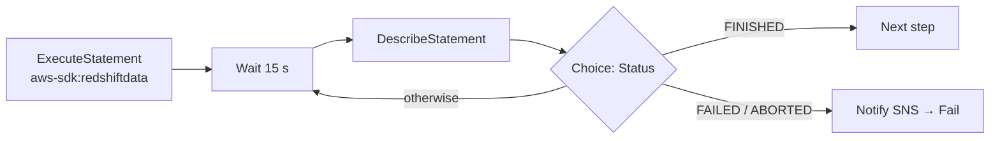

# 20 · AWS Step Functions — the control tower for serverless data pipelines

> **Exam map:** D1 · Task 1.3 — D3 · Task 3.1 · **Skills:** 1.3.1, 1.3.2, 1.3.3, 3.1.1, 3.1.2 · **Weight:** 🔥🔥🔥 High · **Read time:** ~22 min

## The idea

Picture an **air traffic control tower**. The tower flies no planes. What it does is tell each plane when to take off, keep track of every flight, send planes into a holding pattern when the runway is busy, divert them when something breaks, and log every movement. **AWS Step Functions** does that job for your pipeline. The planes are the real workers: a Glue job, an EMR step, an Athena query, a Lambda function. The tower is a **state machine**, a workflow you write as JSON in the **Amazon States Language (ASL)**. It sequences the work, waits for each job to land, retries failures, branches on results, and records every step it took.

Why not just chain Lambdas, where each function calls the next one? Because then the **workflow logic is scattered through application code**. No one can see the whole flow, retries have to be coded by hand, a 15-minute Lambda cannot babysit a 3-hour Glue job, and when step 7 fails you have no audit trail. Step Functions moves all of that out of your code and into a managed, visual, auditable **orchestrator**. It is serverless: nothing to patch, and it scales by itself.

This guide sets you up for the exam's orchestration questions: **Standard vs Express**, *"wait for the Glue job to finish"* (`.sync`), *"pause until a human approves"* (`.waitForTaskToken`), *"process millions of S3 objects in parallel"* (Distributed Map), *"retry with exponential backoff and alert on failure"* (Retry/Catch → SNS), and the classic **256 KiB payload** trap.

## States — the vocabulary of the tower

A state machine is a set of named **states** plus a `StartAt` pointer. Each state is one of eight types:

| State | What it does | Data-pipeline use |
|---|---|---|
| **Task** | Does work by calling a service (Glue, EMR, Athena, Lambda, SNS, any AWS SDK API, HTTPS endpoint) | "Run the Glue job", "publish the alert" |
| **Choice** | Branches on input values, like if/else | "Did the row count pass?", "Is the query FINISHED?" |
| **Parallel** | Runs a fixed set of **different** branches at the same time, then joins | Load dim tables and fact staging at the same time |
| **Map** | Runs the **same** steps for each item in a collection | One transform per file, per partition, per customer |
| **Wait** | Pauses for a number of seconds or until a timestamp | The poll interval inside a status-check loop |
| **Pass** | Passes input to output, optionally injecting or reshaping data | Set defaults, mock a step during development |
| **Succeed** | Ends the execution successfully | Early exit when there is no new data |
| **Fail** | Ends the execution as failed, with an error and a cause | Terminal state after the alert is sent |

**THE trap:** *Parallel vs Map.* Parallel = **different** branches, a fixed number, known at design time. Map = the **same** sub-workflow applied to a **dynamic** list of items. *"Process each of the N files that arrived"* → Map.

## Standard vs Express — two kinds of tower

You choose the type **when you create the state machine, and it cannot be changed later**.

| | **Standard** | **Express** |
|---|---|---|
| Max duration | **1 year** | **5 minutes** |
| Execution semantics | **Exactly-once** (a step never runs twice unless you configured Retry) | Async: **at-least-once**. Sync: **at-most-once** |
| Pricing | Per **state transition** | Per **execution + duration + memory** |
| Execution history | Kept by the service, viewable in console/API for **90 days**; **25,000-event** cap per execution | Not kept by the service. You must **enable CloudWatch Logs** to see it |
| `.sync` / `.waitForTaskToken` | **Supported** | **Not supported** (Request-Response only) |
| Distributed Map / Activities / Redrive | Supported | **Not supported** |
| Sweet spot | Long-running ETL, non-idempotent steps, human approval, auditability | High-volume, short, **idempotent** event processing (IoT, streaming transforms, API backends) |

Decision rule: *"Orchestrate a nightly ETL that runs a 2-hour Glue job and waits for it"* → **Standard** (long duration plus `.sync`). *"Transform 50,000 small events per second, each in under a second"* → **Express** (cheap per execution, unlimited transition rate). **Synchronous Express** (`StartSyncExecution`, often behind API Gateway) returns the workflow result to the caller.

**THE trap:** Express looks cheaper, but it **cannot wait for a Glue/EMR job with `.sync`** and caps out at 5 minutes. Any "wait for the job to complete" requirement means Standard. A common pattern is a **Standard parent** calling **Express children** for bursts of short work.

## Service integration patterns — how the tower talks to planes

Task states call services three ways. This is one of the most heavily tested parts of the topic.

| Pattern | Resource suffix | Behavior | Example |
|---|---|---|---|
| **Request-Response** (default) | none | Calls the API and moves on as soon as the HTTP response returns. Does **not** wait for the job to finish | Fire-and-forget: publish to SNS, put an item to DynamoDB |
| **Run a Job** | `.sync` | Starts the job, then **waits until it completes** (Step Functions polls for you), and fails the state if the job fails | `glue:startJobRun.sync`, `athena:startQueryExecution.sync` |
| **Wait for Callback** | `.waitForTaskToken` | Sends a **task token** out and **pauses** until something calls `SendTaskSuccess` or `SendTaskFailure` with that token | Human approval, external system, on-prem job |

Callback details: pass the token from the context object (`$$.Task.Token`) to the worker, for example inside an SQS message or a Lambda payload. Set **`HeartbeatSeconds`** so a worker that dies silently is detected. The worker calls `SendTaskHeartbeat`, and a missed heartbeat raises **`States.HeartbeatTimeout`**.

### Which integrations support what (data-relevant subset)

| Service | Request-Response | `.sync` | `.waitForTaskToken` |
|---|---|---|---|
| AWS Glue (`StartJobRun`) | ✓ | ✓ | — |
| Glue DataBrew (`StartJobRun`) | ✓ | ✓ | — |
| Amazon EMR (add step, create cluster) / EMR on EKS / EMR Serverless | ✓ | ✓ | — |
| Amazon Athena (`StartQueryExecution`) | ✓ | ✓ | — |
| AWS Batch (`SubmitJob`), CodeBuild, SageMaker AI jobs | ✓ | ✓ | — |
| Amazon ECS/Fargate (`RunTask`), Amazon EKS | ✓ | ✓ | ✓ |
| Nested Step Functions (`StartExecution`) | ✓ | ✓ | ✓ |
| Amazon Bedrock | ✓ | ✓ (model customization jobs) | ✓ |
| AWS Lambda (`Invoke`) | ✓ | — | ✓ |
| Amazon SNS, Amazon SQS, Amazon EventBridge, API Gateway | ✓ | — | ✓ |
| Amazon DynamoDB (GetItem/PutItem/UpdateItem/…) | ✓ | — | — |
| **AWS SDK integrations** (200+ services) | ✓ | **—** | ✓ (Standard) |

**AWS SDK integrations** let a Task call almost any API directly: `arn:aws:states:::aws-sdk:<service>:<action>`, e.g. `arn:aws:states:::aws-sdk:glue:startCrawler`. They never support `.sync`. **HTTP Tasks** (`arn:aws:states:::http:invoke`) call third-party HTTPS APIs using an EventBridge connection for auth, with a **60-second** request limit. That covers the "consume a SaaS data API" step without writing a Lambda.

**THE trap: Redshift Data API and Glue crawlers have no `.sync`.** The Redshift Data API is reached only through **SDK integrations** (`aws-sdk:redshiftdata:executeStatement`), and a crawler through `aws-sdk:glue:startCrawler`. Both return immediately, so you build a **polling loop**:



The same Wait → Describe/Get → Choice loop works for `GetCrawler` (loop until `State` = `READY`). (An alternative for Redshift is the Data API's own completion event on EventBridge; see [Guide 22](22-EventBridge-SNS-SQS.md).)

## Error handling — Retry, Catch, timeouts

By default, an error in any state **fails the whole execution**. You add two arrays to Task, Parallel, and Map states:

**Retry** (applied first). Each retrier has:

| Field | Meaning | Default |
|---|---|---|
| `ErrorEquals` | Error names this retrier handles (required) | — |
| `IntervalSeconds` | Wait before the first retry | **1** |
| `MaxAttempts` | Retries before giving up (`0` = never retry) | **3** |
| `BackoffRate` | Multiplier applied to the interval after each attempt | **2.0** |
| `MaxDelaySeconds` | Cap on the backed-off interval | none |
| `JitterStrategy` | `FULL` randomizes each wait (avoids retry storms); `NONE` | `NONE` |

**Catch** (applied when retries are exhausted or none match): `ErrorEquals` plus `Next` (the fallback state), plus `ResultPath` to decide where the error object goes. **Always use `"ResultPath": "$.error"`** (or similar) in a Catch. That **keeps the original input and adds the error beside it**. The default `$` **replaces your input with the error**, and the downstream alert or cleanup step loses the job name, run date, and so on.

**Predefined error names** (case-sensitive, `States.` prefix):

| Error | Raised when |
|---|---|
| `States.ALL` | Wildcard. Must be **alone and last**. Does **not** catch `States.DataLimitExceeded` or `States.Runtime` |
| `States.TaskFailed` | Any task failure except timeout (wildcard minus `States.Timeout`) |
| `States.Timeout` | Task exceeded `TimeoutSeconds`, or the whole execution exceeded its timeout |
| `States.HeartbeatTimeout` | No heartbeat within `HeartbeatSeconds` |
| `States.Permissions` | The execution role lacks privileges for the call |
| `States.DataLimitExceeded` | Input/output exceeded the **256 KiB** payload quota. Only catchable if named explicitly |
| `States.Runtime` | Unprocessable runtime problem (e.g., a path applied to null). **Never retriable** |
| `States.ExceedToleratedFailureThreshold`, `States.ItemReaderFailed`, `States.ResultWriterFailed` | Distributed Map failures |
| `States.QueryEvaluationError` | A JSONata expression failed |

**Timeouts:** set **`TimeoutSeconds` on every job-running Task** (and optionally on the state machine). Otherwise a hung job keeps the execution open up to the 1-year maximum.

### The canonical snippet: Glue `.sync` + Retry + Catch → SNS

```json
{
  "Comment": "Nightly orders ETL with retry and alerting",
  "StartAt": "RunGlueJob",
  "States": {
    "RunGlueJob": {
      "Type": "Task",
      "Resource": "arn:aws:states:::glue:startJobRun.sync",
      "Parameters": {
        "JobName": "orders-csv-to-parquet",
        "Arguments": { "--run_date.$": "$.run_date" }
      },
      "TimeoutSeconds": 7200,
      "Retry": [
        {
          "ErrorEquals": ["States.TaskFailed"],
          "IntervalSeconds": 60,
          "MaxAttempts": 2,
          "BackoffRate": 2.0,
          "JitterStrategy": "FULL"
        }
      ],
      "Catch": [
        {
          "ErrorEquals": ["States.ALL"],
          "ResultPath": "$.error",
          "Next": "NotifyFailure"
        }
      ],
      "Next": "Done"
    },
    "NotifyFailure": {
      "Type": "Task",
      "Resource": "arn:aws:states:::sns:publish",
      "Parameters": {
        "TopicArn": "arn:aws:sns:us-east-1:123456789012:etl-alerts",
        "Subject": "Orders ETL failed",
        "Message.$": "$.error.Cause"
      },
      "Next": "MarkFailed"
    },
    "MarkFailed": { "Type": "Fail", "Error": "GlueJobFailed", "Cause": "See SNS alert" },
    "Done": { "Type": "Succeed" }
  }
}
```

How to read it: `.sync` makes the tower wait for the Glue run to land. A failed run is retried twice (60 s, then about 120 s, jittered). If it still fails, the Catch stores the error at `$.error` (the input is kept), publishes the cause to SNS, and ends in **Fail**. Ending in Fail rather than Succeed matters because the execution then shows as **failed** in metrics and alarms. The execution role needs `glue:StartJobRun`, `glue:GetJobRun`, `glue:GetJobRuns`, `glue:BatchStopJobRun`, and `sns:Publish`.

### Redrive — resume instead of rerun

**Redrive** (`RedriveExecution`) restarts a **failed, aborted, or timed-out Standard execution from the failed step**, with the same input. Successful steps are **not rerun**. It works for up to **14 days** after the execution closes, and uses the **same definition**. If you changed the definition, start a new execution. Express workflows can't be redriven, but a Distributed Map can redrive its failed child runs. *"Resume the pipeline from the failed step without reprocessing completed steps"* → **redrive**.

## Map state — Inline vs Distributed (the big-data fan-out)

| | **Inline Map** (default) | **Distributed Map** |
|---|---|---|
| Input | A JSON array from the state input | JSON array **or data read straight from S3** via `ItemReader` |
| Concurrency | Up to **40** concurrent iterations | Up to **10,000** parallel **child workflow executions** |
| History | Iterations are written into the **parent's** history (counts toward 25,000 events) | Each child has its **own** history |
| Workflow types | Standard and Express | Parent must be **Standard**. Children run as **STANDARD or EXPRESS** |

Use Distributed Map when **any** of these hold: the dataset is **> 256 KiB**, history would exceed **25,000 events**, or you need **> 40** concurrent iterations.

Distributed Map fields to recognize:
- **`ItemReader`**: lists S3 objects (`s3:listObjectsV2`) or reads a single **CSV, JSON, JSON Lines, or Parquet** file, an **S3 Inventory manifest**, or an **Athena UNLOAD manifest**. `LOAD_AND_FLATTEN` (2025) reads the *contents* of every listed object, not just the object metadata. Files up to **10 GB** each. The bucket must be in the **same account and Region** as the state machine.
- **`ItemBatcher`**: groups items (e.g., 500 rows per child) so each child or Lambda invocation processes a batch. This is the key cost and throughput lever.
- **`MaxConcurrency`**: throttles the fan-out to protect downstream services (Lambda concurrency, database connections).
- **`ToleratedFailurePercentage` / `ToleratedFailureCount`**: let the run succeed despite a few bad items (default 0 = any failure fails the Map Run).
- **`ResultWriter`**: writes child results to **S3** instead of returning a giant array (which would hit the 256 KiB limit).

```
 S3 prefix (2M objects) ──ItemReader──► Distributed Map ──► 10,000 × child workflows (EXPRESS)
                                         ItemBatcher 100/child    └─ Lambda / Glue / Bedrock per batch
                                         ResultWriter ──► s3://…/results/
```

**THE trap:** *"Process millions of S3 objects in parallel with serverless orchestration"* → **Distributed Map**, not an Inline Map (40 concurrency, parent history bloat) and not a hand-written Lambda fan-out.

## Data flow between states — JSONPath and JSONata

Every state receives JSON input and emits JSON output.

**JSONPath (the classic model; still the default).** The five fields are applied in this order:

```
InputPath → Parameters → [task runs] → ResultSelector → ResultPath → OutputPath
(select input) (build request)          (trim result)  (merge into input) (select output)
```

- `Parameters` builds the API request. A key ending in `.$` takes its value from a path (`"JobName.$": "$.job"`).
- `ResultSelector` keeps only the useful parts of a verbose API response.
- `ResultPath` sets where the result goes: `$` replaces the input, `$.glue` adds it beside the input, `null` discards it and passes the input through.
- `OutputPath` filters what moves on to the next state.

**JSONata + variables (Nov 2024).** Set `"QueryLanguage": "JSONata"` at the top level or per state. The five fields collapse into **`Arguments`** (the request) and **`Output`** (the state's output), expressions go inside `""`, and the reserved **`$states`** variable exposes `$states.input`, `$states.result`, `$states.errorOutput`, and `$states.context`. A Choice rule uses a single `Condition` expression. **`Assign`** stores **workflow variables** that later states can read (`$myVar`) without threading them through every payload. Recognize the names; the exam cares about *why* (less glue code, fewer Pass states), not the syntax.

## Limits that drive design

| Limit | Value | Design response |
|---|---|---|
| Payload per state input/output/task | **256 KiB** (UTF-8) | **Store data in S3 and pass only the bucket/key reference**. Use `ResultSelector` / `ResultWriter` to trim |
| Execution history (Standard) | **25,000 events** | Move loops into **child executions** or a **Distributed Map**. Avoid long polling loops in the parent |
| Standard duration | **1 year** | — |
| Express duration | **5 minutes** | Longer work → Standard |
| Standard history retention | **90 days** | Enable CloudWatch Logs for longer audit trails |
| Inline Map / Distributed Map concurrency | **40 / 10,000** | — |

**THE trap:** *"The workflow fails with `States.DataLimitExceeded` when passing query results between steps"* → the fix is **not** a bigger instance or Express. Write the results to **S3** and pass the **S3 URI**.

## Triggers, tooling, deployment

- **Start an execution from:** **EventBridge rules** (e.g., S3 *Object Created* → state machine, see [Guide 22](22-EventBridge-SNS-SQS.md)), **EventBridge Scheduler** (cron/rate with time zones), **API Gateway** (REST/HTTP direct integration to `StartExecution` or `StartSyncExecution`), the **SDK/CLI** (`StartExecution`), a parent state machine, or **Amazon MWAA** (`StepFunctionStartExecutionOperator`).
- **Workflow Studio**: the visual drag-and-drop designer in the console. It generates ASL and can suggest a least-privilege execution role.
- **TestState API**: tests **a single state** in isolation, with `INFO` / `DEBUG` / `TRACE` inspection levels, so you can see the result after each JSONPath stage. Since **Nov 2025** it can **mock service integrations** and test Map, Parallel, `.sync`, and callback states, which enables real unit tests in CI.
- **Versions & aliases**: publish immutable versions and point an alias (e.g., `prod`) at them for safe rollouts.
- **IaC**: deploy with **AWS SAM** (`AWS::Serverless::StateMachine`, see [Guide 17](17-Lambda-for-Data-Pipelines.md)), CloudFormation, or CDK (see [Guide 36](36-Programming-IaC-CICD.md)).

## Monitoring & troubleshooting (skill 3.1.2)

**Where to look:**
- **Execution event history** (Standard): the console graph shows the failed state in red, with its input, output, error, and cause. `GetExecutionHistory` via API.
- **CloudWatch Logs**: **mandatory for Express** (it's the only history), optional for Standard. Log level `ALL`, `ERROR`, or `FATAL`, optionally including execution data.
- **CloudWatch metrics** (namespace `AWS/States`): `ExecutionsFailed`, `ExecutionsTimedOut`, `ExecutionsAborted`, `ExecutionThrottled`, `ExecutionsSucceeded`, `ExecutionTime`, plus `ServiceIntegrationsFailed` / `LambdaFunctionsFailed`. Alarm on `ExecutionsFailed > 0` → SNS.
- **EventBridge**: Standard workflows emit **"Step Functions Execution Status Change"** events (`FAILED`, `TIMED_OUT`, `ABORTED`, `SUCCEEDED`). A rule filtering on `status` → **SNS/Lambda** is the lowest-effort alert for every workflow in the account.
- **CloudTrail** records API calls such as `StartExecution` and `StopExecution` (who started or stopped it).

**Troubleshooting playbook:**

| Symptom | Likely cause | Fix |
|---|---|---|
| Task fails with `States.Permissions` / AccessDenied | The **execution role** lacks the action (e.g., `glue:GetJobRun` for `.sync`, `states:StartExecution` for Distributed Map children) | Add least-privilege permissions to the state machine role |
| `States.DataLimitExceeded` | A payload > 256 KiB | Pass S3 references; trim with `ResultSelector`/`OutputPath`; use `ResultWriter` |
| Execution fails after thousands of loop iterations | Hit the **25,000-event** history cap | Child workflows / Distributed Map / continue-as-new pattern |
| `States.Timeout` | Job took longer than `TimeoutSeconds`, or a callback never arrived | Raise the timeout, add `HeartbeatSeconds`, fix the worker |
| Step "succeeded" but the Glue job is still running | Used Request-Response instead of **`.sync`** | Change the resource to `glue:startJobRun.sync` |
| Downstream step lost its original input after an error | Catch without `ResultPath` overwrote the input | `"ResultPath": "$.error"` |
| Express workflow shows no history | Logging not enabled | Enable CloudWatch Logs on the state machine |
| `ExecutionThrottled` climbing | State transition throttling (Standard) | Request a quota increase, batch work with ItemBatcher, or use Express for high-rate parts |

## Question patterns

> *"A nightly pipeline must run a Glue job, then an Athena validation query, and only then refresh a Redshift table. Each step must start only after the previous one finishes, with the LEAST operational overhead."* → **Standard state machine using `glue:startJobRun.sync` and `athena:startQueryExecution.sync`, then Redshift Data API** (`.sync` waits for completion for you. Lambda chaining would need hand-written polling and 15-minute limits).

> *"A workflow must pause until a data steward approves a dataset in an internal web app, which may take days."* → **`.waitForTaskToken`** (send the task token by SNS/SQS/Lambda; the app calls `SendTaskSuccess`). Standard workflow, because Express caps at 5 minutes and has no callbacks.

> *"Millions of JSON files land in an S3 prefix each day and each must be transformed by Lambda, as fast as possible, serverless."* → **Distributed Map with `ItemReader` (S3), `ItemBatcher`, and Express child workflows** (Inline Map stops at 40 concurrent iterations and bloats parent history).

> *"The state machine fails with States.DataLimitExceeded when passing an Athena result set to the next step."* → **Write results to S3 and pass the S3 location** (256 KiB payload limit; not solved by changing workflow type).

> *"A high-volume IoT stream needs a short (<1 s), idempotent enrichment workflow invoked tens of thousands of times per second at the lowest cost."* → **Express workflow** (priced per execution and duration, at-least-once is fine for idempotent work; Standard's per-transition pricing and transition throttles lose).

> *"A Redshift stored procedure must run as one step of a Step Functions workflow and the next step must wait for it to finish."* → **SDK integration `redshiftdata:executeStatement` + Wait + `describeStatement` + Choice loop** (the Redshift Data API has no `.sync`).

> *"Glue job failures are transient (concurrency limits, throttling). Retry automatically, spacing attempts to avoid synchronized retries."* → **Retry with `BackoffRate` > 1 and `JitterStrategy: FULL`**, optionally `MaxDelaySeconds` (built-in; no custom retry code).

> *"After a failure, the on-call engineer is emailed, but the alert lacks the run_date and job name that were in the state input."* → **Add `"ResultPath": "$.error"` to the Catch** (the default `$` replaced the input with the error object).

> *"A 3-step pipeline failed at step 3 after 2 expensive hours. Resume from step 3 without rerunning steps 1–2."* → **Redrive the execution** (Standard, within 14 days, same definition; successful steps aren't rerun).

> *"Notify the team whenever ANY Step Functions workflow in the account fails or times out, with minimal effort."* → **EventBridge rule on "Step Functions Execution Status Change" with status FAILED/TIMED_OUT → SNS topic** (one rule covers every workflow; no per-workflow Catch needed).

> *"An Express workflow is failing intermittently, but the console shows no execution history."* → **Enable CloudWatch Logs logging on the state machine** (Express keeps no service-side history).

> *"A new S3 object should start a state machine, but only for keys under `raw/` ending in `.csv` larger than 1 MB."* → **Enable EventBridge on the bucket; rule with prefix/suffix + numeric size filter → Step Functions target** (S3 Event Notifications can't target Step Functions directly and can't filter on size).

> *"A workflow must call a partner's HTTPS REST API with an API key stored securely, without writing a Lambda function."* → **HTTP Task with an EventBridge connection** (credentials stored as a Secrets Manager-backed connection; 60-second request limit).

> *"Developers want to unit-test the error-handling branches of a state machine in CI without calling real AWS services."* → **TestState API with mocked integration results** (tests a single state, reports which Retry/Catch fired).

> *"A workflow loops polling a Glue crawler every 10 seconds and now fails after running for many hours."* → **The 25,000-event history quota**: lengthen the Wait, move the loop into a child execution, or trigger the next step from the crawler's EventBridge state-change event instead.

## Pocket card

| Keyword / signal | Answer |
|---|---|
| Visual, serverless orchestration with retries and audit trail | Step Functions (Standard) |
| Wait for Glue/EMR/Athena/Batch/ECS job to finish | `.sync` (Run a Job) — Standard only |
| Pause for human / external system | `.waitForTaskToken` + `SendTaskSuccess/Failure` |
| Detect a silently dead callback worker | `HeartbeatSeconds` → `States.HeartbeatTimeout` |
| Standard | 1 year, exactly-once, per state transition, 90-day history |
| Express | 5 min, at-least-once (async) / at-most-once (sync), per request + duration, CloudWatch Logs |
| Express can't… | `.sync`, callbacks, Distributed Map, activities, redrive |
| Workflow type change after creation | Not possible — recreate |
| Call any AWS API directly | SDK integration `arn:aws:states:::aws-sdk:service:action` (no `.sync`) |
| Redshift Data API / Glue crawler step | SDK call + Wait + Describe/Get + Choice loop |
| Third-party HTTPS API, no Lambda | HTTP Task (EventBridge connection, 60 s) |
| Different branches at once | Parallel |
| Same steps per item | Map |
| > 40 concurrent / > 256 KiB dataset / > 25k events | Distributed Map (up to 10,000 children) |
| Iterate S3 objects, CSV, JSONL, Parquet, S3 Inventory | Distributed Map `ItemReader` |
| Group items per child | `ItemBatcher` |
| Tolerate a few bad items | `ToleratedFailurePercentage/Count` |
| Map results too big | `ResultWriter` → S3 |
| Payload limit | 256 KiB → pass S3 references |
| History limit | 25,000 events (Standard) → child workflows |
| Retry defaults | Interval 1 s, MaxAttempts 3, BackoffRate 2.0 |
| Avoid synchronized retries | `JitterStrategy: FULL` |
| Keep input + error in Catch | `"ResultPath": "$.error"` |
| `States.ALL` | Alone, last; doesn't catch DataLimitExceeded / Runtime |
| Resume from failed step | Redrive (Standard, 14 days) |
| JSONata fields | `QueryLanguage`, `Arguments`, `Output`, `Assign`, `$states` |
| Test one state / mock integrations | TestState API |
| Alert on any workflow failure | EventBridge "Execution Status Change" → SNS |
| Alarm metrics | `ExecutionsFailed`, `ExecutionsTimedOut`, `ExecutionThrottled` |
| AccessDenied inside a task | Fix the state machine execution role |
| Deploy with IaC | SAM `AWS::Serverless::StateMachine` / CloudFormation / CDK |

Step Functions is the AWS-native control tower. When the pipeline is really a Python-coded DAG with rich scheduling, or when the steps are only Glue jobs and crawlers, the tower changes shape: see [Guide 21 — MWAA & Glue Workflows](21-MWAA-Glue-Workflows.md).
