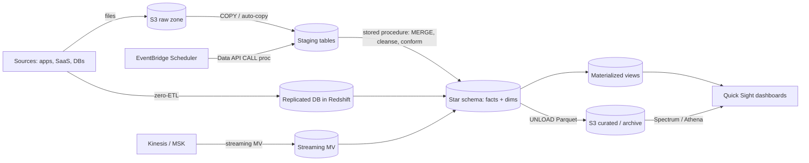

# 24 · Amazon Redshift Loading, Integration & Sharing — the loading docks, the side doors and the glass walls

> **Exam map:** D1 · Task 1.1, 1.2 — D2 · Task 2.1, 2.3 — D3 · Task 3.1 — D4 · Task 4.5 · **Skills:** 1.1.1, 1.1.2, 1.2.5, 2.1.5, 2.3.1, 3.1.4, 4.5.1 · **Weight:** 🔥🔥🔥 High · **Read time:** ~24 min

## The idea

Back to the distribution center from [Guide 23](23-Redshift-Architecture-Table-Design.md). The building is only useful if goods move in and out efficiently, and Redshift gives you several ways to do that:

- **Loading docks (COPY)**: trucks full of files back up to the building, and **every worker (slice) unloads a truck at the same time**. Send one giant truck and only one worker gets to unload it. Send many similar-sized trucks and every dock is busy. **UNLOAD** is the same dock run in reverse.
- **A conveyor belt from the street (streaming ingestion)**: parcels from Amazon Kinesis Data Streams or Amazon MSK roll straight onto a shelf, with no truck and no parking lot (S3) in between.
- **Pipes from the neighbours (zero-ETL)**: your operational databases pump changes straight into the warehouse. Nobody drives anything.
- **Windows onto other buildings**: **Redshift Spectrum** looks through a window at the S3 data lake, and **federated query** looks at a live Aurora/RDS database. You query the goods where they sit and don't move them.
- **Glass walls (data sharing)**: other teams' warehouses see your live shelves through glass. They bring their own workers (compute), but there's only one copy of the goods.
- **The phone line (Redshift Data API)**: Lambda or Step Functions calls in an order over HTTPS without having to keep a connection open.

This guide lets you crack the exam's favourite Redshift ingestion and integration questions: **why a load is slow**, **upserts**, **continuous file loading**, **archiving to S3**, **Spectrum vs federated vs zero-ETL vs COPY**, **near-real-time streams into Redshift**, **materialized views**, **cross-account sharing** and **serverless orchestration of SQL**.

## COPY: the loading dock

`COPY` is the **fast, parallel bulk-load path** into Redshift. It reads from **Amazon S3** (the usual source), **Amazon DynamoDB**, **Amazon EMR** (HDFS output), or **remote hosts over SSH**.

```sql
-- Columnar source: Redshift splits the work across slices for you
COPY staging.orders
FROM 's3://amzn-s3-demo-bucket/orders/dt=2026-09-26/'
IAM_ROLE 'arn:aws:iam::123456789012:role/RedshiftLoadRole'
FORMAT AS PARQUET;

-- Compressed CSV from an explicit list of files (manifest), tolerate a few bad rows
COPY staging.customers
FROM 's3://amzn-s3-demo-bucket/manifests/customers-2026-09-26.manifest'
IAM_ROLE default
FORMAT AS CSV GZIP IGNOREHEADER 1
MANIFEST
MAXERROR 10
COMPUPDATE OFF STATUPDATE ON;
```

### The parallel-load rules

1. **Many files, not one.** A single *non-splittable* file (such as one big `.gz`) is loaded **serially by one slice**. Split it into **multiple files of similar size, 1 MB–1 GB each after compression**, and make the **file count a multiple of the number of slices** so every slice gets an equal share.
2. **Splittable sources are split for you.** **Uncompressed CSV** and **Parquet/ORC** files of **128 MB or more** are automatically split into chunks. Columnar files under 128 MB aren't split. Parquet/ORC also carry their own schema and compress well, so they're the best source format.
3. **Compress row files**: GZIP, LZOP, BZIP2 or ZSTD cut transfer time. Declare the codec in COPY.
4. **One COPY per table per batch.** Point it at a **prefix or manifest** that covers all the files.

**THE trap (row-by-row):** looping `INSERT INTO … VALUES (…)` from an application, one row per statement, is the slowest possible way to load Redshift. Every statement is a tiny commit that runs through the leader node. Batch the data into files and **COPY** them. For the rare small insert, use a multi-row `INSERT` or `INSERT INTO … SELECT`.

**THE trap (concurrent COPYs):** firing **10 COPY commands at the same table at once**, one per file, looks parallel, but the loads **serialize** on the table and each one pays commit overhead. The fix is **one COPY with all 10 files** (prefix or manifest), which Redshift parallelises across slices.

### Options that show up in questions

| Option | What it does |
|---|---|
| `IAM_ROLE 'arn…'` / `IAM_ROLE default` | Role the cluster/namespace assumes to read S3 (don't embed access keys) |
| `FORMAT AS CSV \| JSON \| AVRO \| PARQUET \| ORC` | Source format. **JSON `'auto'`** maps keys to column names, and a **JSONPaths file** maps nested fields explicitly |
| `MANIFEST` | Load an **exact list of files**, including files from **multiple buckets/prefixes**. `"mandatory": true` fails the load if a file is missing. Stops a prefix from picking up stray files |
| `GZIP / LZOP / BZIP2 / ZSTD` | Input compression |
| `MAXERROR n` | Tolerate up to n bad rows before failing |
| `COMPUPDATE` | Automatic compression analysis on an **empty** target. Turn it **OFF** for repeated staging loads to save time |
| `STATUPDATE` | Refresh optimizer statistics after the load |
| `ACCEPTINVCHARS`, `TRUNCATECOLUMNS`, `DATEFORMAT/TIMEFORMAT` | Cope with messy text data |
| `NOLOAD` | Validate the files without loading them |
| `READRATIO n` (DynamoDB) | Caps the percentage of the table's provisioned read capacity the COPY may consume, protecting production traffic |
| `REGION 'x'` | S3 bucket in a different Region |

**Where did my load fail?** Query **`SYS_LOAD_ERROR_DETAIL`** (works on provisioned *and* Serverless) or **`STL_LOAD_ERRORS`** (provisioned). They show the file, line, column and reason. `SYS_LOAD_HISTORY` / `STL_LOAD_COMMITS` show what was loaded.

> ⚠️ **2026 status:** **Client-side encryption for COPY/UNLOAD** (`MASTER_SYMMETRIC_KEY`) closed to new customers on **30 April 2025** and stopped working entirely after **30 April 2026**. Use **server-side encryption** (SSE-S3 / SSE-KMS). Older questions may still show the client-side option as an answer.

## Upserts: MERGE or the staging-table pattern

COPY only *appends*. To apply changes (update the rows that exist, insert the new ones), load into a **staging table** first:

```sql
-- Option 1: MERGE (standard SQL upsert)
MERGE INTO public.orders
USING staging.orders s
ON public.orders.order_id = s.order_id
WHEN MATCHED THEN UPDATE SET status = s.status, amount = s.amount, updated_at = s.updated_at
WHEN NOT MATCHED THEN INSERT VALUES (s.order_id, s.customer_id, s.status, s.amount, s.updated_at);

-- Option 2: classic delete-then-insert, atomic in one transaction
BEGIN;
DELETE FROM public.orders USING staging.orders s WHERE public.orders.order_id = s.order_id;
INSERT INTO public.orders SELECT * FROM staging.orders;
END;
```

MERGE facts that matter:

- **A target row may not match more than one source row.** If it does, MERGE errors with *"multiple matches"*, so **deduplicate the staging data first**.
- The **`REMOVE DUPLICATES`** simplified mode (source and target with identical column layouts) is faster than the full WHEN MATCHED / WHEN NOT MATCHED form.
- The target can't be an external table. The source can be a table, view, subquery or Spectrum table.
- If both tables are large, distributing both on the match column speeds it up.

**`ALTER TABLE target APPEND FROM staging`** *moves* blocks from staging into the target instead of copying rows. It's a fast way to publish an append-only batch. General SQL patterns (SCD2, dedup) are in [Guide 34](34-SQL-for-Data-Engineers.md).

## Auto-copy: continuous file ingestion from S3

When files keep landing in a prefix, you don't need Lambda or cron. Create an **S3 event integration** (bucket → warehouse, same Region), then define a **COPY JOB** once:

```sql
COPY public.clickstream
FROM 's3://amzn-s3-demo-bucket/clickstream/'
IAM_ROLE 'arn:aws:iam::123456789012:role/RedshiftLoadRole'
FORMAT AS PARQUET
JOB CREATE clickstream_autocopy
AUTO ON;
```

Redshift then **detects new objects, batches them into COPY runs and tracks which files it has loaded**, so it doesn't load the same file twice. Monitor with `SYS_COPY_JOB`, `SYS_COPY_JOB_DETAIL` and `SYS_LOAD_HISTORY`. Limits to know: up to **200 COPY JOBs per cluster/workgroup**, and the bucket **can't already have an `s3:ObjectCreated` event notification** covering that scope. Signal: *"automatically load new files as they arrive in S3 with the least operational overhead"* → **auto-copy (COPY JOB)**. The older answer was *S3 event → Lambda → Data API COPY*, which still works but takes more effort.

## UNLOAD: the dock in reverse (skill 2.3.1)

`UNLOAD` writes a query result to S3, **in parallel by default**. **Each slice writes one or more files**, named `<prefix><slice>_part_<n>`.

```sql
UNLOAD ('SELECT * FROM public.orders WHERE order_date < ''2025-01-01''')
TO 's3://amzn-s3-demo-bucket/archive/orders/'
IAM_ROLE 'arn:aws:iam::123456789012:role/RedshiftUnloadRole'
FORMAT AS PARQUET
PARTITION BY (order_year)
MAXFILESIZE 256 MB
ENCRYPTED KMS_KEY_ID '1234abcd-12ab-34cd-56ef-1234567890ab'
CLEANPATH;
```

| Option | Know this |
|---|---|
| `PARALLEL ON` (default) / `OFF` | OFF writes **serially** in ORDER BY order, still split at **6.2 GB** per file. Keep ON for speed |
| `FORMAT AS PARQUET \| CSV \| JSON` | Default is pipe-delimited text. **Parquet** is up to 2x faster to unload and up to 6x smaller, and Athena/Spectrum/EMR/Glue can read it straight away |
| `PARTITION BY (col) [INCLUDE]` | Hive-style folders (`year=2024/`) for partition pruning later. **UNLOAD doesn't register partitions**: add them to the Glue Data Catalog with a crawler, `ALTER TABLE ADD PARTITION` or `CREATE EXTERNAL TABLE` |
| `MAXFILESIZE` | **5 MB–6.2 GB**, default **6.2 GB** |
| `MANIFEST [VERBOSE]` | Writes a JSON list of the files produced (ready for a later COPY) |
| Encryption | Output is **SSE-S3 by default**. `ENCRYPTED KMS_KEY_ID` gives SSE-KMS, and `ENCRYPTED AUTO` uses the bucket's default KMS key |
| `ALLOWOVERWRITE` / `CLEANPATH` | Overwrite files, or delete the target prefix first (you can't combine the two) |
| Compression | `GZIP / BZIP2 / ZSTD` for text formats. Parquet uses Snappy internally |

**Archive pattern ("hot in Redshift, cold in the lake"):** UNLOAD old rows to partitioned Parquet in S3 → define a Spectrum external table over it → `DELETE` those rows (and let VACUUM reclaim space) → a **late-binding view** `UNION ALL`s hot and cold data so users see a single table. S3 Lifecycle can then move the archive to cheaper storage classes ([Guide 31](31-Data-Lifecycle-Retention-Resiliency.md)).

## Redshift Spectrum: a window onto the data lake

**Spectrum** queries files in **S3 in place** (Parquet, ORC, JSON, CSV, Avro, and open table formats such as Iceberg) as **external tables**. Their metadata lives in the **AWS Glue Data Catalog** ([Guide 13](13-Glue-Data-Catalog-Crawlers.md)). On RA3/DC2 the scan runs on a **separate, AWS-managed Spectrum fleet**, and filters and aggregations are **pushed down** there. Only the reduced results reach your cluster, where they can be **joined with local tables**.

```sql
CREATE EXTERNAL SCHEMA lake
FROM DATA CATALOG DATABASE 'sales_lake'
IAM_ROLE 'arn:aws:iam::123456789012:role/RedshiftSpectrumRole'
CREATE EXTERNAL DATABASE IF NOT EXISTS;

SELECT c.segment, SUM(e.amount)
FROM lake.web_events e                -- S3, partitioned by dt
JOIN public.dim_customer c ON c.customer_key = e.customer_key
WHERE e.dt BETWEEN '2026-09-01' AND '2026-09-26'   -- partition pruning
GROUP BY c.segment;
```

- **Cost:** on provisioned clusters Spectrum is billed **per TB of S3 data scanned** (the same model as Athena). Cut the bill with **Parquet/ORC, compression and partitions**, exactly as in [Guide 26](26-Amazon-Athena.md). On **Serverless** it's simply **RPU time**, with no per-TB fee.
- **Same Region:** on RA3/DC2 the S3 data must be in the **same Region** as the cluster. RG's integrated engine removes that restriction ([Guide 23](23-Redshift-Architecture-Table-Design.md)).
- **Governance:** when the Glue catalog is managed by **AWS Lake Formation**, Spectrum **enforces Lake Formation grants**, including column- and row-level filters ([Guide 40](40-Lake-Formation.md)).
- Views over external tables must be **late-binding** (`WITH NO SCHEMA BINDING`).
- Signal: *"query S3 data from Redshift without loading it"*, *"join the data lake with warehouse tables"*, *"extend the warehouse to infrequently accessed history"* → **Spectrum**.

## Federated query: a window onto live operational databases

**Federated query** lets Redshift query **Amazon RDS / Aurora PostgreSQL** and **RDS / Aurora MySQL** *live*. The leader node fetches metadata, and compute nodes send sub-queries with **predicates pushed down** to the source.

```sql
CREATE EXTERNAL SCHEMA ops
FROM POSTGRES                         -- or FROM MYSQL
DATABASE 'orders' SCHEMA 'public'
URI 'orders-db.cluster-abc123example.us-east-1.rds.amazonaws.com' PORT 5432
IAM_ROLE 'arn:aws:iam::123456789012:role/RedshiftFederatedRole'
SECRET_ARN 'arn:aws:secretsmanager:us-east-1:123456789012:secret:orders-db-readonly';
```

Credentials come from **AWS Secrets Manager**, and the network path must allow Redshift to reach the database (VPC routing plus security groups). Use it to **join today's live operational rows with warehouse history**, or for a small `INSERT INTO … SELECT` ELT pull, all without building a pipeline. **Don't** use it for bulk replication of large tables: it loads the production database, and it's the wrong tool for moving terabytes. Use **zero-ETL**, DMS or snapshot export for that.

## Streaming ingestion: the conveyor belt (skill 1.1.1)

Redshift can **consume Kinesis Data Streams or Amazon MSK (and other Kafka) directly** into a **streaming materialized view**. There's **no Firehose and no S3 staging**, and latency is typically seconds. The warehouse *is* the stream consumer.

```sql
-- Kinesis Data Streams
CREATE EXTERNAL SCHEMA kds
FROM KINESIS
IAM_ROLE 'arn:aws:iam::123456789012:role/RedshiftStreamingRole';

CREATE MATERIALIZED VIEW mv_clicks AUTO REFRESH YES AS
SELECT approximate_arrival_timestamp,
       partition_key,
       shard_id,
       sequence_number,
       JSON_PARSE(kinesis_data) AS payload      -- VARBYTE -> SUPER
FROM kds."clickstream-events"
WHERE CAN_JSON_PARSE(kinesis_data);

-- Amazon MSK
CREATE EXTERNAL SCHEMA msk
FROM MSK
IAM_ROLE 'arn:aws:iam::123456789012:role/RedshiftStreamingRole'
AUTHENTICATION iam
CLUSTER_ARN 'arn:aws:kafka:us-east-1:123456789012:cluster/orders-cluster/abcd1234-example';

CREATE MATERIALIZED VIEW mv_orders AUTO REFRESH YES AS
SELECT kafka_partition, kafka_offset, kafka_timestamp,
       JSON_PARSE(kafka_value) AS payload
FROM msk."orders-topic"
WHERE CAN_JSON_PARSE(kafka_value);
```

Facts to hold on to:

- **Manual refresh is the default.** Add `AUTO REFRESH YES` for continuous ingestion.
- The first refresh starts at **TRIM_HORIZON** (Kinesis) or **offset 0** (MSK).
- Records land as **VARBYTE**. Up to **16 MiB** per record for Kafka (Kinesis itself caps records at 10 MiB).
- **Best practice: `JSON_PARSE` into SUPER and query with PartiQL** afterwards. Shredding with many `JSON_EXTRACT_PATH_TEXT` calls re-parses every record per column and adds latency.
- The view must be **incrementally refreshable**. **Joins aren't allowed** inside a streaming MV, so build a second MV or view on top of it to join.
- **Create one streaming MV per stream/topic.** Each MV is a separate consumer, and several can throttle the stream.
- KPL-aggregated records aren't de-aggregated. Redshift guarantees **exactly-once** processing per record (by shard/sequence number or partition/offset).
- Signal: *"near real-time analytics in Redshift on Kinesis/MSK data with the least latency and fewest components"* → **streaming ingestion**. If the question needs S3 archival as well, or transformation via Lambda, **Firehose → Redshift** (which stages in S3 and uses COPY, [Guide 07](07-Amazon-Data-Firehose.md)) is the answer.

## Zero-ETL integrations: pipes from the neighbours

A **zero-ETL integration** is a **fully managed replication pipeline** from a source into Redshift: an initial full load, then **continuous change replication within seconds**, with nothing for you to build or operate. Sources as of 2026:

- **Aurora MySQL, Aurora PostgreSQL, RDS for MySQL, RDS for PostgreSQL, RDS for Oracle, Oracle Database@AWS**
- **Amazon DynamoDB**
- **Applications** via AWS Glue zero-ETL: Salesforce, SAP, ServiceNow, Zendesk, Meta/Instagram ads and others
- **Self-managed** MySQL, PostgreSQL, SQL Server and Oracle

The target is a provisioned **RA3/RG** cluster or **Serverless**. You create a **destination database from the integration**, and its replicated tables are **read-only**. Build MVs and views on top, or share them. Options include a **refresh interval** (trade freshness for cost) and **history mode** (keep changed and deleted row versions for SCD-style analysis). The source-side mechanics (DMS comparisons, when zero-ETL isn't possible) are in [Guide 10](10-DMS-Database-Ingestion.md).

**Which "get operational data into Redshift" answer?**

| Requirement | Answer |
|---|---|
| Near-real-time copy of an Aurora/RDS/DynamoDB database, **least operational overhead** | **Zero-ETL integration** |
| Occasional **live** lookup/join against current operational rows, no copy | **Federated query** |
| Replicate from an unsupported engine, or transform heavily in flight | **AWS DMS** (CDC) or Glue ETL |
| Data already in S3, query it without loading | **Spectrum** |
| Batch files arriving in S3, load them | **COPY** / **auto-copy** |
| Kinesis/MSK events, seconds of latency | **Streaming ingestion** |

## Materialized views (skill 2.1.5)

A **materialized view (MV)** stores a query's **precomputed result** so that repeated dashboards read the stored answer instead of re-joining billions of rows.

```sql
CREATE MATERIALIZED VIEW mv_daily_revenue
AUTO REFRESH YES
AS
SELECT d.cal_date, c.segment, SUM(f.amount) AS revenue, COUNT(*) AS orders
FROM fact_sales f
JOIN dim_date d     ON d.date_key = f.date_key
JOIN dim_customer c ON c.customer_key = f.customer_key
GROUP BY d.cal_date, c.segment;

REFRESH MATERIALIZED VIEW mv_daily_revenue;   -- on demand
```

- **Refresh:** **incremental** where the query shape allows it (only changes since the last refresh are processed). Otherwise Redshift does a **full recompute**. `AUTO REFRESH YES` lets Redshift refresh in the background when base tables change and resources allow. It isn't instant, so schedule or call `REFRESH` when you need a guarantee.
- **Automatic query rewrite:** queries written against the **base tables** can be transparently redirected to an up-to-date MV. BI tools benefit without changing their SQL.
- **Automated MVs:** Redshift can create and maintain MVs on its own for repeated query patterns.
- **MVs can be built on external (Spectrum) tables, on datashare objects (on the consumer), on zero-ETL tables, and on other MVs** (a cascading refresh).
- MV vs regular view: a view stores only SQL and recomputes every time, while an MV stores results that go stale until refreshed. MV vs a CTAS table: an MV knows its lineage and can refresh incrementally.

## Data sharing: glass walls (skill 4.5.1)

**Data sharing** gives other warehouses **live, transactionally consistent access to your data without copying it**. The **producer** owns the data. **Consumers** query it with **their own compute**, which gives workload isolation and chargeback for free. Sharing works between **provisioned RA3/RG clusters and Serverless**, in any combination, across **AZs, accounts and Regions**. DC2 isn't supported. Shareable objects include **schemas, tables, views (regular, late-binding and materialized) and SQL UDFs**.

```sql
-- PRODUCER
CREATE DATASHARE sales_share;
ALTER DATASHARE sales_share ADD SCHEMA sales;
ALTER DATASHARE sales_share ADD ALL TABLES IN SCHEMA sales;
GRANT USAGE ON DATASHARE sales_share TO NAMESPACE 'c3d4e5f6-consumer-namespace-guid';  -- same account
GRANT USAGE ON DATASHARE sales_share TO ACCOUNT '210987654321';                        -- cross-account

-- CONSUMER (after association for cross-account)
CREATE DATABASE sales_db
FROM DATASHARE sales_share OF ACCOUNT '123456789012' NAMESPACE 'a1b2c3d4-producer-namespace-guid';
GRANT USAGE ON DATABASE sales_db TO ROLE bi_analyst;
SELECT * FROM sales_db.sales.orders;
```

| Scenario | Steps |
|---|---|
| **Same account** | Producer grants the datashare to the consumer **namespace**. Consumer runs `CREATE DATABASE … FROM DATASHARE` |
| **Cross-account** | Producer grants to the **account**. A producer admin **authorizes** the share (console/CLI). A **consumer-account admin associates** it with namespaces. Then `CREATE DATABASE … FROM DATASHARE` |
| **Cross-Region** | Same flow. **Cross-Region data transfer is charged** (on Serverless you can cap it with a usage limit) |
| **Lake Formation-managed datashare** | The share is published to the Glue Data Catalog, and **Lake Formation** centrally governs who sees which tables/columns/rows ([Guide 40](40-Lake-Formation.md)) |
| **Writes (multi-warehouse writes)** | Producer grants `INSERT`/`UPDATE`/`DELETE` on shared objects (and `CREATE` on schemas). Consumers **write back** and commits are visible to all warehouses immediately |
| **AWS Data Exchange for Redshift** | Producer creates a datashare **managed by AWS Data Exchange** and lists it as a **licensed product**. Subscribers query live data once they subscribe, and billing and entitlement are handled by ADX ([Guide 46](46-GapFill-Services.md)) |

**THE trap:** *"Give the analytics team's cluster access to production tables without affecting ETL performance or copying data"*. UNLOAD → COPY into the other cluster, or restoring snapshots, creates stale copies. **Data sharing** is live and uses the consumer's compute. Broader sharing patterns (data mesh, SageMaker Catalog subscriptions) are in [Guide 41](41-SageMaker-Unified-Studio-Catalog-Governance.md).

## Redshift Data API: the phone line

The **Data API** runs SQL over **HTTPS**, **asynchronously**, with **no JDBC/ODBC drivers, no connection pools and no VPC connectivity** to manage. That makes it the natural choice from **Lambda, Step Functions, EventBridge, SageMaker notebooks** or any SDK.

| Call | Purpose |
|---|---|
| `ExecuteStatement` | Run one SQL statement. Returns a statement **Id** right away |
| `BatchExecuteStatement` | Run several statements as **one transaction** |
| `DescribeStatement` | Poll the status (SUBMITTED/STARTED/FINISHED/FAILED) |
| `GetStatementResult` | Fetch the result rows (paginated) |
| `ListStatements`, `CancelStatement` | Housekeeping |

- **Auth:** an **AWS Secrets Manager secret** (`SecretArn`), or **temporary IAM credentials**: `DbUser` on provisioned (via GetClusterCredentials), or your IAM identity on Serverless. There are no passwords in code.
- **Results are kept for 24 hours**, so fetch them within that window.
- `WithEvent=true` publishes an **EventBridge event when the statement finishes**, so there's no polling loop.
- Step Functions has a direct Data API integration ([Guide 20](20-Step-Functions.md)). MWAA has Redshift Data operators ([Guide 21](21-MWAA-Glue-Workflows.md)).

## Stored procedures, scheduling and tooling

- **Stored procedures** (`CREATE PROCEDURE … LANGUAGE plpgsql`, run with `CALL`) package ELT logic in the database: loops, conditionals, dynamic SQL, **COMMIT/ROLLBACK inside the procedure**, `SECURITY DEFINER` to run with the owner's rights. Good for *"transform in the warehouse with SQL, least moving parts"*.
- **Scheduling:** **Query Editor v2 scheduled queries** (EventBridge plus the Data API under the hood), or your own **EventBridge Scheduler rule → Data API**, or Step Functions/MWAA for multi-step DAGs.
- **Query Editor v2:** browser SQL client with notebooks, charts, saved/shared queries and scheduling. It includes **Amazon Q generative SQL** (natural language → SQL suggestions based on your schema, [Guide 19](19-GenAI-LLMs-Vectors.md)).
- **UDFs:** SQL UDFs and **Lambda UDFs** (call external code or services from SQL).
- **Redshift ML** (one paragraph, since ML is out of exam scope): `CREATE MODEL` trains a model through Amazon SageMaker AI from a SQL query and exposes a **SQL inference function**. Redshift can also register **Amazon Bedrock LLMs** as SQL functions to summarise or classify text inside a query ([Guide 19](19-GenAI-LLMs-Vectors.md)).

> ⚠️ **2026 status:** **Python UDFs** (`LANGUAGE plpythonu`) reached **end of support after 30 June 2026**, with enforcement in phases. Migrate them to **Lambda UDFs** or SQL UDFs. If an older question offers a Python UDF as the answer, treat it as legacy.

## Reference ELT flow



## Question patterns

> *"A nightly job loads a single 80 GB gzip CSV file into Redshift with one COPY command, and it takes hours. How can load time be reduced?"* → **Split the file into many similar-sized compressed files (1 MB–1 GB each, a multiple of the slice count) and load them with one COPY** (a single gzip file can't be split, so one slice does all the work; resizing the cluster wouldn't help).

> *"A microservice writes each order to Redshift with an individual INSERT statement, and the cluster struggles as volume grows. MOST efficient ingestion design?"* → **Buffer records into S3 files (for example, Firehose or micro-batches) and COPY them in bulk** (row-by-row inserts are the classic anti-pattern).

> *"Ten Lambda functions each run COPY for their own file into the same table concurrently, and loads are slower than expected."* → **Use a single COPY with a prefix or manifest covering all files** (concurrent COPYs into one table serialize).

> *"CDC files containing new and changed customer rows arrive hourly and must be applied to a Redshift dimension table."* → **COPY into a staging table, dedupe, then MERGE (or DELETE + INSERT in one transaction)**. COPY alone would duplicate the changed rows.

> *"New Parquet files land in an S3 prefix throughout the day and must be loaded into Redshift automatically, without custom code, and without loading any file twice."* → **Auto-copy: an S3 event integration plus COPY JOB … AUTO ON** (tracks loaded files; the Lambda + Data API approach is more overhead).

> *"Transactions older than 2 years are rarely queried, but must remain queryable with SQL at the lowest cost."* → **UNLOAD to partitioned Parquet in S3, delete from Redshift, query with Spectrum through a late-binding view that UNIONs hot and cold data.**

> *"Analysts need to join a 200 TB clickstream dataset in S3 (Parquet, Glue catalog) with Redshift dimension tables without loading the data."* → **Redshift Spectrum external schema from the Data Catalog** (partition pruning plus columnar format keep the bytes scanned, and so the cost, down).

> *"A report must combine warehouse history with the current status of orders in Aurora PostgreSQL at query time. No pipeline should be built."* → **Federated query** (live, predicate pushdown, credentials in Secrets Manager). Not suited to bulk-copying the whole database.

> *"Replicate an Aurora MySQL OLTP database into Redshift continuously, with seconds of latency and the LEAST operational overhead."* → **Aurora zero-ETL integration with Redshift** (DMS CDC works but means running replication instances and tasks; federated query doesn't replicate).

> *"IoT telemetry flows through Kinesis Data Streams. Operations needs dashboards in Redshift with the lowest latency and no intermediate storage."* → **Redshift streaming ingestion: external schema FROM KINESIS + materialized view with AUTO REFRESH YES, JSON_PARSE into SUPER** (Firehose adds buffering and S3 staging).

> *"A streaming materialized view built with 25 JSON_EXTRACT_PATH_TEXT columns shows high ingestion latency."* → **JSON_PARSE the payload into a SUPER column and extract fields with PartiQL in downstream views** (each JSON_EXTRACT_PATH_TEXT call re-parses the record).

> *"A dashboard runs the same five-table aggregation every minute and times out. The underlying data changes hourly."* → **Materialized view with AUTO REFRESH (incremental), relying on automatic query rewrite** (no BI change needed; bigger clusters only brute-force it).

> *"The data science team in another AWS account needs read access to live production tables without copying data or impacting the ETL cluster's performance."* → **Cross-account datashare**: the producer grants USAGE to the account and authorizes it, the consumer admin associates it and creates a database from it. Consumer compute runs their queries.

> *"A company wants to sell subscription access to its curated Redshift datasets, with AWS handling entitlements and billing."* → **AWS Data Exchange for Amazon Redshift (ADX-managed datashare)**.

> *"A Lambda function must run a Redshift stored procedure after each Glue job, without managing drivers, VPC connections or database passwords."* → **Redshift Data API ExecuteStatement with a Secrets Manager secret (or IAM temporary credentials), plus WithEvent for completion via EventBridge.**

> *"Business users should run a Redshift transformation procedure every night at 02:00 with no additional infrastructure."* → **Query Editor v2 scheduled query** (or EventBridge Scheduler → Data API `CALL`). A cron EC2 instance is unnecessary overhead.

## Pocket card

| Keyword / signal | Answer |
|---|---|
| Fastest bulk load | COPY from S3 (never row-by-row INSERT) |
| One big gzip file loads slowly | Split into equal files, 1 MB–1 GB compressed, count = multiple of slices |
| Auto-split sources | Uncompressed CSV and Parquet/ORC ≥128 MB |
| Many concurrent COPYs to one table | One COPY with a prefix/manifest |
| Exact file list / multiple buckets | MANIFEST |
| JSON key → column mapping | FORMAT AS JSON 'auto' (or a JSONPaths file) |
| Load errors | SYS_LOAD_ERROR_DETAIL / STL_LOAD_ERRORS, MAXERROR |
| COPY from DynamoDB | READRATIO caps read-capacity use |
| Upsert | Staging + MERGE (dedupe first) or DELETE+INSERT in one transaction |
| MERGE "multiple matches" error | Duplicate keys in source. Dedupe |
| Continuous S3 file loading, no code | Auto-copy: S3 event integration + COPY JOB AUTO ON |
| Export / archive to lake | UNLOAD … FORMAT PARQUET PARTITION BY |
| UNLOAD default | Parallel, files per slice, SSE-S3, 6.2 GB max file |
| UNLOAD with your key | ENCRYPTED KMS_KEY_ID |
| Partitions after UNLOAD | Register them yourself (crawler / ALTER TABLE ADD PARTITION) |
| Query S3 in place from Redshift | Spectrum (external schema FROM DATA CATALOG) |
| Spectrum cost | Per TB scanned (provisioned), RPU time (Serverless). Use Parquet + partitions |
| Spectrum + governance | Lake Formation permissions enforced |
| Live query of RDS/Aurora PostgreSQL/MySQL | Federated query + Secrets Manager |
| Continuous DB replication, least ops | Zero-ETL integration (Aurora, RDS incl. Oracle, DynamoDB, SaaS, self-managed) |
| Kinesis/MSK → Redshift, lowest latency | Streaming ingestion MV, AUTO REFRESH YES, JSON_PARSE → SUPER |
| Stream + S3 archive + transform | Firehose → Redshift (via S3 + COPY) |
| Repeated heavy aggregation | Materialized view (incremental refresh, auto query rewrite) |
| Live data to another cluster/account, no copy | Data sharing (producer grants, consumer creates database) |
| Cross-account datashare steps | Grant to account → authorize → consumer associates |
| Consumer writes back | Multi-warehouse writes (grant INSERT/UPDATE on the share) |
| Sell/license Redshift data | AWS Data Exchange datashare |
| SQL from Lambda/Step Functions, no drivers | Redshift Data API (results kept 24 h, WithEvent → EventBridge) |
| ELT logic in-database | Stored procedure (PL/pgSQL) + schedule |
| Natural language → SQL | Amazon Q generative SQL in Query Editor v2 |
| Python UDF | End of support after 30 June 2026 → Lambda UDF |
| Client-side encryption for COPY/UNLOAD | Gone after 30 April 2026 → SSE-S3/SSE-KMS |

Once the data is in and shared, the next job is keeping it fast, safe and recoverable: [Guide 25 — Redshift Performance, Operations & Security](25-Redshift-Performance-Operations-Security.md).
