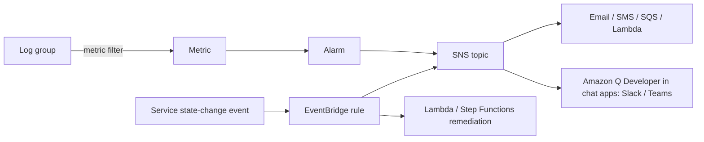

# 32 · Monitoring, Logging & Troubleshooting — the pipeline's intensive-care ward

> **Exam map:** D1 · Task 1.3, 1.4 — D3 · Task 3.3 · **Skills:** 3.3.2, 3.3.3, 3.3.4, 3.3.6, 3.3.7, 3.3.8, 1.3.4, 1.4.4 · **Weight:** 🔥🔥🔥 High · **Read time:** ~18 min

## The idea

Picture a hospital ward at night. Each patient has a **vital-signs monitor** showing a few numbers, and a **chart** holding the detailed story. When a number crosses a red line, a **bedside alarm** sounds and the doctor's **pager** buzzes. The nurses' station has a **wall of screens** covering every bed, and the doctor carries a **diagnosis flowchart**: symptom → cause → treatment.

Your pipelines are the patients. **Amazon CloudWatch metrics** are the vital signs (IteratorAge, worker utilization, queue time). **CloudWatch Logs** is the chart: everything a Glue job, Lambda function or Airflow task wrote. **Alarms** are the red lines. **Amazon SNS** (Simple Notification Service), **Amazon EventBridge** and chat integrations are the pager. **Dashboards** and **Amazon Managed Grafana** are the nurses' station, and the playbook tables at the end are the flowchart. "Who called which API" (CloudTrail) and "what did the config look like" (AWS Config) are audit topics in [Guide 43](43-Audit-Logging-CloudTrail-Config.md).

This guide lets you crack questions on: which metric exposes a lagging consumer, how to alert on text in logs, why the log bill keeps growing, where each data service puts its logs, how to centralize logs across accounts, and what to fix when Glue, EMR, Kinesis, Firehose, Lambda, Redshift, Step Functions or DMS misbehaves.

## CloudWatch metrics & alarms

A **metric** is identified by a **namespace** (`AWS/Kinesis`, `Glue`, or your own `AnyCompany/Pipeline`), a name and up to **30 dimensions**. Every dimension combination is a separate metric, and metrics are **Regional**.

| Fact | Value |
|---|---|
| Resolution | Standard **1 min** (AWS default). **High resolution 1 s** for custom metrics, with alarms at **10 s / 30 s** periods |
| Retention | < 60 s data **3 h** · 1-min **15 days** · 5-min **63 days** · 1-h **15 months**. Metrics can't be deleted; they expire |
| Custom metrics | **`PutMetricData`** API, or **Embedded Metric Format (EMF)**: JSON log lines with an `_aws` block that CloudWatch turns into metrics asynchronously, with no API calls (Powertools Metrics does this) |
| CloudWatch agent | Adds **memory, disk and process metrics** and ships log files from EC2/on-premises. **THE trap:** EC2 memory is *never* a default metric; detailed monitoring won't add it |
| Metric math / Metrics Insights | Derived series (`100*Errors/Invocations`) and SQL-like queries across many metrics; both can be alarmed on |
| Dashboards | Cross-account and cross-Region capable; priced per dashboard per month |

| Alarm | Watches | Signal |
|---|---|---|
| **Static threshold** | Metric or math expression, **M of N datapoints** | *"IteratorAge > 60 s for 5 min"* |
| **Anomaly detection** | ML band that learns daily/weekly seasonality | *"volume varies by hour; avoid hand-tuned thresholds"* |
| **Composite** | Boolean rule over other alarms | *"reduce alert noise; page only when errors AND latency are bad"* |

**Actions:** **SNS**, **EC2 Auto Scaling**, EC2 actions, **Lambda invoked directly** (since Dec 2023), Systems Manager OpsItems/incidents. Composite alarms can notify but **can't** take EC2 or Auto Scaling actions. **Missing-data treatment** (`missing`/`notBreaching`/`breaching`/`ignore`) matters for batch jobs. **THE trap:** *"alert if the nightly job did NOT run"*: a metric that never arrives leaves the alarm in INSUFFICIENT_DATA. Treat missing data as **breaching**, or use EventBridge state events.

## CloudWatch Logs — configuration & automation (skill 3.3.7)

The structure is **log group** (settings live here) → **log streams** (one per instance, container or run) → **events** (up to **1 MB** each).

**Retention is THE cost trap.** The default is **"Never expire,"** and Lambda, Glue and API Gateway auto-create log groups that grow forever. The fix is a **retention policy** (1 day to 10 years), automated:
- Pre-create log groups in **IaC** (`AWS::Logs::LogGroup` + `RetentionInDays`, CDK `logRetention`) before the service creates them.
- Sweep existing groups with `PutRetentionPolicy`, or run an EventBridge rule on the `CreateLogGroup` CloudTrail event → Lambda.
- For long-term audit retention, keep CloudWatch retention short and **stream the logs to S3** with S3 lifecycle rules.

**Encryption:** logs are always encrypted at rest. For your own key, **associate a KMS customer managed key** with the log group; the key policy must allow the Regional CloudWatch Logs principal.

**Log classes** are chosen at creation and **can't be changed**:

| | Standard | Infrequent Access |
|---|---|---|
| Ingestion price | Full | About **half** (storage and Insights are the same) |
| Logs Insights, KMS, export to S3, cross-account, PII masking | Yes | Yes |
| **Metric filters, subscription filters, Live Tail, EMF, anomaly detection** | Yes | **No** |

**THE trap:** Infrequent Access plus "alarm on log patterns" or "stream logs in real time" is impossible. (A separate **Delivery** class exists only for Lambda logs routed straight to S3/Firehose, with a fixed 2-day retention.)

**Metric filters → alarms.** A pattern (`{ $.level = "ERROR" }` or `"OutOfMemoryError"`) increments a custom metric that you alarm on. You get **up to 100 per log group**, and they apply only to data ingested after creation.

**Subscription filters** send a real-time feed (**base64 + gzip**, usually within minutes) to **Kinesis Data Streams, Amazon Data Firehose (formerly Kinesis Data Firehose), Lambda or OpenSearch Service**:
- **Up to 5 per log group** (older material says 1 or 2), **Standard class only**, at-least-once delivery, retries for up to 24 h.
- **Cross-account:** the receiving account creates a **destination** (in front of KDS or Firehose) with a **destination policy**.
- **Account-level subscription policy:** `PutAccountPolicy` type `SUBSCRIPTION_FILTER_POLICY` (**one per Region**) covers every log group. Use **selection criteria** to exclude the delivery pipeline's own log groups, or you get **infinite recursion** and a runaway bill.

**Export to S3** (`CreateExportTask`) is **batch only**: data can take **up to 12 h** to be exportable, and there's **one active task per account per Region**. **THE trap:** *"continuously deliver logs to S3"* → **subscription filter → Firehose → S3**, never scheduled exports.

**Logs Insights** does interactive queries, **billed per GB scanned** (so narrow the time range and log groups). JSON fields are auto-discovered.

```
fields @timestamp, @message, jobRunId
| filter level = "ERROR" and @message like /Timeout/
| parse @message "table=* rows=*" as tbl, rowCount
| stats count(*) as errors by bin(15m), tbl
| sort errors desc
| limit 20
```

**Live Tail** streams matching events to the console in real time (billed per minute after a free allowance): *"watch the job's logs as it runs."*

**Data protection policies** mask PII (card numbers, SSNs, emails, keys, IPs via managed or custom identifiers) **at ingestion, at every egress point** (Insights, filters, subscriptions). Only principals with **`logs:Unmask`** see raw values. They can be account-wide or per log group and don't mask events that arrived before the policy. Macie is the S3 answer, not the log answer ([Guide 42](42-Privacy-PII-Masking-Sovereignty.md)).

**Cross-account observability (OAM, the Observability Access Manager):** a **monitoring account** owns a **sink**, and **source accounts** create **links** (best via Organizations, so new accounts auto-join). Metrics, logs and traces become viewable and alarmable centrally **without copying**, within a Region, at no extra charge for logs and metrics. If the logs must be *copied* to a central store, use subscriptions instead. (Since Dec 2025, log groups can also be exposed as Iceberg tables in S3 Tables for Athena. It's too new to be a likely answer.)

## Who logs where (skill 3.3.8)

| Service | Logs / metrics | Must-know |
|---|---|---|
| **AWS Glue** | `/aws-glue/jobs/output` (stdout) and `/aws-glue/jobs/error` (driver, executors, GlueLogger). **Real-time on Glue 5.0+**; on 4.0 and earlier enable **continuous logging** | **Observability metrics** (4.0+): `glue.driver.skewness.*`, `workerUtilization`, memory/disk, error categories. **Spark event logs → S3** for the Spark UI. Crawlers log to `/aws-glue/crawlers` |
| **Lambda** | `/aws/lambda/<fn>`; Invocations, Errors, Throttles, Duration, ConcurrentExecutions, IteratorAge | JSON log format, log-level filtering, custom log group |
| **EMR on EC2** | Node-local `/mnt/var/log` archived to **S3 via the log URI** (console default; **CLI/API need `--log-uri`**) | `steps/<step-id>/stderr`, container logs, persistent Spark History Server. No log URI → logs die with the cluster |
| **EMR Serverless** | Managed storage by default; optional S3/CloudWatch | Spark UI per job run |
| **MWAA** | `airflow-<env>-DAGProcessing/Scheduler/Task/WebServer/Worker`, each opt-in with a level | `requirements.txt` errors show in the Scheduler group |
| **Step Functions** | Standard: **90-day console history**. **Express: none → enable CloudWatch Logs** | ExecutionsFailed / TimedOut / Throttled metrics |
| **API Gateway** | Execution logs + access logs → CloudWatch (access logs can also go to Firehose) | Per-stage setting |
| **VPC Flow Logs** | CloudWatch Logs, S3 or Firehose | S3 + Athena is the cheap path |
| **Redshift** | **Audit logs** (connection, user, user-activity) → **S3 or CloudWatch**, off by default. User activity also needs `enable_user_activity_logging`. **Serverless → CloudWatch only** | STL/SYS system tables always on |
| **DMS** | Task logs → CloudWatch (enable per task); Time Travel logs → S3 | Instance keeps local logs 10 days |
| **Firehose** | Error logging → CloudWatch; failed records → S3 error prefixes | See the playbook |

**Analyzing logs:** **Logs Insights** for ad hoc queries in CloudWatch. **Athena** for logs already in S3 (flow, ALB, CloudTrail, EMR). **OpenSearch Service + Dashboards** for full-text search and near-real-time log analytics. **EMR (Spark)** for *"very large volumes of log data needing custom processing."*

## Application logging practices (skill 1.4.4)

- **Structured JSON** makes fields parsable by Logs Insights and `$.field` filters.
- **Correlation IDs** (batch ID, Step Functions execution name, Glue `JobRunId`) on every line let you follow one record across services.
- **Log levels** are set by config, not code. Log context, not whole payloads (PII and cost).
- **Powertools for AWS Lambda:** the Logger writes structured JSON with Lambda context and correlation IDs; Metrics writes EMF.
- **Glue:** `glueContext.get_logger()` for real-time messages; keep Spark event logs for post-run Spark UI.
- Anything you alert on repeatedly should be a **metric** (EMF or metric filter), not a nightly grep.

## Amazon Managed Grafana — the ops nurses' station

A fully managed **Grafana** service. You create **workspaces** (isolated Grafana servers). Users sign in via **AWS IAM Identity Center or any SAML 2.0 IdP** and get Admin/Editor/Viewer roles. Built-in data sources include **CloudWatch, Amazon Managed Service for Prometheus, OpenSearch Service, Athena, Redshift, Timestream, X-Ray, IoT SiteWise**, plus open-source ones (PostgreSQL, MySQL, Loki...). Enterprise plugins (Snowflake, Splunk, Datadog...) are a paid add-on. Pricing is **per active user per workspace** (editors cost more than viewers); there's no server to run. Grafana 12.4 workspaces are available since 2026.

| Need | Pick |
|---|---|
| Operational dashboards over **many sources** (Prometheus, CloudWatch across accounts, OpenSearch, Athena), teams already on Grafana, SSO | **Managed Grafana** |
| Quick AWS-native graphs and alarm widgets | **CloudWatch dashboards** |
| **Business** BI for analysts, SPICE, embedding, row-level security | **Quick Sight** ([Guide 35](35-Analytics-Visualization-Quick-Notebooks.md)) |
| Log search and exploration over OpenSearch indices | **OpenSearch Dashboards** |

**THE trap:** *"business users need interactive sales dashboards embedded in a portal"* → Quick Sight, not Grafana. Grafana is for operational, time-series observability.

## Notifications — the pager (skills 3.3.3, 1.3.4)



- **Alarm → SNS** is the default path. Fan SNS out to SQS for durable handling ([Guide 22](22-EventBridge-SNS-SQS.md)).
- **Amazon Q Developer in chat applications** (**formerly AWS Chatbot**, renamed Feb 2025) posts SNS alerts to **Slack, Microsoft Teams or Chime**.
- **EventBridge state-change rules** replace polling. Examples: **`Glue Job State Change`** (FAILED/TIMEOUT/STOPPED/SUCCEEDED), `Glue Crawler State Change`, `EMR Step Status Change`, `Step Functions Execution Status Change`, `Athena Query State Change`, plus Redshift and DMS events (DMS also offers SNS event subscriptions).
- **Glue job delay notification:** set the job's **delay notification threshold** (`NotifyDelayAfter`, minutes). A run still going past it emits a **`Glue Job Run Status`** event.
- **MWAA:** DAG `on_failure_callback` / SNS operator.

**THE trap:** *"notify when a Glue job fails, least effort"* → **EventBridge rule → SNS**, not a Lambda polling `GetJobRuns`.

## Troubleshooting playbooks (skills 3.3.4, 3.3.6)

**AWS Glue** ([Guide 12](12-AWS-Glue-ETL.md), [16](16-Apache-Spark-Essentials.md))

| Symptom | Cause | Fix |
|---|---|---|
| Driver OOM | Huge small-file listing, `collect()` | groupFiles/groupSize, compact, bigger worker (G.2X/R-type) |
| One long task, high `skewness` | Skewed key | AQE skew join, salting, broadcast small side |
| Low `workerUtilization` | Over-provisioned | Auto Scaling, fewer workers, Flex |
| Old files reprocessed | Bookmarks off (default) / no `job.commit()` | Enable bookmarks, set `transformation_ctx` |
| JDBC timeout | Networking | Self-referencing SG rule, S3 gateway endpoint/NAT ([Guide 38](38-Networking-for-Data-Pipelines.md)) |
| Stops at 8 h | Default timeout **480 min on 5.0+** (2,880 on ≤4.0) | Set timeout, optimize |

**Amazon EMR** ([Guide 15](15-Amazon-EMR.md))

| Symptom | Cause | Fix |
|---|---|---|
| Failed cluster, no logs | No log URI | `--log-uri`; read bootstrap/step logs |
| "Container killed by YARN… memory" | Overhead too small / skew | Raise `spark.executor.memoryOverhead`, repartition |
| Lost tasks | Spot on core nodes | Spot on task nodes, instance fleets |
| S3 `503 Slow Down` | Hot prefix | Spread prefixes, bigger files |

**Kinesis Data Streams** ([Guide 06](06-Kinesis-Data-Streams.md))

| Metric | Cause | Fix |
|---|---|---|
| `WriteProvisionedThroughputExceeded` | Shard limit (1 MB/s or 1,000 rec/s) or hot key | Better partition key, more shards/on-demand, backoff |
| `ReadProvisionedThroughputExceeded` | Consumers share 2 MB/s | **Enhanced fan-out** |
| `GetRecords.IteratorAgeMilliseconds` ↑ | Slow consumer or poison batch | ParallelizationFactor, shards, EFO; bisect + bounded retries + on-failure destination |

**Amazon Data Firehose** ([Guide 07](07-Amazon-Data-Firehose.md))

| Signal | Cause | Fix |
|---|---|---|
| `DataFreshness` ↑ | Destination slow/unreachable | Check destination, permissions, buffering |
| S3 `processing-failed/` | Lambda transform errors/timeouts (max 5 min, 6 MB) | Fix function, return `recordId`/`result` |
| S3 `errors/` manifests (Redshift) | COPY failed after retry window (0–7,200 s) | `STL_LOAD_ERRORS`, reachability, COPY the manifests |
| `FailedConversion.Records` | Schema mismatch with Glue table | Fix the table/schema |

**AWS Lambda** ([Guide 17](17-Lambda-for-Data-Pipelines.md)): **`Throttles`** → reserved/account concurrency too low, so raise it or buffer with SQS. **`Duration`** near the timeout (max **900 s**) → more memory (and CPU), smaller batches, or move to Glue/Step Functions. SQS duplicates → visibility timeout ≥ **6x** the function timeout. Can't reach S3 from a VPC → gateway endpoint.

**Amazon Redshift** ([Guide 25](25-Redshift-Performance-Operations-Security.md)): high **queue time** → concurrency scaling, WLM priorities, SQA. **`is_diskbased`** steps → more memory per query. "Missing statistics" in `STL_ALERT_EVENT_LOG` / high `stats_off` → **ANALYZE**. **`skew_rows`** → change the DISTKEY. Slow after deletes → **VACUUM**. COPY errors → `STL_LOAD_ERRORS`. Blocked sessions → `STV_LOCKS`.

**Athena** ([Guide 26](26-Amazon-Athena.md)): zero rows → partitions not loaded (MSCK REPAIR/projection). `HIVE_PARTITION_SCHEMA_MISMATCH` → partition schema drift. Slow or "exhausted resources" → small files or row formats. Access denied → results bucket or Lake Formation.

**Step Functions** ([Guide 20](20-Step-Functions.md)): **`States.Timeout`** → TimeoutSeconds/HeartbeatSeconds, or Express's 5-min cap. **`States.Permissions`** → the execution role lacks e.g. `glue:StartJobRun` or the `.sync` polling permissions. **`States.DataLimitExceeded`** → payload > **256 KiB**, so pass an S3 pointer. **25,000-event** history limit → child executions/Distributed Map. Transient failures → `Retry` with backoff; `Catch` → SNS.

**MWAA** ([Guide 21](21-MWAA-Glue-Workflows.md)): a DAG missing from the UI → import error in the DAGProcessing/Scheduler logs. Package install failure → the requirements log stream. Tasks stuck queued → raise max workers or the environment class.

**AWS DMS** ([Guide 10](10-DMS-Database-Ingestion.md))

| Symptom | Cause | Fix |
|---|---|---|
| **`CDCLatencySource`** high | Capture slow: source load, log settings, long open transactions | Tune the source, binlog/supplemental logging |
| **`CDCLatencyTarget`** high, source low | Apply slow: **no PKs/indexes on target**, bottleneck | Add PKs/indexes, batch apply, scale |
| `FreeableMemory`→0, `SwapUsage`↑ | Instance overloaded | Bigger class, fewer tasks |
| Truncated LOBs | **Limited LOB mode** over Max LOB size | Raise the limit or use full/inline LOB; validate |

**Performance best practices:** columnar + compressed + right-sized files; partition on filter columns; push filters down; broadcast small tables, salt skew, enable AQE; scale only the bottleneck (shards, EFO, Lambda memory, concurrency scaling); measure first (Glue observability, Spark UI, Redshift SYS views); retry with exponential backoff and jitter on throttling.

## Question patterns

> *"The CloudWatch Logs bill grows every month; hundreds of log groups were auto-created by Lambda and Glue. Fix with the LEAST operational overhead."* → **Retention policies, enforced in IaC plus a one-time `PutRetentionPolicy` sweep** (the default is never expire; S3 exports delete nothing).

> *"Ops must be alerted within minutes whenever an ingestion Lambda logs PAYMENT_REJECTED."* → **Metric filter → alarm → SNS** (Logs Insights is ad hoc; S3 export lags up to 12 h).

> *"Logs from 30 accounts must land centrally in S3 in near real time for Athena, minimal code."* → **Subscription filters / account-level policy → cross-account destination → Firehose → S3** (export tasks are one-at-a-time batch; OAM shares but doesn't copy).

> *"A central ops account must view metrics, logs and alarms from all workload accounts without copying data."* → **CloudWatch cross-account observability (OAM sink + links via Organizations).**

> *"Debug logs kept 1 year for rare forensic queries, lowest ingestion cost, no alerting."* → **Infrequent Access log class** (wrong if they need metric or subscription filters).

> *"Card numbers occasionally appear in app logs; only the security team may see them."* → **CloudWatch Logs data protection policy + `logs:Unmask` for security only** (Macie scans S3, not logs).

> *"A Kinesis consumer's IteratorAge climbs; no throttling metrics are elevated."* → **Consumer too slow: raise ParallelizationFactor/batch size, add shards or EFO.** Rising Write…Exceeded would point at producers.

> *"Several apps read one stream and ReadProvisionedThroughputExceeded rises."* → **Enhanced fan-out** (more polling consumers make it worse).

> *"Firehose → Redshift: some batches never load; recover them."* → **Fix the cause (STL_LOAD_ERRORS) and COPY the manifests in S3 `errors/`**; the data is still staged.

> *"Post to Slack whenever a production Glue job fails or times out, least custom code."* → **EventBridge `Glue Job State Change` rule → SNS → Amazon Q Developer in chat applications (formerly AWS Chatbot).**

> *"A nightly Glue job sometimes hangs; alert at 90 minutes, before the timeout."* → **Job delay notification threshold = 90 → `Glue Job Run Status` event → SNS.**

> *"An EMR cluster launched by a CLI script failed overnight; no logs anywhere."* → **Relaunch with `--log-uri` S3 archiving**, then read step stderr and container logs.

> *"An Express workflow fails intermittently; the console shows no history."* → **Enable CloudWatch Logs logging (ERROR/ALL, include execution data).**

> *"DMS CDC shows CDCLatencyTarget rising while CDCLatencySource stays low."* → **Target apply problem: add primary keys/indexes on target tables or scale the target.**

> *"SREs want one Grafana-style dashboard across Prometheus, CloudWatch in 12 accounts and OpenSearch, with corporate SSO, no servers."* → **Amazon Managed Grafana with IAM Identity Center/SAML** (Quick Sight is business BI; CloudWatch dashboards don't cover Prometheus/OpenSearch as well).

> *"Hourly volume is seasonal by time of day; static thresholds false-alarm."* → **Anomaly detection alarm** (composite alarms combine alarms but don't learn patterns).

## Pocket card

| Keyword / signal | Answer |
|---|---|
| Sub-minute custom metric | High resolution (1 s; alarms 10/30 s) |
| Metrics from Lambda without API calls | Embedded Metric Format |
| EC2 memory/disk metrics | CloudWatch agent |
| Alert on text in logs | Metric filter → alarm → SNS |
| Seasonal thresholds | Anomaly detection alarm |
| Cut alert noise | Composite alarm |
| Log bill grows forever | Retention policy (default never expire), in IaC |
| Own key for logs | Associate KMS key with the log group |
| Cheapest ingestion, forensic only | Infrequent Access (no metric/subscription filters, no Live Tail) |
| Real-time log feed | Subscription filter → KDS / Firehose / Lambda / OpenSearch (≤5 per group) |
| Every log group at once | Account-level subscription policy (exclude recursion) |
| Logs to another account | Destination + destination policy |
| Continuous logs → S3 | Subscription → Firehose (not export tasks) |
| One-off historical copy | CreateExportTask (≤12 h lag, 1 active task) |
| Ad hoc log SQL-ish queries | Logs Insights (billed per GB scanned) |
| Watch logs live | Live Tail |
| Mask PII in logs | Data protection policy + `logs:Unmask` |
| Central view, no copy | Cross-account observability (OAM) |
| Multi-source ops dashboards + SSO | Amazon Managed Grafana |
| Slack/Teams alerts | Amazon Q Developer in chat applications (ex-AWS Chatbot) |
| Job failed → notify | EventBridge state-change rule → SNS |
| Glue job running long | Delay notification → `Glue Job Run Status` |
| Glue skew / idle workers | Observability metrics `skewness` / `workerUtilization` |
| EMR logs survive termination | S3 log URI |
| Express workflow history | CloudWatch Logs logging |
| Step Functions payload error | 256 KiB → S3 pointer |
| Redshift audit logs | S3 or CloudWatch (Serverless: CloudWatch only) |
| Consumer lag | `GetRecords.IteratorAgeMilliseconds` |
| Readers throttled | Enhanced fan-out |
| Firehose falling behind | `DataFreshness` |
| Firehose Lambda failures | `processing-failed/` prefix |
| Firehose → Redshift failures | `errors/` manifests + `STL_LOAD_ERRORS` |
| DMS capture vs apply lag | `CDCLatencySource` vs `CDCLatencyTarget` |
| Huge log volumes, custom processing | EMR over S3 logs |

Monitoring tells you *what* broke. For *who* changed it, and proving it to an auditor, continue with [Guide 43 — Audit Logging, CloudTrail & Config](43-Audit-Logging-CloudTrail-Config.md).
