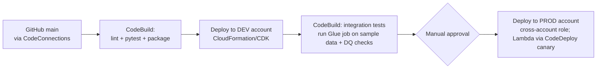

# 36 · Programming, IaC & CI/CD — running a data platform like a franchise kitchen

> **Exam map:** D1 · Task 1.2, 1.4 — D3 · Task 3.1 — D4 · Task 4.1 · **Skills:** 1.2.8, 1.4.1, 1.4.3, 1.4.4, 1.4.5, 1.4.8, 1.4.9, 3.1.3, 3.1.5, 4.1.4 · **Weight:** 🔥🔥 Medium · **Read time:** ~22 min

## The idea

Picture a **restaurant franchise** with 50 identical kitchens. The company doesn't let each chef improvise. It runs on four disciplines:

1. **A recipe book under version control.** Every recipe change is proposed, reviewed, and tested before it reaches a kitchen. That's **Git + code review + tests** for your PySpark and SQL.
2. **A kitchen blueprint.** A new branch is built from the same blueprint, so the ovens are always in the same place. That's **Infrastructure as Code (IaC)**: CloudFormation, CDK, and SAM templates that stamp out identical buckets, Glue jobs, and roles in dev, test, and prod.
3. **A test kitchen and rollout line.** A new dish is cooked in the test kitchen, tasted, approved, then rolled out to one location before all of them. That's **CI/CD (Continuous Integration / Continuous Delivery)**: CodePipeline, CodeBuild, and CodeDeploy.
4. **A takeout window and a supplier phone line.** Customers order through a window with rules (opening hours, order limits, ID checks), and staff call suppliers politely, with a script for "line busy, try again later". That's **data APIs** (API Gateway) and **SDK etiquette** (pagination, retries with backoff).

The exam doesn't test language syntax (that's explicitly out of scope). It tests **decisions**: which language or runtime fits a service, how to protect a data store during a stack update, what a buildspec does, how to call async AWS APIs correctly, and how to expose data safely. This guide covers all four disciplines.

## Languages and where they run (skill 1.4.3)

| Language | Where it runs in data engineering on AWS |
|---|---|
| **Python** | PySpark on Glue/EMR/Athena Spark; Glue Python shell; Lambda; **boto3** scripts; **pandas / AWS SDK for pandas** (awswrangler: read/write S3, Athena, Redshift, Glue Catalog as DataFrames); Airflow DAGs; Flink (PyFlink) |
| **SQL** | Athena, Redshift (plus **PL/pgSQL stored procedures**), Spark SQL, Flink SQL, Aurora/RDS, DynamoDB **PartiQL** |
| **Scala** | Spark on Glue and EMR (JVM performance, typed Datasets) |
| **Java** | **Apache Flink** apps on Managed Service for Apache Flink, **KCL** consumers and **KPL** producers for Kinesis, Kafka clients, Lambda |
| **R** | Statistical analysis on EMR (SparkR) and SageMaker AI notebooks. Rarely the "right answer" |
| **Bash / PowerShell** | Automation with the **AWS CLI**, EMR **bootstrap actions** and steps, CodeBuild commands, MWAA startup scripts |

| Service | Languages |
|---|---|
| **AWS Glue** | Spark jobs in **Python (PySpark) or Scala**; Python shell jobs; (Ray jobs ⚠️ maintenance from Apr 30, 2026) |
| **Amazon EMR** | Any Hadoop/Spark ecosystem language: Java, Scala, Python, SQL (Hive/Trino/Spark SQL), R |
| **Managed Service for Apache Flink** | **Java, Scala, Python, SQL** (Studio notebooks) |
| **Lambda** | Managed runtimes for Python, Node.js, Java, .NET, Ruby; Go/Rust via OS-only runtimes; custom runtimes |
| **Redshift** | SQL, PL/pgSQL stored procedures, **SQL UDFs**, **Lambda UDFs** (any Lambda language) |
| **Athena** | SQL (Trino engine), **PySpark notebooks** (Athena for Apache Spark), federated connectors (Lambda) |

> ⚠️ **2026 status:** **Amazon Redshift Python UDFs** (`CREATE FUNCTION ... LANGUAGE plpythonu`) reached **end of support after June 30, 2026**, with enforcement in phases. For custom logic in Redshift, use **Lambda UDFs** or **SQL UDFs**. Older questions that answer "write a Python UDF in Redshift" are outdated; if Lambda UDF is an option, prefer it.

### Optimizing code to reduce runtime (skill 1.4.1)

Push work to the engine instead of looping in Python: set-based SQL, Spark DataFrame operations instead of per-row UDFs, and **predicate pushdown / partition pruning** (read less; see [Guide 03](03-Data-Formats-Compression.md) and [Guide 16](16-Apache-Spark-Essentials.md)). **Batch API calls** (`PutRecords`, `BatchWriteItem`, `SendMessageBatch`) instead of one call per record. In Lambda, **create SDK clients and DB connections outside the handler** so warm invocations reuse them. Parallelize independent I/O. Profile before tuning.

## Software engineering best practices (skill 1.4.4)

| Practice | Data-engineering form |
|---|---|
| **Version control** | Everything in Git: PySpark scripts, SQL, DAGs, state machine ASL, IaC templates, data quality rules |
| **Branching + pull requests** | Short-lived feature branches, PR review, protected `main`, CI checks required before merge |
| **Unit tests** | **pytest** on pure transformation functions (small in-memory DataFrames); mock AWS calls with **moto** or botocore Stubber |
| **Local Glue development** | AWS Glue Docker images on ECR Public (e.g., `public.ecr.aws/glue/aws-glue-libs:5` for Glue 5.0) run `spark-submit`, `pyspark`, and `pytest` locally. Job bookmarks, Glue Data Quality, and some Glue-only transforms don't work locally |
| **Interactive development** | **Glue interactive sessions** (Jupyter/VS Code or Glue Studio notebooks, billed per session), EMR Studio, Athena Spark notebooks |
| **Integration tests** | Run the real job in a **test account** on a small, representative (anonymized) sample dataset; assert on outputs |
| **Data tests** | Glue Data Quality / DQDL rules, Deequ, row-count and schema checks as pipeline gates (see [Guide 33](33-Data-Quality.md)) |
| **Logging & monitoring** | Structured (JSON) logs to CloudWatch Logs, custom metrics, alarms → SNS (see [Guide 32](32-Monitoring-Logging-Troubleshooting.md)) |
| **Configuration** | Parameterize environment-specific values (job arguments, SSM Parameter Store, IaC parameters). **No hard-coded bucket names, account IDs, or secrets** |
| **Secrets** | **Secrets Manager** (rotation) or Parameter Store SecureString; code gets credentials from **IAM roles**, never embedded access keys |
| **Environment isolation** | Separate **dev / test / prod accounts** (AWS Organizations), promoted through a pipeline |
| **Generative help** | **Amazon Q Developer**: IDE/CLI assistant that generates PySpark, SQL, and IaC, explains and debugs code, writes unit tests. Also built into data tools (e.g., generative SQL in Redshift Query Editor, Glue job authoring and troubleshooting). See [Guide 19](19-GenAI-LLMs-Vectors.md) |

### Git essentials

| Command | What it does |
|---|---|
| `git clone <url>` | Copy a remote repository locally |
| `git init` | Start a new repository in the current folder |
| `git status` | Show changed, staged, and untracked files |
| `git add <file>` / `git add .` | Stage changes for the next commit |
| `git commit -m "msg"` | Record staged changes as a commit |
| `git push origin <branch>` | Upload local commits to the remote |
| `git fetch` | Download remote commits **without** merging them |
| `git pull` | `fetch` + merge (or rebase) into the current branch |
| `git branch` / `git branch <name>` | List / create branches |
| `git checkout -b <name>` / `git switch -c <name>` | Create **and** switch to a new branch |
| `git merge <branch>` | Merge another branch into the current one (may create a merge commit) |
| `git rebase main` | Replay your commits on top of `main` (linear history; don't rebase shared branches) |
| `git tag v1.4.0` | Mark a release commit (tags can trigger CodePipeline V2) |
| `git stash` / `git stash pop` | Shelve uncommitted work / bring it back |
| `git log --oneline` / `git diff` | History / line-level changes |
| `git remote add origin <url>` | Connect a local repo to a remote |
| `git revert <commit>` | Undo a commit with a **new** commit (safe on shared branches) |

**Merge conflicts** happen when two branches change the same lines. Git marks the conflict with `<<<<<<<`, `=======`, `>>>>>>>`; you edit the file, `git add` it, and commit.

v1.1 removed **AWS CodeCommit** and **AWS Cloud9** from the exam scope. The expected pattern is a **GitHub / GitLab / Bitbucket** repository connected to AWS through **AWS CodeConnections** (formerly *AWS CodeStar Connections*, renamed 2024), which CodePipeline, CodeBuild, and Glue can use as a source.

## Infrastructure as Code (skills 1.4.5, 1.4.8)

### AWS CloudFormation — the blueprint language

A **template** (YAML/JSON) declares resources. CloudFormation creates them as a **stack** and works out the order from dependencies.

| Section / feature | Purpose |
|---|---|
| `Parameters` | Inputs per deployment (env name, bucket suffix); `AllowedValues`, SSM parameter types |
| `Mappings` | Static lookup tables (e.g., per-Region or per-env values) via `Fn::FindInMap` |
| `Conditions` | Create resources only in some environments (`Fn::Equals`, `Fn::If`) |
| `Resources` | The only **required** section |
| `Outputs` | Export values (e.g., bucket ARN) for other stacks (`Fn::ImportValue`) |
| Intrinsic functions | `!Ref`, `!GetAtt`, `!Sub`, `!Join`, `!Select`, `!If`, `!ImportValue`, `!FindInMap` |
| **Change sets** | **Preview** exactly what an update will add, modify, or **replace** before executing it |
| **Drift detection** | Find resources changed manually outside CloudFormation |
| **StackSets** | Deploy one template to **many accounts and Regions** (e.g., a standard logging bucket in every account in the Organization) |
| **Nested stacks** | Reuse components (`AWS::CloudFormation::Stack`) within one parent stack |
| **Custom resources** | Lambda-backed logic for anything CloudFormation lacks (e.g., seed a table, call a third-party API) |
| Rollback | Failed create/update rolls back automatically. Rollback triggers can watch CloudWatch alarms |
| **cfn-lint / cfn-guard** | Lint templates / enforce policy-as-code rules in CI before deployment |
| Service role | CloudFormation can deploy **using a service role** you pass (`iam:PassRole`), so developers don't need broad permissions themselves |

**THE trap: protecting data stores.** Deleting a stack, or an update that *replaces* a resource (changing an immutable property such as a bucket name or a DynamoDB key schema), **deletes the old resource by default**. Protect stateful resources:

| Attribute | Values | Effect |
|---|---|---|
| **`DeletionPolicy`** | `Delete`, **`Retain`**, `RetainExceptOnCreate`, **`Snapshot`** (RDS, Aurora, Redshift, EBS, Neptune, DocumentDB, ElastiCache) | What happens when the resource is **removed from the stack or the stack is deleted** |
| **`UpdateReplacePolicy`** | `Delete`, `Retain`, `Snapshot` | What happens to the **old physical resource when an update replaces it** |

Set **both** to `Retain` (or `Snapshot`) on S3 buckets, DynamoDB tables, Redshift clusters, and RDS databases. Also run **change sets** so a surprise "Replacement: True" is caught before it executes. Stack termination protection prevents accidental stack deletion.

Example: a data bucket that survives the stack, plus a Glue job.

```yaml
Parameters:
  Env: { Type: String, AllowedValues: [dev, test, prod] }
Resources:
  CuratedBucket:
    Type: AWS::S3::Bucket
    DeletionPolicy: Retain
    UpdateReplacePolicy: Retain
    Properties:
      BucketName: !Sub "anycompany-curated-${Env}-${AWS::AccountId}"
      VersioningConfiguration: { Status: Enabled }
      BucketEncryption:
        ServerSideEncryptionConfiguration:
          - ServerSideEncryptionByDefault: { SSEAlgorithm: aws:kms }
  OrdersJob:
    Type: AWS::Glue::Job
    Properties:
      Name: !Sub "orders-to-parquet-${Env}"
      Role: !GetAtt GlueJobRole.Arn          # role defined elsewhere in the template
      GlueVersion: "5.1"
      WorkerType: G.1X
      NumberOfWorkers: 10
      Command:
        Name: glueetl
        PythonVersion: "3"
        ScriptLocation: !Sub "s3://anycompany-artifacts-${Env}/scripts/orders_to_parquet.py"
      DefaultArguments:
        "--target_path": !Sub "s3://${CuratedBucket}/orders/"
        "--job-bookmark-option": job-bookmark-enable
Outputs:
  CuratedBucketArn: { Value: !GetAtt CuratedBucket.Arn, Export: { Name: !Sub "${Env}-curated-arn" } }
```

### AWS CDK — the blueprint written in code

The **Cloud Development Kit** lets you define infrastructure in **TypeScript, JavaScript, Python, Java, C#/.NET, or Go**. It **synthesizes to CloudFormation**.

- **App → Stacks → Constructs.** **L1** constructs (`CfnBucket`, `CfnJob`) map 1:1 to CloudFormation resources. **L2** constructs (`s3.Bucket`) add sensible defaults and helper methods (`bucket.grantRead(role)` writes the least-privilege IAM policy for you). **L3** "patterns" compose many resources (e.g., a queue-processing Fargate service).
- CLI lifecycle: **`cdk bootstrap`** (once per account/Region: creates the staging bucket and deployment roles), **`cdk synth`** (emit the template), **`cdk diff`** (compare with what's deployed), **`cdk deploy`**, `cdk destroy`.
- Stateful resources: **`removal_policy=RemovalPolicy.RETAIN`** (the default for the L2 S3 bucket and DynamoDB table). `RemovalPolicy.DESTROY` plus `auto_delete_objects=True` is for throwaway dev stacks only.

```python
bucket = s3.Bucket(self, "Curated", versioned=True,
                   encryption=s3.BucketEncryption.KMS_MANAGED,
                   removal_policy=RemovalPolicy.RETAIN)
bucket.grant_read_write(glue_role)   # least-privilege policy generated
```

**CloudFormation vs CDK vs SAM:** CDK when teams prefer real programming languages, loops, and reusable constructs. Raw CloudFormation when you want declarative templates and StackSets directly. **AWS SAM** (Serverless Application Model) is a CloudFormation **transform** with shorthand resources (`AWS::Serverless::Function`, `::StateMachine`, `::SimpleTable`) plus the `sam build / sam local invoke / sam deploy` CLI. It's the pick for **Lambda + Step Functions + DynamoDB** serverless pipelines; depth in [Guide 17](17-Lambda-for-Data-Pipelines.md). All three can deploy the same things; the exam signal decides which one fits.

## CI/CD for data pipelines (skill 1.4.9)

| Service | Role | Key facts |
|---|---|---|
| **AWS CodePipeline** | The **conveyor belt**: stages Source → Build → Test → Deploy (→ Approve → Deploy prod) | Sources include GitHub/GitLab/Bitbucket via CodeConnections, S3, ECR. **V2 pipelines** add triggers filtered on **branches, file paths, and Git tags**, plus pipeline variables. **Manual approval** actions gate prod. Cross-account deploy actions via IAM roles plus a KMS-encrypted artifact bucket |
| **AWS CodeBuild** | The **test kitchen**: runs commands in managed containers, pay per build minute | **`buildspec.yml`** phases **`install` → `pre_build` → `build` → `post_build`**, plus `artifacts` and `reports` (JUnit test reports). Typical data work: `pytest`, `cfn-lint`, zip or upload Glue scripts to S3, `cdk synth/deploy`, `sam build`, `aws cloudformation deploy` |
| **AWS CodeDeploy** | The **rollout manager** | **EC2/on-premises** (in-place or blue/green, `appspec.yml`). **Lambda** traffic shifting: **Canary** (e.g., 10% for 5 minutes, then 100%), **Linear** (e.g., +10% every minute), **All-at-once**, with **CloudWatch alarms for automatic rollback** and pre/post-traffic hooks. **ECS** blue/green |

A minimal `buildspec.yml` for a Glue + Lambda pipeline:

```yaml
version: 0.2
phases:
  install:
    runtime-versions: { python: 3.12 }
    commands: [ "pip install -r requirements-dev.txt" ]
  pre_build:
    commands: [ "pytest tests/unit --junitxml=reports/unit.xml", "cfn-lint template.yaml" ]
  build:
    commands:
      - aws s3 cp src/glue/ s3://$ARTIFACT_BUCKET/scripts/ --recursive
      - sam build && sam package --s3-bucket $ARTIFACT_BUCKET --output-template-file packaged.yaml
artifacts: { files: [ packaged.yaml ] }
reports:
  unit-tests: { files: [ reports/unit.xml ], file-format: JUNITXML }
```

**Reference promotion flow (multi-account):**



The pipeline lives in a **tooling account**, assumes **cross-account deployment roles** in dev and prod, and shares artifacts through an S3 bucket encrypted with a **customer-managed KMS key** whose policy trusts the target accounts. Glue jobs "deploy" by updating the job definition (IaC) and the script in S3. Lambda functions deploy gradually with CodeDeploy.

## Calling AWS from code — SDK patterns (skill 3.1.3)

- **boto3 clients vs resources.** **Clients** map 1:1 to service APIs and cover every service. **Resources** are an older object-oriented layer (S3, DynamoDB, …) that is feature-frozen. New code uses clients.
- **Paginators.** List/describe APIs return one page at a time (`NextToken`/`ContinuationToken`). Use `client.get_paginator("list_objects_v2")`, or you'll silently process only the first **1,000** S3 keys.
- **Waiters.** Built-in polling until a resource reaches a state (e.g., an EMR step complete, a Redshift cluster available, an S3 object exists). Not every async job has a waiter; otherwise poll with backoff.
- **Retries.** boto3 supports **legacy, standard, and adaptive** retry modes (`Config(retries={"mode": "standard", "max_attempts": 10})`). **Adaptive** adds client-side rate limiting. On throttling (`ThrottlingException`, `ProvisionedThroughputExceededException`, `TooManyRequestsException`, S3 `SlowDown`/503) the answer is **exponential backoff with jitter**, plus batching and fewer, larger calls. Never retry in a tight loop.
- **Idempotency.** Many APIs accept a **client token** (e.g., `ClientRequestToken`, `ClientToken`) so a retried request doesn't start a job twice.
- **Credentials.** Always via the default provider chain from an **IAM role**: Lambda execution role, Glue/EMR job role, EC2 instance profile, ECS task role, or `aws sso login` / `sts assume-role` profiles for humans on the CLI. **Never hard-code access keys.**

**Async query APIs.** Both are "submit, poll, fetch":

```python
athena = boto3.client("athena")
qid = athena.start_query_execution(
    QueryString="SELECT region, sum(amount) FROM sales GROUP BY 1",
    QueryExecutionContext={"Database": "curated"},
    WorkGroup="etl")["QueryExecutionId"]
# poll get_query_execution(QueryExecutionId=qid) until State is SUCCEEDED/FAILED/CANCELLED (with backoff)
rows = athena.get_paginator("get_query_results").paginate(QueryExecutionId=qid)

rsd = boto3.client("redshift-data")
sid = rsd.execute_statement(WorkgroupName="analytics", Database="dev",   # or ClusterIdentifier + SecretArn
                            Sql="CALL refresh_daily_sales()")["Id"]
# poll describe_statement(Id=sid)["Status"] until FINISHED/FAILED/ABORTED, then get_statement_result(Id=sid)
```

The **Redshift Data API** needs no JDBC driver, persistent connection, or VPC networking. It authenticates with IAM (temporary credentials) or a **Secrets Manager** secret, which makes it ideal for Lambda, Step Functions, and EventBridge (see [Guide 24](24-Redshift-Loading-Integration-Sharing.md)). In orchestration, let [Step Functions](20-Step-Functions.md) do the polling (`athena:startQueryExecution.sync`) instead of a Lambda that sleeps.

## Data APIs with Amazon API Gateway (skills 1.2.8, 3.1.5)

API Gateway is the **takeout window**: a managed front door that handles auth, throttling, and monitoring in front of your data.

| | **REST API** | **HTTP API** |
|---|---|---|
| Cost / latency | Higher | **Cheaper, lower latency** |
| Auth | **IAM (SigV4)**, **Cognito user pools**, **Lambda authorizers**, resource policies | **IAM**, **JWT** (Cognito/OIDC), Lambda authorizers |
| Usage plans + API keys, per-client throttling/quotas | **Yes** | No |
| Response **caching** | **Yes** (stage cache, TTL) | No |
| Request validation, request/response mapping templates, WAF | **Yes** | Limited / no |
| Endpoint types | Edge-optimized, Regional, **Private** (VPC endpoint only) | Regional |
| AWS service integrations | Almost any AWS API via mapping templates (e.g., **Kinesis PutRecord**, **DynamoDB**, **SQS**, **Step Functions StartExecution**, S3) | First-class integrations for a few (SQS, Kinesis, Step Functions, EventBridge, AppConfig) |
| Integration timeout | **29 s** default; since **June 2024** it can be **raised** for Regional and private REST APIs through a quota request (possibly at the cost of account-level throttle quota) | **30 s** max |

Integration choices:
- **Lambda proxy integration**: API Gateway passes the whole request to Lambda, which returns the HTTP response. Flexible and the most common answer when there's logic to run.
- **Direct AWS service integration** (no Lambda): API → **Kinesis Data Streams `PutRecord`** for clickstream ingestion, API → **DynamoDB** GetItem/PutItem, API → **SQS** SendMessage, API → **Step Functions `StartExecution`** (or `StartSyncExecution` for Express). *"Least operational overhead / no custom code to ingest events from an HTTP endpoint"* → a direct integration. API Gateway needs an **IAM role** that allows the target action (skill 4.1.4).

Serving data: use **DynamoDB** (or ElastiCache/MemoryDB) behind the API for **millisecond** key lookups. **Athena** and the **Redshift Data API** are asynchronous and take seconds, so for API use either run the query asynchronously (return a query ID, let the client poll or receive a callback) or precompute results into DynamoDB/S3. Beware the integration timeout.

**Maintaining APIs:** **stages** (dev/prod) with **stage variables**, **deployments** as immutable snapshots, **canary release** settings on REST stages, versioning via path (`/v1/`) or a separate stage, custom domain names with base path mappings, **CloudWatch metrics** (`Count`, `4XXError`, `5XXError`, `Latency`, `IntegrationLatency`), access and execution logs, and X-Ray tracing. Throttling happens at the **account level per Region** (defaults of **10,000 requests/s steady, 5,000 burst**), at the stage/method level, and per client through **usage plans**. Throttled callers get **HTTP 429**. **API keys identify clients for usage plans; they are not an authorization mechanism.**

**Lambda function URLs**: a dedicated HTTPS endpoint on a single function, with auth `AWS_IAM` or `NONE`. The simplest way to expose one function, but it has **no usage plans, API keys, caching, or request validation**. When those matter, use API Gateway.

## IAM roles for tooling (skill 4.1.4)

Lambda uses an **execution role**. API Gateway assumes a role for direct service integrations and logging. CloudFormation can deploy with a **stack service role**, so the deployer needs only `iam:PassRole`. Humans and CI use **short-lived credentials** (`aws sso login`, assume-role profiles, the CodeBuild service role). Details are in [Guide 37](37-IAM-for-Data-Engineers.md).

## Question patterns

> *"A CloudFormation stack update changes the name of an S3 bucket holding 40 TB of curated data. The team must ensure the data is never deleted by stack operations."* → **Set `DeletionPolicy: Retain` and `UpdateReplacePolicy: Retain` on the bucket and review the change set before executing** (replacement would otherwise delete the old bucket).

> *"Deploy the same logging bucket and IAM roles to 60 accounts across 3 Regions from one template."* → **CloudFormation StackSets** (with Organizations integration).

> *"Developers want to define data infrastructure in Python with loops and reusable components, and preview changes before deployment."* → **AWS CDK** (`cdk diff`, then `cdk deploy`; synthesizes to CloudFormation).

> *"Package and deploy a serverless pipeline of Lambda functions, a Step Functions state machine, and a DynamoDB table, and test functions locally."* → **AWS SAM** (`sam build`, `sam local invoke`, `sam deploy`).

> *"Every merge to main must run unit tests on the PySpark transformation code, upload Glue scripts to S3, deploy to a test account, run integration tests, and require sign-off before production."* → **CodePipeline (source via CodeConnections) + CodeBuild (pytest, packaging) + manual approval action + cross-account CloudFormation deploy.**

> *"A new Lambda version that writes to the data lake must be released gradually, rolling back automatically if errors spike."* → **CodeDeploy Lambda canary or linear deployment with CloudWatch alarms.**

> *"Glue developers want to run and unit-test Glue ETL scripts on their laptops before committing, without paying for job runs."* → **AWS Glue Docker image (ECR Public) with pytest/spark-submit**, or Glue interactive sessions for cloud-backed interactive work.

> *"A script lists objects in a prefix containing 50,000 files but only processes 1,000."* → **Use a paginator** (`list_objects_v2` returns at most 1,000 keys per call).

> *"A Python ingestion job calling the Kinesis PutRecord API receives ProvisionedThroughputExceededException during peaks."* → **Retry with exponential backoff and jitter (standard/adaptive retry mode), batch with PutRecords**, and add shards/on-demand if sustained. See [Guide 06](06-Kinesis-Data-Streams.md).

> *"A Lambda function must run SQL against Redshift Serverless without managing JDBC drivers, connections, or VPC configuration."* → **Redshift Data API** (`ExecuteStatement` → `DescribeStatement` → `GetStatementResult`), with IAM or Secrets Manager auth.

> *"Mobile apps must send clickstream events over HTTPS into Kinesis Data Streams with the LEAST operational overhead and no custom code."* → **API Gateway REST API with a direct Kinesis `PutRecord` integration** (no Lambda; IAM role for API Gateway).

> *"Partners consume a data API; each partner must be limited to 100 requests per second and 1 million requests per month, and responses for popular queries should be cached."* → **API Gateway REST API with usage plans + API keys and stage caching** (HTTP APIs lack usage plans and caching).

> *"An API backed by Athena returns 504 errors for long-running queries."* → **Make it asynchronous** (start the query, return the ID, poll or notify) **or precompute results into DynamoDB/S3**. The synchronous integration timeout is too short for long queries.

> *"A team stores database passwords in a Glue job script in Git."* → **Move them to Secrets Manager (with rotation) and read at runtime via the job's IAM role**; remove them from the Git history.

> *"A Redshift Python UDF used for custom parsing must be modernized."* → **Replace it with a Lambda UDF (or a SQL UDF)**; Redshift Python UDFs reached end of support after June 30, 2026.

> *"Which service connects a GitHub repository as the source of an AWS CodePipeline pipeline?"* → **AWS CodeConnections** (formerly CodeStar Connections); CodeCommit is out of v1.1 scope.

## Pocket card

| Keyword / signal | Answer |
|---|---|
| Spark on Glue | Python (PySpark) or Scala |
| Flink apps | Java / Scala / Python / SQL |
| Kinesis consumer library | KCL (Java-centric) |
| DataFrames ↔ S3/Athena/Redshift from Python | AWS SDK for pandas (awswrangler) |
| Custom logic in Redshift SQL | Lambda UDF / SQL UDF (Python UDFs ⚠️ end of support after Jun 30, 2026) |
| Test transforms | pytest on pure functions; moto/Stubber for AWS calls |
| Run Glue locally | Glue Docker image (`public.ecr.aws/glue/aws-glue-libs`) |
| Interactive Glue dev in the cloud | Glue interactive sessions |
| Secrets in code | Secrets Manager / Parameter Store + IAM roles |
| New branch and switch | `git checkout -b` / `git switch -c` |
| Get remote changes without merging | `git fetch` |
| Undo a shared commit safely | `git revert` |
| GitHub/GitLab/Bitbucket → AWS | CodeConnections (ex-CodeStar Connections) |
| Preview stack changes | Change sets (`cdk diff` in CDK) |
| Manual changes outside IaC | Drift detection |
| Many accounts/Regions from one template | StackSets |
| Keep data store on delete / replacement | `DeletionPolicy` + `UpdateReplacePolicy` = Retain/Snapshot |
| Logic CloudFormation lacks | Custom resource (Lambda) |
| IaC in a programming language | CDK (L1/L2/L3; bootstrap → synth → diff → deploy) |
| Serverless shorthand + local testing | SAM |
| Pipeline stages + approvals | CodePipeline (V2 triggers on branch/path/tag) |
| Run tests / package / deploy commands | CodeBuild `buildspec.yml` (install, pre_build, build, post_build) |
| Gradual Lambda rollout with rollback | CodeDeploy canary/linear + alarms |
| Only first 1,000 S3 keys processed | Paginator |
| Wait for a resource state | Waiter |
| Throttling exceptions | Exponential backoff + jitter; batch calls |
| Athena from code | StartQueryExecution → GetQueryExecution (poll) → GetQueryResults |
| Redshift from Lambda, no drivers | Data API: ExecuteStatement → DescribeStatement → GetStatementResult |
| Usage plans, API keys, caching | API Gateway REST API |
| Cheapest/fastest simple API, JWT auth | API Gateway HTTP API |
| HTTP → Kinesis with no code | REST API direct service integration |
| Integration timeout | REST 29 s default (raisable, Regional/private); HTTP 30 s |
| 429 from API | Throttling (account/stage/usage plan) |
| One function over HTTPS, simplest | Lambda function URL |
| AI coding help for PySpark/SQL | Amazon Q Developer |

With code, infrastructure, and deployments under control, the next layer is **who can do what**: [Guide 37 — IAM for Data Engineers](37-IAM-for-Data-Engineers.md).
