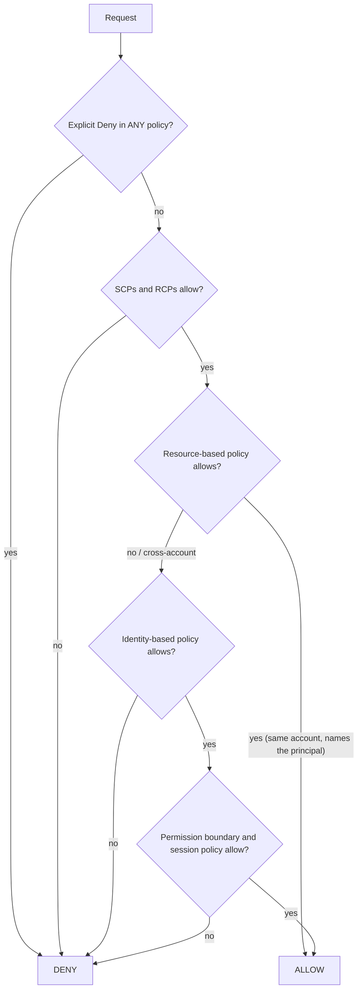

# 37 · IAM for Data Engineers — badges, guest lists, and the bouncer's rulebook

> **Exam map:** D4 · Task 4.1, 4.2 · **Skills:** 4.1.2, 4.1.4, 4.1.5, 4.2.1, 4.2.5, 4.2.6 · **Weight:** 🔥🔥🔥 High · **Read time:** ~20 min

## The idea

Think of AWS as a **corporate campus** with a very strict security desk. Every person or robot that makes a request is a **principal**, and every request is checked against written rules:

- **Your badge** lists the doors you may open. That's an **identity-based policy**, attached to an IAM user, group or role.
- **A guest list taped to a specific door** says who may come in, even visitors from another company. That's a **resource-based policy**, attached to an S3 bucket, a KMS key, an SQS queue or a Glue Data Catalog.
- **Visitor badges** are handed out for an hour and then expire. That's a **role**: you *assume* it, and AWS STS (Security Token Service) gives you **temporary credentials**. The role's **trust policy** says who may check that badge out.
- **Building-wide rules** from head office cap what any badge can do in a department. Those are **Organizations SCPs/RCPs** and **permission boundaries**. They **never open a door by themselves**. They only remove doors from the list.
- The **guard's blacklist** beats everything: an **explicit Deny** anywhere ends the discussion.

Data pipelines are mostly robots: Glue jobs, EMR clusters, Lambda functions, Redshift running COPY, Firehose writing to S3. Almost every Domain 4 IAM question is really *"which robot needs which badge, who is allowed to hand it that badge, and how do we keep the badge as small as possible?"* This guide covers policy types and evaluation, service roles and the `iam:PassRole` trap, a least-privilege S3 policy, condition keys, ABAC, cross-account access, access points and VPC endpoint policies.

## Policy types at a glance

| Policy type | Attached to | Grants? | Typical data-engineering use |
|---|---|---|---|
| **AWS managed** | Users/groups/roles | Yes | Quick start (`AWSGlueServiceRole`, `AmazonRedshiftAllCommandsFullAccess`). Broad; AWS maintains it |
| **Customer managed** | Users/groups/roles | Yes | **Your** least-privilege policies. Reusable, versioned (up to 5 versions) |
| **Inline** | One principal | Yes | Strict 1:1 coupling. Deleted with the principal |
| **Resource-based** | S3 bucket, **KMS key policy**, SQS, SNS, Lambda, Secrets Manager, **Glue Data Catalog**, **Kinesis Data Streams** (since Nov 2023), ECR, EventBridge bus… | Yes (incl. cross-account) | Cross-account sharing without role hopping |
| **Trust policy** (a resource policy on a role) | IAM role | Who may assume | `"Service": "glue.amazonaws.com"` |
| **Permission boundary** | User/role | **No**, it caps | Delegated admin: devs create roles, but only within the boundary |
| **SCP** (service control policy) | Org root/OU/account | **No**, caps principals | *"No one may use Regions outside the EU"*, *"never disable CloudTrail"* |
| **RCP** (resource control policy) | Org root/OU/account | **No**, caps resources | Data perimeter: *"our buckets/keys/secrets can't be reached by identities outside our org"* |
| **Session policy** | Passed on `AssumeRole` | **No**, caps the session | Further scope a broker-issued session |
| **ACLs** (legacy) | S3 buckets/objects | Yes | Legacy. Disable with Object Ownership = *bucket owner enforced* |

RCP details worth knowing: RCPs cover a specific list of services. That list includes **S3, STS, KMS, SQS, Secrets Manager, DynamoDB, CloudWatch Logs, ECR, Firehose, EventBridge** and OpenSearch Serverless. It does **not** include Kinesis Data Streams or Glue. RCPs don't restrict **service-linked roles**, resources in the **management account**, or **AWS managed KMS keys**. SCPs likewise never affect the management account or service-linked roles.

## Evaluation logic: how the guard decides



The rules to recite:
1. **Default = implicit deny.** Nothing is allowed until something allows it.
2. **Explicit Deny > Allow > implicit deny.**
3. **Guardrails (SCP, RCP, boundary, session policy) only subtract.** An SCP that "allows S3" grants nothing on its own.
4. **Same account:** an identity policy **or** a resource policy is enough.
5. **Cross-account: both sides must say yes.** The caller's identity policy must allow the action, **and** the resource policy (or the role's trust policy) in the other account must allow the caller.
6. **KMS is special:** the **key policy must allow** access, either directly or via the default statement that delegates to IAM. An IAM policy alone can't use a key whose policy doesn't trust the account ([Guide 39](39-Encryption-Key-Management.md)).

**THE trap:** *"An SCP allows `s3:*` for the account, but the Glue job gets AccessDenied."* SCPs never grant. The job's **role** still needs an identity policy (and maybe a bucket policy or KMS key-policy entry).

## Service roles, trust policies, and `iam:PassRole`

A **service role** is a role that an AWS service assumes to do work for you. Its trust policy names the **service principal**:

| Workload | Trust principal | Notes |
|---|---|---|
| Glue job / crawler / interactive session | `glue.amazonaws.com` | Needs S3 + catalog + CloudWatch Logs (+ KMS, + `ec2:*NetworkInterface*` for VPC connections) |
| Lambda execution role | `lambda.amazonaws.com` | `AWSLambdaBasicExecutionRole` (logs); `AWSLambdaKinesisExecutionRole`/`…SQSQueueExecutionRole` for event sources; `AWSLambdaVPCAccessExecutionRole` for VPC |
| Redshift (COPY/UNLOAD/Spectrum/ML) | `redshift.amazonaws.com` | Associate the role with the cluster/namespace |
| Firehose delivery | `firehose.amazonaws.com` | S3 write, Glue (format conversion), KMS, Lambda invoke |
| EMR **service role** | `elasticmapreduce.amazonaws.com` | EMR provisions EC2, networking |
| EMR **EC2 instance profile** | `ec2.amazonaws.com` | What code on cluster nodes can access (EMRFS → S3) |
| EMR Serverless job runtime role | `emr-serverless.amazonaws.com` | Per job run |
| Step Functions | `states.amazonaws.com` | Start Glue/EMR/Athena/Lambda |
| EventBridge Scheduler / rules / Pipes | `scheduler.amazonaws.com` / `events.amazonaws.com` / `pipes.amazonaws.com` | Invoke targets |
| API Gateway AWS-service integration | `apigateway.amazonaws.com` | e.g., `kinesis:PutRecord`, `sqs:SendMessage`, `states:StartExecution` |
| CloudFormation service role | `cloudformation.amazonaws.com` | Stack actions use this role, not the deployer's permissions |
| Lake Formation registration role | `lakeformation.amazonaws.com` | Vends data credentials ([Guide 40](40-Lake-Formation.md)) |

```json
{
  "Version": "2012-10-17",
  "Statement": [{
    "Effect": "Allow",
    "Principal": { "Service": "glue.amazonaws.com" },
    "Action": "sts:AssumeRole",
    "Condition": { "StringEquals": { "aws:SourceAccount": "123456789012" } }
  }]
}
```

(`aws:SourceAccount` / `aws:SourceArn` in trust policies guard against the **confused deputy** problem, where someone else's resource tricks the service into using your role.)

**`iam:PassRole` is THE trap.** When a *human or pipeline* creates a Glue job, launches an EMR cluster, creates a Lambda function, registers a Lake Formation location, or deploys a CloudFormation stack with a service role, they are **handing a badge to a robot**. IAM checks that the caller has **`iam:PassRole` on that role ARN**. Missing it produces errors like *"User is not authorized to perform iam:PassRole"*, even though the caller has full `glue:*`.

```json
{
  "Effect": "Allow",
  "Action": "iam:PassRole",
  "Resource": "arn:aws:iam::123456789012:role/GlueEtlRole",
  "Condition": { "StringEquals": { "iam:PassedToService": "glue.amazonaws.com" } }
}
```

Scope `PassRole` to specific role ARNs, never `"Resource": "*"`. Otherwise a developer can pass an admin role to a job and escalate privilege.

**Service-linked roles (SLRs)** are predefined by the service (e.g., `AWSServiceRoleForLakeFormationDataAccess`, `AWSServiceRoleForEMRCleanup`). You can't edit their permissions, and SCPs/RCPs don't restrict them.

### Redshift roles
- Attach one or more roles to the cluster or Serverless namespace, then reference them: `COPY … IAM_ROLE 'arn:…'`. A role marked as the **default IAM role** can be used with `IAM_ROLE default`. Only **one** default per cluster. The console-created default gets `AmazonRedshiftAllCommandsFullAccess`, which is broad, so tighten it for production.
- **Role chaining for cross-account S3:** RoleA (attached to the cluster, account A) assumes RoleB (account B, which can read the bucket). RoleA needs `sts:AssumeRole` on RoleB, and RoleB's trust policy trusts RoleA or account A. Syntax: a comma-separated list with **no spaces**: `IAM_ROLE 'arn:aws:iam::111111111111:role/RoleA,arn:aws:iam::222222222222:role/RoleB'`.
- Limit which database users may use a role: add an `sts:ExternalId` condition listing `dbuser` ARNs in the trust policy, and/or use the Redshift **`GRANT ASSUMEROLE`** privilege.

### EMR's three identities
**Service role** (EMR manages infrastructure) ≠ **EC2 instance profile** (permissions for everything running on the nodes) ≠ **runtime roles** (per-step or per-job roles, EMR **6.7+**, enabled in a security configuration). With runtime roles, jobs **can't** fall back to the instance profile, so different teams can share one cluster, and Lake Formation FGAC becomes possible. Control who may use which runtime role with the `elasticmapreduce:ExecutionRoleArn` condition key.

### AWS CLI and humans assuming roles
```ini
# ~/.aws/config
[profile etl-prod]
role_arn       = arn:aws:iam::123456789012:role/EtlDeployRole
source_profile = default            # or credential_source = Ec2InstanceMetadata
mfa_serial     = arn:aws:iam::111111111111:mfa/alice   # optional
```
`aws s3 ls --profile etl-prod` makes the CLI call `sts:AssumeRole` for you. The manual equivalent is `aws sts assume-role --role-arn … --role-session-name etl`, which returns an AccessKeyId, SecretAccessKey and **SessionToken**. For workforce users, `aws configure sso` with **IAM Identity Center** is the modern answer.

## Managed vs custom policies, and building least privilege (4.2.1, 4.2.6)

AWS managed policies are written for the general case: `AmazonS3FullAccess`, `AWSGlueConsoleFullAccess`. **When a managed policy grants too much or can't express your scope (one bucket, one prefix, one key, one job), write a customer managed policy.** The exam's favorite worked example is read-only access to a single prefix of an SSE-KMS bucket:

```json
{
  "Version": "2012-10-17",
  "Statement": [
    {
      "Sid": "ListOnlyTheSalesPrefix",
      "Effect": "Allow",
      "Action": "s3:ListBucket",
      "Resource": "arn:aws:s3:::amzn-s3-demo-bucket",
      "Condition": { "StringLike": { "s3:prefix": ["curated/sales/", "curated/sales/*"] } }
    },
    {
      "Sid": "ReadObjectsUnderThePrefix",
      "Effect": "Allow",
      "Action": "s3:GetObject",
      "Resource": "arn:aws:s3:::amzn-s3-demo-bucket/curated/sales/*"
    },
    {
      "Sid": "DecryptOnlyThroughS3",
      "Effect": "Allow",
      "Action": "kms:Decrypt",
      "Resource": "arn:aws:kms:us-east-1:123456789012:key/1234abcd-12ab-34cd-56ef-1234567890ab",
      "Condition": { "StringEquals": { "kms:ViaService": "s3.us-east-1.amazonaws.com" } }
    }
  ]
}
```

**THE trap:** putting `s3:ListBucket` on `arn:aws:s3:::bucket/*`. **ListBucket is a bucket-level action**, so it must target the **bucket ARN** (no `/*`), and the prefix is restricted with the `s3:prefix` condition. Object actions (`GetObject`, `PutObject`, `DeleteObject`) target **object ARNs** (`bucket/path/*`). The second classic miss is forgetting **`kms:Decrypt`** (reads) or **`kms:GenerateDataKey`** (writes) for SSE-KMS buckets. The error still says AccessDenied.

**Tools for least privilege (IAM Access Analyzer):**
| Feature | What it does |
|---|---|
| **Policy generation** | Builds a policy from the actions a role actually used, from **CloudTrail** logs over a date range. The classic answer to *"generate least-privilege policy from observed activity"* |
| **Policy validation** | Checks grammar and best practices (security warnings, errors, suggestions) while you author |
| **Custom policy checks** | `CheckNoNewAccess`, `CheckAccessNotGranted`, `CheckNoPublicAccess`: gate CI/CD so a policy change can't widen access (paid per check) |
| **External access analyzer** | Findings for resources (buckets, keys, roles, secrets, queues, snapshots, DynamoDB tables…) shared outside your zone of trust |
| **Internal access analyzer** | Which principals inside your org can reach selected critical resources (paid) |
| **Unused access analyzer** | Unused roles, access keys, passwords, and unused services/actions on active roles (paid) |

Also useful: **last accessed information** in the IAM console (service- and action-level) to trim policies, and the **IAM policy simulator** for testing.

## Condition keys you'll see in answers

| Key | Typical use |
|---|---|
| `aws:SourceVpce` / `aws:SourceVpc` | Bucket policy: allow only via a specific VPC endpoint / VPC |
| `aws:SourceIp` | Allow only corporate public CIDRs. **Doesn't match traffic arriving via VPC endpoints** (private IPs; use `aws:VpcSourceIp`) |
| `aws:SecureTransport` | Deny when `false`, which forces TLS |
| `aws:PrincipalOrgID` | Allow any principal in your AWS Organization (no account lists) |
| `aws:PrincipalTag/…` · `aws:ResourceTag/…` · `aws:RequestTag/…` · `aws:TagKeys` | ABAC: match caller tags to resource tags; control tags on create |
| `aws:RequestedRegion` | SCP: restrict Regions (data sovereignty, [Guide 42](42-Privacy-PII-Masking-Sovereignty.md)) |
| `aws:SourceArn` / `aws:SourceAccount` | Confused-deputy protection in trust/resource policies |
| `s3:prefix` | Limit ListBucket to a prefix |
| `s3:x-amz-server-side-encryption` · `s3:x-amz-server-side-encryption-aws-kms-key-id` | Require SSE-KMS / a specific key on PutObject |
| `kms:ViaService` | Key usable only through a given service (S3, Glue, Redshift…) |
| `kms:EncryptionContext:…` | Bind key use to a context (e.g., a specific bucket ARN or table) |
| `iam:PassedToService` | Restrict which service a role can be passed to |

## RBAC vs ABAC vs tag-based (4.2.5)

- **RBAC (role-based):** one role per job function (`analyst`, `etl`, `admin`) with its own policy. Easy to understand, but the number of policies grows with every new project.
- **ABAC (attribute-based):** **one** policy compares **principal tags** with **resource tags**. Add a project by tagging, not by writing policy.

```json
{
  "Version": "2012-10-17",
  "Statement": [
    {
      "Sid": "RunOnlyYourTeamsJobs",
      "Effect": "Allow",
      "Action": ["glue:StartJobRun", "glue:GetJobRun", "glue:GetJobRuns"],
      "Resource": "arn:aws:glue:us-east-1:123456789012:job/*",
      "Condition": { "StringEquals": { "aws:ResourceTag/team": "${aws:PrincipalTag/team}" } }
    },
    {
      "Sid": "CreateOnlyJobsTaggedForYourTeam",
      "Effect": "Allow",
      "Action": ["glue:CreateJob", "glue:TagResource"],
      "Resource": "*",
      "Condition": {
        "StringEquals": { "aws:RequestTag/team": "${aws:PrincipalTag/team}" },
        "ForAllValues:StringEquals": { "aws:TagKeys": ["team", "costcenter"] }
      }
    }
  ]
}
```

Principal tags can come from IAM role tags **or from your identity provider as session tags** (SAML/OIDC attributes via IAM Identity Center), so HR attributes drive access.

- **Tag-based for catalog data** means **Lake Formation LF-Tags**, which is a separate system from IAM tags ([Guide 40](40-Lake-Formation.md)).
- **Inside Redshift**, RBAC means database roles and GRANTs ([Guide 25](25-Redshift-Performance-Operations-Security.md)).

**THE trap:** answering *"tag thousands of Glue tables and columns to control analyst access"* with IAM ABAC. `aws:ResourceTag` doesn't give column-level control and doesn't read LF-Tags. The answer is LF-TBAC.

## Cross-account access patterns

| Pattern | How | Pick when |
|---|---|---|
| **Role assumption** | Account B creates a role that trusts account A; A's identity policy allows `sts:AssumeRole` on it | Many actions/services in B; clean audit trail in B. The caller gives up its own permissions while in the role |
| **Resource-based policy** | Bucket/queue/key/secret policy names A's principal; A's identity policy also allows | Single resource; the caller keeps its own permissions (e.g., copying from its bucket into B's) |
| **Lake Formation / RAM** | LF grant to account/org/OU | Catalog tables with fine-grained permissions |
| **Redshift data sharing** | Datashare authorized to consumer account | Live warehouse data, no copies ([Guide 24](24-Redshift-Loading-Integration-Sharing.md)) |

Cross-account details that decide answers:
- **S3 Object Ownership = "Bucket owner enforced"** disables ACLs, and the bucket owner **owns every object**, even ones written by other accounts. It's the default for new buckets since April 2023. It fixes the old *"the owner can't read files uploaded by the partner account"* problem, which used to need `bucket-owner-full-control`.
- **KMS:** the key policy in the key-owner account must allow the other account, **and** the other account's IAM policy must allow the key. **AWS managed keys (`aws/s3`, `aws/kinesis`…) can't be shared cross-account**, so switch to a customer managed key ([Guide 39](39-Encryption-Key-Management.md)).
- **Kinesis Data Streams resource policies** let a Lambda function or KCL consumer in another account read a stream directly. For an SSE stream, use a **customer managed key**, not the AWS managed one.
- **Glue Data Catalog resource policy** grants catalog access cross-account (IAM-style). **Lake Formation** is the fine-grained alternative.

## S3 Access Points, Access Grants, and VPC endpoint policies (4.1.5)

**S3 Access Points** are named entry points to one bucket, each with its **own policy** (up to 20 KB) and optionally **VPC-only** network origin. Instead of one giant bucket policy with 40 statements, give each team or app its own access point. A common setup delegates control from the bucket policy to access points (condition `s3:DataAccessPointAccount`). Signal: *"many teams, different prefixes, the bucket policy is becoming unmanageable"* → access points.

**S3 Access Grants** map **prefixes, buckets or objects** to IAM principals **or directly to corporate-directory users and groups** (via IAM Identity Center), with READ/WRITE/READWRITE levels. Apps request temporary credentials for the end user, and CloudTrail records the actual end user. Signal: *"grant S3 prefix access to directory users/groups at scale, audit per user."* For **tables**, prefer Lake Formation. For **unstructured files**, Access Grants.

**Forcing private access.** Pair a **VPC endpoint policy** (what may flow through the endpoint) with a **bucket policy** (only accept traffic from that endpoint):

```json
{
  "Sid": "DenyUnlessThroughOurEndpoint",
  "Effect": "Deny",
  "Principal": "*",
  "Action": "s3:*",
  "Resource": ["arn:aws:s3:::amzn-s3-demo-bucket", "arn:aws:s3:::amzn-s3-demo-bucket/*"],
  "Condition": { "StringNotEquals": { "aws:SourceVpce": "vpce-0a1b2c3d4e5f67890" } }
}
```

```json
{
  "Statement": [{
    "Sid": "EndpointOnlyReachesTheDataLake",
    "Effect": "Allow",
    "Principal": "*",
    "Action": ["s3:GetObject", "s3:PutObject", "s3:ListBucket"],
    "Resource": ["arn:aws:s3:::amzn-s3-demo-bucket", "arn:aws:s3:::amzn-s3-demo-bucket/*"]
  }]
}
```

The first is the bucket policy. The second is the gateway endpoint policy: it stops a compromised job from copying data to *other* buckets (exfiltration). Test carefully, because a blanket deny also blocks console users and services that don't come through that endpoint. (Classic Redshift Spectrum on provisioned clusters, for instance, can't read a bucket locked to a VPC endpoint; see [Guide 38](38-Networking-for-Data-Pipelines.md).) Interface endpoints (PrivateLink) support endpoint policies too.

## Humans vs workloads (4.1.2)

- **Humans:** federate through **IAM Identity Center** (SSO with permission sets, backed by your IdP such as Okta, Entra ID or AD) and get short-lived credentials. If you use IAM users, attach permissions to **groups** (`DataEngineers`, `Analysts`), never user by user, and require MFA.
- **Workloads:** **roles only**: execution roles, instance profiles, service roles. **No long-term access keys in code, config files or notebooks.** For on-premises servers, use **IAM Roles Anywhere** (X.509 certificates exchanged for temporary credentials) instead of static keys.
- Rotate or remove unused keys (the Access Analyzer unused-access findings flag them). A leaked key → deactivate, rotate, and review CloudTrail.

## Authentication methods

| Method | What it looks like in data pipelines |
|---|---|
| **Password-based** | DB users in RDS/Aurora/Redshift/DocumentDB. Store in **Secrets Manager** with rotation ([Guide 39](39-Encryption-Key-Management.md)) |
| **Certificate-based** | **mTLS** client certificates for **MSK** (via AWS Private CA), API Gateway mutual TLS, X.509 for IAM Roles Anywhere |
| **Role-based (STS)** | Every AWS service call from Glue/EMR/Lambda; temporary credentials, auto-rotated |
| **Federation / token** | SAML 2.0 or OIDC via IAM Identity Center; Redshift and Athena JDBC/ODBC IdP plugins; Identity Center trusted identity propagation (Redshift, Lake Formation, S3 Access Grants, Quick) |
| **Kerberos** | **EMR** security configuration: cluster-dedicated KDC or cross-realm trust with Active Directory, for Hadoop-style user authentication |
| **IAM database authentication** | **RDS/Aurora** (MySQL/PostgreSQL): a short-lived auth token (valid **15 minutes**) instead of a password. **Redshift**: `GetClusterCredentials`/`GetClusterCredentialsWithIAM` (Serverless: `GetCredentials`) issue temporary DB credentials; the Redshift Data API accepts IAM or a Secrets Manager secret |
| **MSK IAM access control** | Kafka clients authenticate and authorize with IAM (no Kafka ACLs needed) ([Guide 08](08-Amazon-MSK-Kafka.md)) |

## Question patterns

> *"A data engineer with `glue:*` permissions gets an error when creating a Glue job that uses the `GlueEtlRole` role."* → **Grant `iam:PassRole` on that role ARN (optionally with `iam:PassedToService = glue.amazonaws.com`)** (creating a job hands a role to a service; `glue:*` alone never covers it).

> *"A Glue job must read only `s3://amzn-s3-demo-bucket/curated/sales/` (SSE-KMS) and nothing else. Which policy is LEAST privilege?"* → **`s3:ListBucket` on the bucket ARN with an `s3:prefix` condition + `s3:GetObject` on `bucket/curated/sales/*` + `kms:Decrypt` on the key** (AmazonS3ReadOnlyAccess is too broad; ListBucket on `/*` silently fails).

> *"Security wants each Lambda function's permissions trimmed to exactly what it used over the last 90 days."* → **IAM Access Analyzer policy generation from CloudTrail activity** (last-accessed data helps, but generation writes the policy for you).

> *"Developers may create IAM roles for their own Glue jobs but must never be able to grant more than S3 and Glue access."* → **Permission boundary, plus a condition requiring `iam:PermissionsBoundary` on `iam:CreateRole`** (SCPs apply to whole accounts; a boundary caps what the created roles can ever do).

> *"Hundreds of projects start every quarter. Engineers should run only Glue jobs belonging to their project, without writing new policies per project."* → **ABAC: `aws:ResourceTag/project` = `${aws:PrincipalTag/project}`** (RBAC means a new policy each time).

> *"A Redshift cluster in account A must COPY from a bucket in account B, whose security team won't add account A principals to the bucket policy but will create a role."* → **Role chaining: `IAM_ROLE 'arn:…:role/RoleA,arn:…:role/RoleB'`** (RoleB in B has bucket access and trusts RoleA).

> *"Files written by a partner account into the company's bucket can't be read by the company's analytics roles."* → **Set S3 Object Ownership to bucket owner enforced** (ACLs disabled, and the bucket owner owns all objects; the older fix was `bucket-owner-full-control`).

> *"A Lambda function in account B must process a Kinesis data stream in account A with the least operational overhead."* → **Kinesis Data Streams resource-based policy granting B's execution role, and a customer managed KMS key if the stream is encrypted** (no custom cross-account role hopping in the function code).

> *"Access to a bucket must only be possible from pipelines inside one VPC, and those pipelines must not be able to write to any other bucket."* → **Bucket policy denying requests unless `aws:SourceVpce` matches + gateway endpoint policy allowing only that bucket** (`aws:SourceIp` doesn't work for private endpoint traffic).

> *"Thirty application teams need different prefix permissions on one shared bucket; the bucket policy is near its size limit."* → **S3 Access Points (one per team, optionally VPC-only), with the bucket policy delegating to access points** (a bigger bucket policy isn't an option).

> *"Corporate directory groups (via IAM Identity Center) need read access to specific S3 prefixes of unstructured documents, with per-user audit."* → **S3 Access Grants** (Lake Formation is for catalog tables; IAM roles per group lose the end-user identity).

> *"An organization must guarantee that no principal outside the organization can ever access its S3 buckets or KMS keys, even if a bucket policy is misconfigured."* → **Resource control policy (RCP) denying access unless `aws:PrincipalOrgID` matches** (SCPs restrict your principals, not outsiders touching your resources).

> *"An on-premises ETL server currently uses an IAM user's access keys stored in a config file."* → **IAM Roles Anywhere (X.509 certificates → temporary credentials)** (removes long-term keys; Secrets Manager would just store the same static key).

> *"An application connects to Aurora PostgreSQL and security forbids stored database passwords."* → **IAM database authentication (15-minute tokens)** (Secrets Manager still stores a password, even if rotated).

## Pocket card

| Keyword / signal | Answer |
|---|---|
| Default decision | Implicit deny |
| Precedence | Explicit Deny > Allow > implicit deny |
| SCP / RCP / boundary / session policy | Cap only; never grant |
| Cross-account | Both identity policy and resource/trust policy must allow |
| KMS access | Key policy must allow (directly or via IAM delegation) |
| "Not authorized to perform iam:PassRole" | Grant `iam:PassRole` on that role ARN |
| Service assumes role | Trust policy with service principal (glue/lambda/redshift/firehose…) |
| Confused deputy | `aws:SourceArn` / `aws:SourceAccount` |
| Managed policy too broad | Customer managed policy |
| ListBucket resource | Bucket ARN + `s3:prefix` condition |
| GetObject resource | Object ARN `bucket/prefix/*` |
| SSE-KMS read / write | + `kms:Decrypt` / `kms:GenerateDataKey` |
| Key usable only via S3 | `kms:ViaService` |
| Least privilege from real usage | Access Analyzer policy generation (CloudTrail) |
| Block policy changes that widen access in CI | Access Analyzer custom policy checks |
| Find unused roles/keys/permissions | Access Analyzer unused access |
| Resources shared outside the org | Access Analyzer external access findings |
| One policy scales with tags | ABAC (`PrincipalTag` = `ResourceTag`) |
| Tag-based on catalog tables/columns | Lake Formation LF-Tags |
| Restrict Regions org-wide | SCP with `aws:RequestedRegion` |
| Outsiders must never reach our resources | RCP + `aws:PrincipalOrgID` |
| Force TLS | Deny `aws:SecureTransport = false` |
| Only via our VPC endpoint | Bucket policy `aws:SourceVpce` + endpoint policy |
| Partner-written objects unreadable | Object Ownership: bucket owner enforced |
| Cross-account encryption fails with aws/… key | Use a customer managed KMS key |
| Redshift cross-account S3 | Role chaining (comma-separated ARNs, no spaces) |
| Redshift role without typing ARN | Default IAM role (`IAM_ROLE default`) |
| Shared EMR cluster, per-team permissions | EMR runtime roles (6.7+) |
| Many teams, one bucket | S3 Access Points |
| Directory users → S3 prefixes | S3 Access Grants |
| Workforce SSO | IAM Identity Center |
| No keys on on-prem servers | IAM Roles Anywhere |
| DB login without password | IAM database authentication |
| Kafka client certs | MSK mTLS |
| Hadoop user auth on EMR | Kerberos security configuration |

IAM decides *who* may reach the data. The network decides *which path* the bytes take, and that's next in [Guide 38 — Networking for Data Pipelines](38-Networking-for-Data-Pipelines.md).
