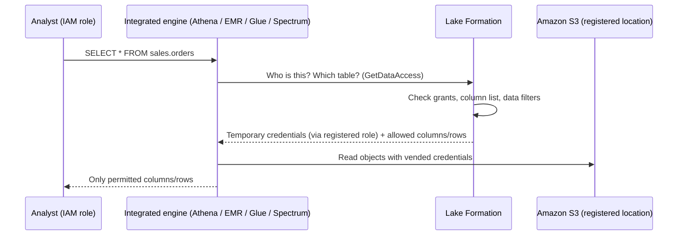

# 40 · AWS Lake Formation — the librarian who decides which pages you may read

> **Exam map:** D2 · Task 2.4 — D4 · Task 4.2, 4.5 · **Skills:** 2.4.1, 4.2.4, 4.5.1, 4.5.2 · **Weight:** 🔥🔥🔥 High · **Read time:** ~22 min

## The idea

Picture a huge archive. The boxes on the shelves are your files in Amazon S3. Until now, security was a set of **door keys**: IAM policies and bucket policies that open a room (a bucket or a prefix) or keep it shut. Once you're inside a room you can read every box, every page, every line. That's fine for raw files. It's hopeless when HR, marketing and finance all need *the same table* but each may only see certain **columns** (no salaries for marketing) or certain **rows** (EMEA managers see EMEA only).

**AWS Lake Formation (LF)** puts a **librarian** at the reading-room desk. Nobody walks into the stacks any more. You ask for a *book* (a table in the AWS Glue Data Catalog), the librarian checks a **ledger of grants** (`GRANT SELECT ON sales.orders (order_id, amount) TO analyst`), fetches the box using the archive's own master key, and hands your query engine a **temporary pass** that works only for the data you're entitled to. That hand-off is called **credential vending**, and the engines that honor the librarian's rules (Athena, Redshift Spectrum, EMR, Glue) are the **integrated services**.

So Lake Formation is a **permission layer over the Data Catalog**, with database-, table-, column-, row- and cell-level grants. It doesn't replace IAM. It adds a second, finer check on top. It also brings tag-based access at scale (LF-Tags) and cross-account sharing through AWS RAM (Resource Access Manager).

After this guide you'll handle the exam's favorite Domain 4 items: *"analysts must not see PII columns"*, *"regional managers see only their rows"*, *"LF grants were created but everyone can still read everything"*, *"share tables with 40 accounts with the least effort"*, *"the shared table doesn't show up in Athena"*, and *"Macie found PII, so restrict it automatically"*.

## Why IAM alone isn't enough

| Need | IAM + S3 policies | Lake Formation |
|---|---|---|
| Unit of control | Bucket, prefix, object | Catalog, database, table, **column, row, cell** |
| Model | JSON policies attached to principals and buckets | Database-style **GRANT / REVOKE** (console, CLI, API) |
| "Hide the SSN column" | Impossible without copying data | Column include/exclude list |
| "Only rows where region = 'EMEA'" | Impossible | Data filter (row filter expression) |
| Thousands of tables | Policy sprawl, size limits (bucket policy max **20 KB**) | LF-Tags: grant once on a tag expression |
| Cross-account table sharing | Bucket policy + catalog resource policy + KMS, per consumer | Grant to account / org / OU. RAM does the plumbing |

**Two locks, both must open.** A principal needs **IAM permission to call the APIs** (for example `lakeformation:GetDataAccess`, `glue:GetTable`, `athena:StartQueryExecution`), which is the coarse part, **and** an **LF grant** on the resource, which is the fine part. For data in a **registered** location, principals do **not** need S3 permissions: the librarian fetches the data with the registered role.

**THE trap:** *"The user has an LF SELECT grant but gets 'Insufficient Lake Formation permission(s)' or AccessDenied."* Check both locks. The IAM side often lacks `lakeformation:GetDataAccess` or the Glue read actions. The reverse is also true: IAM `s3:*` means nothing for a registered location if the LF grant is missing.

## How enforcement works: credential vending



- Lake Formation **never reads the data itself**. The engine reads it and **filters** it before returning results. AWS calls this *distributed enforcement* with **fail-close**: if an engine can't enforce a rule, the query must fail rather than leak data.
- Every hand-off is logged in CloudTrail as a **`GetDataAccess`** event (more under *Auditing*).

## Setting up: admins, registered locations, and the IAMAllowedPrincipals trap

**1. Data lake administrators.** These principals can grant anything in the catalog and create LF-Tags and data filters. Keep the list tiny. You can delegate tag management to **LF-Tag creators**.

**2. Register S3 locations.** Registering `s3://amzn-s3-demo-bucket/sales/` puts that prefix **and everything under it** under LF management. You pick the IAM role LF will use to read and write the location:

| Role option | Use when |
|---|---|
| **Service-linked role** `AWSServiceRoleForLakeFormationDataAccess` (default) | Simple same-account setups. With a customer managed KMS key, add the SLR as a key user in the key policy |
| **User-defined (custom) role**, trusting `lakeformation.amazonaws.com` | **Required** when: the location is in **another account**; the bucket uses the **AWS managed key `aws/s3`**; or you'll access the data with **Amazon EMR**. Also recommended in general, because the SLR has limitations |

Custom-role must-knows: an inline S3 read/write policy on the location, KMS permissions if encrypted, and the **admin who registers it needs `iam:PassRole`** on that role. Avoid registering **Requester Pays** buckets.

**THE trap:** *"Queries fail after registering an SSE-KMS bucket."* Either the registration role isn't allowed in the KMS key policy, or the bucket uses `aws/s3` and the SLR was used. Fix: a **custom role** with `kms:Decrypt`/`GenerateDataKey` on the key.

**3. Data location permission (`DATA_LOCATION_ACCESS`).** This lets a principal **create** a database or table that *points at* a registered location. It is **not** needed to query. Crawlers and ETL jobs that create tables in registered locations need it.

**4. The backward-compatibility switch.** Out of the box, LF behaves like "IAM only". It grants the **`Super`** permission to a virtual group called **`IAMAllowedPrincipals`** (every principal whose IAM policies allow Glue access) on new databases and tables. The **Data Catalog settings** checkboxes *"Use only IAM access control for new databases"* and *"…for new tables in new databases"* are **on by default**.

**THE trap:** *"We granted fine-grained LF permissions, but users with broad IAM Glue/S3 policies still see every column."* `IAMAllowedPrincipals` still holds `Super` on those resources, so **IAM is still what's controlling access**. Fix: clear the two default checkboxes, **revoke `IAMAllowedPrincipals`** from existing databases and tables, and register the location. (Don't confuse it with **`ALLIAMPrincipals`**. A grant to that group gives every IAM principal in the account an LF-governed grant. It's used, for example, to let everyone create resource links in a placeholder database.)

**5. Hybrid access mode (gradual migration).** Register the location in **hybrid access mode**, then **opt in** specific principals for specific databases and tables. **Opted-in principals** need **LF grants + IAM**. **Everyone else keeps working with IAM policies only**, so existing jobs aren't interrupted. It's the answer to *"adopt Lake Formation incrementally without breaking current pipelines."* Sharing hybrid resources cross-account requires cross-account **version 4 or later**.

## The permission vocabulary

| Resource | Permissions |
|---|---|
| Catalog | `CREATE_DATABASE`, `ALTER`, `DROP`, `DESCRIBE`, `ALL (Super)`, `Super user` (on nested catalogs only) |
| Database | `CREATE_TABLE`, `ALTER`, `DROP`, `DESCRIBE`, `ALL (Super)` |
| Table | **`SELECT`, `INSERT`, `DELETE`** (data), `ALTER`, `DROP`, `DESCRIBE`, `ALL (Super)` |
| View | `SELECT`, `DESCRIBE`, `DROP`, `ALL` |
| S3 location | `DATA_LOCATION_ACCESS` |
| LF-Tag | `ALTER`, `DROP`; on tag values: `ASSOCIATE`, `DESCRIBE`, `GrantWithLFTagExpression` |

Rules that show up in answers:
- **Grantable** ("with grant option") lets the grantee pass the permission on. You **can't** combine grant option with column filtering.
- `DESCRIBE` = see the metadata only, no query. Any other permission implies `DESCRIBE`.
- **Column filtering** on `SELECT` uses an **inclusion list** or an **exclusion list**. You **can't** column-filter **partition key** columns. A principal with *partial* `SELECT` can't also hold `ALTER/DROP/INSERT/DELETE` on that table.
- The **"All tables"** wildcard counts as one grant and also covers future tables in the database.
- **Principals** can be: IAM users and roles; **SAML** users and groups; **IAM Identity Center** users and groups (trusted identity propagation); **Quick Sight** (Amazon Quick, formerly QuickSight) Enterprise users and groups; and for cross-account grants, an **AWS account, organization, or OU**.
- LF permissions are **Regional**: a grant applies only in the Region where it was made.

**Schema design for LF (skill 2.4.1).** Design the catalog around permission boundaries. Use a database per domain or zone (raw, curated, consumption) so the "All tables" grants stay clean. Keep sensitive attributes in columns you can tag or exclude. Remember that partition columns are always visible. Build an LF-Tag ontology (e.g., `domain`, `confidentiality`, `zone`) before you create tables. Deeper modeling lives in [Guide 30 — Data Modeling](30-Data-Modeling-Schema-Evolution-Lineage.md).

## Data filters: row, column and cell security

A **data filter** belongs to one table and combines two things:
- a **column specification** (include list, exclude list, or all columns; nested `struct` fields are supported), and
- a **row filter expression**: a PartiQL `WHERE`-style predicate such as `region = 'EMEA'`, or the **all-rows wildcard**.

| You specify | You get |
|---|---|
| All columns + row expression | **Row-level security** |
| Column list + all rows | **Column-level security** |
| Column list + row expression | **Cell-level security** (different columns hidden depending on the row) |

Filters apply to **reads only**, so you grant **`SELECT` with a filter** and nothing else. Creating filters needs `SELECT` **with grant option** on the table, which data lake admins have by default. You can create as many filters per table as you need and grant different ones to different groups.

**Worked example.** Marketing sees orders without PII. The EMEA team sees only EMEA rows, also without PII.

```bash
# Column-level: exclude PII columns for the marketing role
aws lakeformation grant-permissions \
  --principal DataLakePrincipalIdentifier=arn:aws:iam::123456789012:role/MarketingAnalyst \
  --permissions "SELECT" \
  --resource '{"TableWithColumns":{"DatabaseName":"sales","Name":"orders",
      "ColumnWildcard":{"ExcludedColumnNames":["customer_email","phone"]}}}'
```

```json
// emea-filter.json  ->  aws lakeformation create-data-cells-filter --cli-input-json file://emea-filter.json
{
  "TableData": {
    "TableCatalogId": "123456789012",
    "DatabaseName": "sales",
    "TableName": "orders",
    "Name": "emea_no_pii",
    "RowFilter": { "FilterExpression": "region = 'EMEA'" },
    "ColumnWildcard": { "ExcludedColumnNames": ["customer_email", "phone"] }
  }
}
```

```bash
# Grant SELECT through the filter (cell-level security)
aws lakeformation grant-permissions \
  --principal DataLakePrincipalIdentifier=arn:aws:iam::123456789012:role/EmeaManagers \
  --permissions "SELECT" \
  --resource '{"DataCellsFilter":{"TableCatalogId":"123456789012",
      "DatabaseName":"sales","TableName":"orders","Name":"emea_no_pii"}}'
```

In the console, the same thing is **Data filters → Create new filter** (choose the table, *Exclude columns*, type the row filter expression), then **Grant → Named Data Catalog resources → select the filter → SELECT**.

**THE trap:** creating **one view or one copy of the data per audience** (Athena views, extra S3 prefixes, Glue jobs writing filtered copies). Those work, but they add storage, pipelines and drift. *"Least operational overhead"* + row/column restrictions on catalog tables = **LF data filters / column grants**.

## LF-Tags: tag-based access control (LF-TBAC) at scale

Named-resource grants ("SELECT on table X to role Y") explode when you have thousands of tables and dozens of personas. **LF-Tags** flip it around:
1. **Define** tags with allowed values, e.g. `confidentiality = {public, internal, pii}` and `domain = {sales, hr}`. Tags must be predefined.
2. **Assign** them to databases, tables and columns. **Inheritance** flows down (database → tables → columns), and you can override an inherited value at a lower level. A resource holds **one value per key**.
3. **Grant** permissions on **tag expressions**: *"SELECT on tables where `domain=sales AND confidentiality=(public OR internal)`"*. New tables that get tagged are **automatically covered**, with no new grants.

Expression logic: **different keys in one grant = AND**; **multiple values of one key = OR**. For "sales OR public", make **two grants**. If a principal has both a named grant and a TBAC grant, the effective permission is the **union**.

Useful numbers: up to **50 LF-Tags per resource**; up to **1,000 values per tag** (soft limit); keys and values ≤ **50 characters**, stored **lowercase**. Tag permissions (`ASSOCIATE`, `DESCRIBE`, `GrantWithLFTagExpression`) let you delegate tagging to data stewards without making them admins. **Saved LF-Tag expressions** let you reuse complex expressions.

**THE trap:** **LF-Tags ≠ IAM resource tags.** A tag you put on a Glue table or S3 object with `TagResource` does nothing in LF's grant model, and `aws:ResourceTag` conditions don't read LF-Tags. When a question says *"tag-based access to thousands of catalog tables and columns"*, the answer is **LF-Tags + LF-TBAC grants**, not IAM ABAC. (IAM ABAC is in [Guide 37 — IAM](37-IAM-for-Data-Engineers.md). Redshift's own RBAC is in [Guide 25](25-Redshift-Performance-Operations-Security.md).)

## Cross-account sharing (skill 4.5.1)

Two ways to share: the **named-resource method** (grant on a specific database or table) or the **LF-Tag method** (grant on a tag expression to an external account). Under the hood, **AWS RAM** creates resource shares.

Consumer side, step by step:
1. **Accept the RAM invitation.** Grants to your **organization or OU** need no invitation. Grants to an account outside the org do.
2. The consumer's **data lake admin re-grants** the shared resource to local principals. They **can't** re-share it to other accounts, and **`DROP`/`Super`** on a database can't be granted externally at all.
3. **Create a resource link**, a local catalog pointer to the shared database or table. **Athena and Redshift Spectrum only see shared objects through resource links.**

**THE trap:** *"The consumer can see the shared table in the Lake Formation console but not in the Athena query editor."* → create a **resource link** (on the database, together with an "All tables" grant, so one link covers every table).

**Cross-account version settings** (Data Catalog settings; set in the *producer*, the grantor):

| Version | What it adds |
|---|---|
| 1 | Original: one RAM share per grant |
| 2 | Packs many grants into fewer RAM shares |
| 3 | Share **directly with IAM principals** in another account; LF-Tag grants to **orgs/OUs** via RAM |
| 4 | Needed to share resources in **hybrid access mode** or objects in **federated catalogs** |
| 5 | Wildcard-based RAM shares, so an **effectively unlimited number of tables** can be shared; **can't downgrade** |

The encryption side of sharing is simpler than with pure IAM. Because LF reads the data with the **producer's registered role**, consumers need no bucket policy. The KMS key only has to trust the registration role (details in [Guide 39 — Encryption](39-Encryption-Key-Management.md)).

**Hub-and-spoke / data mesh.** A **central governance account** holds the catalog and the grants. Producer accounts own the S3 data and register it. Consumer accounts receive shares and use resource links. This is the reference *"centralized governance, decentralized ownership"* pattern. SageMaker Catalog layers business publish/subscribe on top of it, see [Guide 41](41-SageMaker-Unified-Studio-Catalog-Governance.md).

**Redshift datashares managed by LF.** A Redshift producer can grant a datashare to a Lake Formation account instead of directly to a consumer. The LF admin associates it, creates a **federated database** in the Data Catalog, and applies **database/table/column/row** permissions centrally. Requirements: **RA3 or Serverless**, same Region (not cross-Region). Plain Redshift data sharing is in [Guide 24](24-Redshift-Loading-Integration-Sharing.md).

## Engine integrations: who enforces what (skill 4.2.4)

| Engine | Table-level | Column | Row / cell | Notes |
|---|---|---|---|---|
| **Athena (SQL)** | Read/write | Read | Read | The default *"fine-grained + serverless SQL"* answer. SAML federation supported. Athena **for Apache Spark** does **not** support LF-governed tables |
| **Redshift Spectrum** (provisioned & Serverless) | Read/write | Read | Read | External schema over the Data Catalog; needs resource links for shared tables |
| **EMR on EC2: Spark** | Read/write | Read | Read | Use **runtime roles** (per-step IAM roles) with the LF-enabled security configuration. Register the location with a **custom role** |
| **EMR on EC2: Hive** | Read/write | Read | **No** | |
| **EMR Serverless: Spark** | Read/write | Read | Read | Hive on EMR Serverless: not supported |
| **EMR on EKS: Spark** | Yes | Yes | Yes | FGAC with EMR **7.7+** (GA Feb 2025), Spark jobs only |
| **Glue ETL** | Read/write | Glue **5.0+** read | Glue **5.0+** read | Older Glue versions: table-level only (no column filtering) |
| **Quick Sight** | via Athena | via Athena | via Athena | Quick users/groups can be LF principals |

Open table formats: for **Iceberg**, Athena and EMR Spark **read** with table/column/row/cell rules, but **writes need full-table access**. Glue 5.0+ reads Iceberg with FGAC. Details in [Guide 04](04-Open-Table-Formats-S3-Tables.md) and [Guide 26 — Athena](26-Amazon-Athena.md).

**THE trap:** *"Enforce column-level permissions for a Spark job"* with an **old Glue version** or with **Athena Spark notebooks**. Neither enforces LF column rules. Pick **Glue 5.0+**, **EMR (runtime roles)**, or **Athena SQL**.

## Iceberg tables and Amazon S3 Tables under Lake Formation

> 🆕 **New in exam guide v1.1:** Amazon S3 Tables and Iceberg management are in scope. Most older prep material predates the catalog integration below.

- When you integrate **S3 Tables** with the Data Catalog, Glue creates one **federated catalog, `s3tablescatalog`**, per account and Region. Each **table bucket** becomes a child catalog, each **namespace** becomes a database, and each **table** becomes a catalog table.
- You choose the access-control model: **IAM access control** (IAM policies on both S3 Tables and catalog objects) **or** **Lake Formation access control**. With LF, grants decide databases/tables/**columns/rows**, credential vending means principals **don't need S3 Tables IAM permissions**, and it also supports vending credentials to third-party engines. You can switch models later with a planned migration.
- Exam signal: *"S3 Tables + column-level/row-level restrictions for Athena users"* → **integrate with the Data Catalog using Lake Formation access control and grant LF permissions**.

## Blueprints, workflows and governed tables

- **Blueprints → workflows** generate Glue crawlers, jobs and triggers for you. The three types are **Database snapshot** (full reload from a JDBC source), **Incremental database** (new rows only, tracked by bookmark columns) and **Log file** (CloudTrail, ELB/ALB logs). They still exist and still appear in older questions (*"ingest an on-prem MySQL database into the lake with the least effort"*). For new builds, Glue jobs, DMS or zero-ETL are the more common answers ([Guide 10](10-DMS-Database-Ingestion.md)).
- > ⚠️ **2026 status:** **Governed tables** (LF's own ACID table type) were **discontinued**. Writes and Athena queries stopped on **Dec 31, 2024**, and the APIs stopped working after **Feb 17, 2025**. Treat *"use Lake Formation governed tables for ACID transactions"* as a **distractor**; the modern answer is **Apache Iceberg** (or Hudi/Delta).

## PII identification with Macie + Lake Formation (skill 4.5.2)

**Amazon Macie** scans S3 objects for sensitive data such as names, emails, card numbers and custom identifiers, and publishes findings to **EventBridge**. The standard automation pattern:

```
Macie sensitive-data discovery job (S3)
   └─> finding → EventBridge rule → Lambda
          └─> map the S3 path to its catalog table/columns
          └─> lakeformation:AddLFTagsToResource (confidentiality = pii)
                 └─> existing LF-TBAC grants now exclude pii-tagged columns automatically
```

Because grants are written against tags (e.g., analysts get `confidentiality=(public OR internal)`), newly classified columns disappear from analyst queries with **no grant changes**. Alternatives: **Glue sensitive data detection** during ETL (column-level detection plus redaction or hashing) and DataBrew PII transforms, covered in [Guide 42 — Privacy & PII](42-Privacy-PII-Masking-Sovereignty.md).

## Auditing

- **CloudTrail** records every LF API call: `GrantPermissions`, `RevokePermissions`, `PutDataLakeSettings`, `AddLFTagsToResource`, and so on.
- **`GetDataAccess`** is logged each time an engine requests vended credentials. `additionalEventData` shows the **`lakeFormationPrincipal`** (the real caller) and the `requesterService` (e.g., `GLUE_JOB`). This answers *"which principal accessed which table through Lake Formation?"*
- S3 data events alone show the **registration role** as the caller. Since **Feb 2026** you can enable source-identity propagation (`SET_SOURCE_IDENTITY` plus `sts:SetSourceIdentity` in the registration role's trust policy) so S3 `GetObject` events also carry the originating role's ID.
- The LF console shows **Data permissions** per principal and resource, plus a **Review location permissions** check before you register a path. For cross-account grants, events appear in both accounts. Redshift federated catalogs don't emit `GetDataAccess`; watch `GetTable`/`BatchGetTable` instead. More in [Guide 43](43-Audit-Logging-CloudTrail-Config.md).

## Troubleshooting cheat table

| Symptom | Likely cause → fix |
|---|---|
| `Insufficient Lake Formation permission(s)` | Missing LF grant (or missing `DESCRIBE` on the database) → grant; also check the IAM side (`lakeformation:GetDataAccess`, Glue actions) |
| LF grants seem ignored; everyone sees everything | `IAMAllowedPrincipals` still has `Super`; default "IAM only" settings on → revoke, clear settings |
| Access denied on an encrypted location | Registration role not in the KMS key policy, or `aws/s3` used with the SLR → custom role + KMS permissions |
| Shared table invisible in Athena/Spectrum | No **resource link** in the consumer account |
| Consumer admin can't see a direct share | Direct-to-principal grants (v3) are visible only to that grantee |
| Crawler/ETL can't create a table in a registered path | Missing **`DATA_LOCATION_ACCESS`** |
| EMR ignores LF rules | No runtime roles / LF security configuration, or location registered with the SLR |
| Cross-account LF-Tag grant error about version | Producer's cross-account version lower than the consumer's (v3+ needed) → upgrade |

## Question patterns

> *"Marketing analysts query the `orders` table with Athena. They must not see `customer_email` or `phone`. Data lives in S3 and is cataloged in Glue. What meets this with the LEAST operational overhead?"* → **Lake Formation column-level `SELECT` grant (exclude those columns)** (a filtered copy via a Glue job or a view per audience works but adds pipelines to maintain; IAM can't hide columns in a Parquet file).

> *"Regional sales managers may only see rows for their own region, and managers outside HR must never see the salary column."* → **LF data cell filters** (row expression `region = 'X'` + excluded columns), one filter per group, granted with `SELECT` (row + column = cell-level security).

> *"After granting fine-grained Lake Formation permissions, users with broad IAM Glue and S3 policies still query every column."* → **Revoke `Super` from `IAMAllowedPrincipals` and turn off "Use only IAM access control" defaults** (while that group holds `Super`, IAM is still in charge).

> *"A data lake has 8,000 tables and new ones arrive daily. Access must follow data classification (public/internal/confidential) with minimal ongoing administration."* → **LF-Tags with tag-expression grants** (new tables inherit tags from the database and are covered automatically; named grants and IAM ABAC don't scale here, and IAM tags aren't LF-Tags).

> *"A central governance account must share curated tables with 30 accounts in the same AWS Organization, minimizing per-account setup and invitation handling."* → **LF-Tag (or named) grants to the organization/OU with cross-account version 3+** (org/OU grants need no RAM invitation acceptance; consumers create resource links).

> *"A consumer account's admin accepted the share, but analysts can't find the shared database in the Athena query editor."* → **Create a resource link to the shared database** (Athena and Spectrum only see shared objects through resource links).

> *"EMR Spark jobs run by different teams on one cluster must be limited to the tables and columns each team is allowed in Lake Formation."* → **EMR runtime roles + LF-enabled security configuration, with the S3 location registered using a custom IAM role** (instance-profile permissions are all-or-nothing; the service-linked role can't be used with EMR).

> *"The company wants to move from IAM-based catalog access to Lake Formation one team at a time without disrupting existing Glue jobs."* → **Hybrid access mode, opting in principals gradually** (opted-in principals use LF + IAM; everyone else continues with IAM only).

> *"After registering a bucket encrypted with the `aws/s3` key, Athena queries through Lake Formation fail with access denied."* → **Re-register with a custom role that has KMS permissions on the key** (the Lake Formation service-linked role can't be used with AWS managed key encryption).

> *"When Macie detects PII in new S3 data, access to those columns must be restricted automatically."* → **Macie finding → EventBridge → Lambda that applies an LF-Tag (e.g., `confidentiality=pii`), with TBAC grants that exclude that tag** (tag-driven grants adjust without editing permissions).

> *"Auditors ask which IAM principal obtained access to a governed table last Tuesday."* → **CloudTrail `GetDataAccess` events (lakeFormationPrincipal)** (S3 data events alone show the registration role as the caller).

> *"A Glue for Apache Spark ETL job must read a table while respecting row-level filters defined in Lake Formation."* → **Use AWS Glue 5.0 or later** (FGAC reads arrived in Glue 5.0; earlier versions support only table-level permissions).

> *"A producer's Redshift RA3 cluster must share tables with another account, and the governance team wants to control column- and row-level access centrally alongside the data lake."* → **Lake Formation-managed Redshift datashare** (datashare granted to the LF account, federated database, LF grants).

> *"A team needs ACID updates and time travel on data lake tables. One option suggests Lake Formation governed tables."* → **Apache Iceberg tables in the Glue Data Catalog** (governed tables were discontinued in 2024–2025, so that option is a distractor).

> *"Analysts query Iceberg tables stored in S3 table buckets with Athena; some may only see non-sensitive columns."* → **Integrate S3 Tables with the Data Catalog using Lake Formation access control and grant column-level permissions** (the `s3tablescatalog` federated catalog becomes governable like any catalog).

## Pocket card

| Keyword / signal | Answer |
|---|---|
| Column / row / cell-level access on lake tables | Lake Formation grants + data filters |
| Hide specific columns | `SELECT` with column exclusion (or inclusion) list |
| Only certain rows | Data filter with row filter expression |
| Different columns hidden per row | Cell-level: column list + row expression |
| Filters can be granted with | `SELECT` only (reads) |
| Two locks | IAM (call APIs) + LF grant (resource) |
| Principal reads data via | Vended temporary credentials from the registered role |
| LF grants ignored | `IAMAllowedPrincipals` has `Super`; revoke + clear defaults |
| Gradual IAM → LF migration | Hybrid access mode + opt-in principals |
| Create tables in a registered path | `DATA_LOCATION_ACCESS` |
| Must use custom registration role | Cross-account location, `aws/s3` key, or EMR |
| Admin registering with custom role needs | `iam:PassRole` |
| Thousands of tables, classification-based | LF-Tags (TBAC) |
| Tag keys in one grant / values in one key | AND / OR |
| LF-Tags vs IAM tags | Different systems; IAM tags don't drive LF grants |
| Tags per resource / values per tag | 50 / 1,000 (soft) |
| Share with accounts in the org, no invitations | Grant to organization / OU (v3+) |
| Shared table not visible in Athena/Spectrum | Resource link in consumer account |
| Share directly with an IAM role in another account | Cross-account version 3+ |
| Share hybrid-mode or federated-catalog resources | Version 4+ |
| Share huge numbers of tables | Version 5 (wildcard RAM shares, no downgrade) |
| Cross-account plumbing | AWS RAM |
| Centralized governance, decentralized data | Hub-and-spoke LF (+ SageMaker Catalog) |
| EMR honoring LF | Runtime roles + LF security configuration |
| EMR on EKS FGAC | EMR 7.7+, Spark only |
| Glue ETL row/column enforcement | Glue 5.0+ |
| Athena Spark notebooks + LF tables | Not supported |
| Redshift data governed centrally by LF | LF-managed datashares (RA3/Serverless, same Region) |
| S3 Tables fine-grained access | `s3tablescatalog` + LF access control |
| Legacy ingestion wizard | Blueprints: snapshot / incremental / log file |
| "Governed tables" | Discontinued; distractor → Iceberg |
| PII found, restrict automatically | Macie → EventBridge → Lambda → LF-Tag |
| Who accessed data via LF | CloudTrail `GetDataAccess` |

Lake Formation is the enforcement engine underneath modern AWS data sharing. Next, see how SageMaker Unified Studio and SageMaker Catalog wrap it in domains, projects and subscriptions in [Guide 41 — SageMaker Unified Studio & Catalog Governance](41-SageMaker-Unified-Studio-Catalog-Governance.md).
