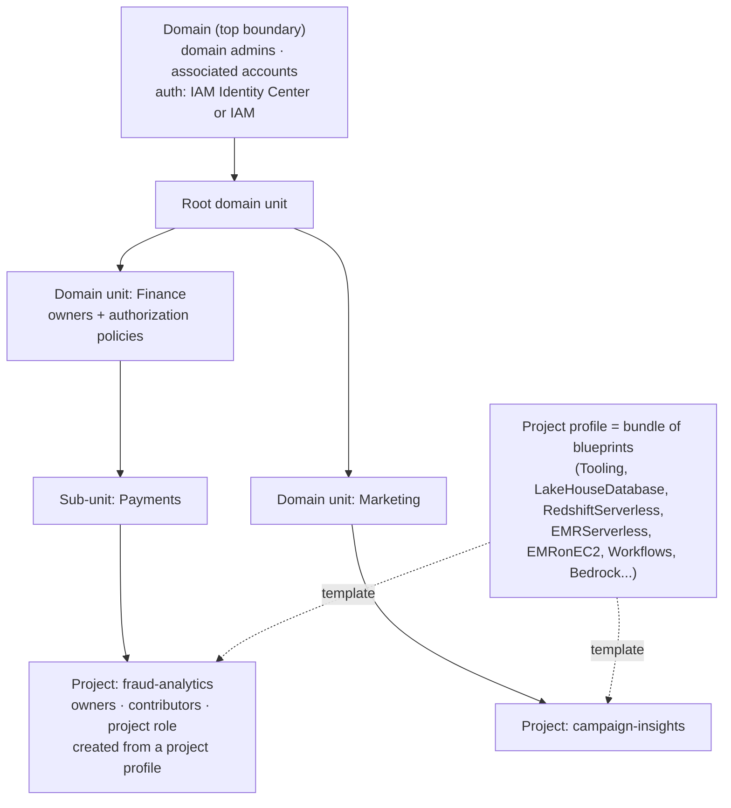

# 41 · SageMaker Unified Studio, Catalog & Governance — the data marketplace with a front desk

> **Exam map:** D2 · Task 2.2, 2.4 — D3 · Task 3.1 — D4 · Task 4.1, 4.5 · **Skills:** 2.2.6, 2.4.4, 3.1.6, 4.1.7, 4.5.1, 4.5.6, 4.5.7 · **Weight:** 🔥🔥 Medium · **Read time:** ~20 min

> 🆕 **New in exam guide v1.1:** business data catalogs (2.2.6), SageMaker Catalog lineage (2.4.4), Unified Studio data prep (3.1.6), domains/domain units/projects (4.1.7), access through Catalog projects (4.5.6), and governance frameworks and sharing patterns (4.5.7). Older prep material covers at most "Amazon DataZone" in a paragraph.

## The idea

Picture a big **farmers' market**. Farmers (**producer** teams) bring produce (tables, dashboards, models). Before a stall opens, each item gets a **label**: what it is, who grew it, quality grade, allergens. The labels are collected in a **market directory** anyone can browse. A shopper (a **consumer** team) doesn't walk into the barn and take things. They find an item in the directory and place a **request**. The farmer approves, and the **market office hands over the goods** automatically, recording who got what. The market also has a map of **sections** (business units), each with a manager who decides who may set up a stall or print new label templates.

That is the **next generation of Amazon SageMaker**, announced at re:Invent in December 2024. It has three layers:

- **SageMaker Unified Studio** is the market hall: one web workspace for SQL, notebooks, Spark, visual ETL, workflows, generative AI and Amazon Q.
- The **lakehouse architecture of Amazon SageMaker** (launched as "SageMaker Lakehouse") is the produce in one place. It unifies S3 data lakes and Redshift warehouses under Apache Iceberg-compatible catalogs, one copy of the data.
- **SageMaker Catalog** is the directory and the market office: the **business data catalog**, publish/subscribe and governance, **built on Amazon DataZone**.

The ML service everyone used to call "SageMaker" is now **Amazon SageMaker AI**, one tool inside this bigger house.

After this guide you'll be able to answer the governance questions v1.1 added. Who can create projects (**domain units** and their policies). How a team gets access to another team's table **without a ticket to the Lake Formation admin** (**subscriptions**). What "data mesh" really means versus hub-and-spoke. And which **sharing mechanism** to pick when the requirement says *"live," "no copy," "third party"* or *"without exposing raw data."*

## The new SageMaker in one table

| Piece | What it is | Formerly / related |
|---|---|---|
| **SageMaker Unified Studio** | Browser IDE. **Query editor and Querybooks** (Athena or Redshift, with Amazon Q generating SQL), **JupyterLab notebooks** (Spark on **EMR** or **Glue**), **Visual ETL** (drag-and-drop, generates PySpark, can be authored in English with Q), **Workflows** (Airflow on MWAA), **Amazon Bedrock in SageMaker Unified Studio** (build generative AI apps), MLflow experiments | Absorbs DataZone's data portal, Glue Studio-style ETL, Redshift QEv2-style SQL |
| **Lakehouse architecture** | Unified technical catalog over S3 (Glue Data Catalog) and **Redshift Managed Storage** catalogs, reachable through Iceberg-compatible APIs by Spark, Athena, Redshift and others. Governed by **Lake Formation** | "SageMaker Lakehouse" (Dec 2024). See [Guide 04](04-Open-Table-Formats-S3-Tables.md), [Guide 13](13-Glue-Data-Catalog-Crawlers.md) |
| **SageMaker Catalog** | **Business** catalog: assets, glossary, metadata forms, publish/subscribe, data products, lineage, data quality | **Amazon DataZone** |
| **SageMaker AI** | Build, train and deploy ML models | "Amazon SageMaker" (renamed Dec 2024) |

**Technical catalog vs business catalog (2.2.6).** The **Glue Data Catalog** tells *engines* where files are and what the schema is. **SageMaker Catalog** tells *people* what the data means, who owns it, whether it's trustworthy, and how to request it. The business catalog **imports** technical metadata from the technical catalog. It doesn't replace it.

## Unified Studio constructs (4.1.7): domain → domain units → projects

- **Domain** is the top-level organizing boundary for users, assets and projects. You can run one for the enterprise or one per business unit. The IAM principal who creates it becomes a **domain administrator**. Domain admins manage project profiles, blueprints, users, **account associations**, Bedrock model access, Git connections and Amazon Q.
- **Two authentication styles.** **Identity Center-based domains** use AWS IAM Identity Center with SSO from your IdP. **IAM-based domains** use federated IAM roles, and **only one IAM-based domain is allowed per account**.
- **Associated accounts** are other AWS accounts linked to the domain after their admins **accept** the association request. Projects can then publish data from, and deploy tooling into, those accounts. This is how one domain spans a multi-account estate.
- **Domain units** form a **hierarchy** under a root unit that mirrors the organization (Finance → Payments). **Domain unit owners** receive **delegated authority** and grant **authorization policies**.

  Policies granted to **users and groups**:
  - domain unit creation
  - project creation
  - project membership
  - domain unit ownership assumption
  - project ownership assumption

  Policies granted to **projects**:
  - **glossary creation**
  - **metadata forms creation**
  - **custom asset type creation**

  So *"only the data governance project may define glossary terms"* is a **glossary creation policy** on a domain unit.
- **Project** is the unit of work, collaboration **and permission**. It holds notebooks, queries, workflows, a project Git repo and a project S3 path, plus the data it owns or has subscribed to.
  - **Owners** add and remove members and manage the project. **Contributors** do the work.
  - Data and compute access runs through the project's **IAM role**. Adding someone to the project is how they gain its access.
  - Nothing leaves a project unless it's **published** to the catalog.
- **Project profile** is an admin-defined **template** of **blueprints**. Examples: *All capabilities*, *SQL analytics*, *Generative AI application development*, or custom. The profile says which blueprints are provisioned at creation and which members can enable **on demand**.
- **Blueprint** is a CloudFormation-based configuration that provisions one capability:
  - **Tooling** (project IAM roles, security groups)
  - **LakeHouseDatabase** (Glue database + Athena workgroup + LF permissions)
  - **LakehouseCatalog** (catalog on Redshift Managed Storage)
  - **RedshiftServerless**
  - **EMRServerless**, **EMRonEC2**
  - **Workflows** (MWAA)
  - **MLExperiments** (MLflow)
  - the **AmazonBedrock…** family (Knowledge Base, Guardrail, Agent, Flow, Prompt, Evaluation, Function)

  Blueprint-level policies control which projects may use each blueprint.

**THE trap:** answering *"let each business unit's leads decide who can create projects, without making them domain admins"* with IAM policies or more domain administrators. The designed answer is **domain units with owners, plus a project creation policy**. Delegation is the whole point of domain units.

## SageMaker Catalog (2.2.6, 4.5.6): from inventory to access

1. **Data source run.** A producer project creates a **data source** for the **AWS Glue Data Catalog** or **Amazon Redshift**. Each run (on creation, on a **schedule** or manual) imports **technical metadata** (tables, columns, types) as **assets** in the project's **inventory**.
2. **Curate.**
   - Add a business name and description. **AI-generated descriptions** can draft these for tables and columns, and you review them before publishing.
   - Attach **business glossary terms** (a shared vocabulary: "Active Customer" means one thing company-wide) to assets and columns.
   - Fill in **metadata forms**. These are domain-defined templates with typed fields such as data classification, retention or regulatory scope. They can be **required** before publishing.
   - Show **data quality** scores. Results from **AWS Glue Data Quality** surface on the asset, and external results can be pushed by API ([Guide 33](33-Data-Quality.md)).
3. **Publish** to the catalog. The asset is now **discoverable by every project in the domain**, across accounts and Regions, through **search** with facets, glossary terms and forms. **Data products** bundle related assets (for example, the "Customer 360" tables) so consumers request them as one unit.
4. **Subscribe.** A consumer project submits a **subscription request** with a justification. The **owner (producer) project approves or rejects**. Access can be **revoked** later.
5. **Automatic fulfillment (managed assets).** On approval, the catalog grants access to the **subscriber project** with no manual step:
   - **Glue tables** get **Lake Formation** grants, including cross-account.
   - **Redshift tables and views** get **Redshift** grants or datashares.

   The consumer queries immediately from its project tools. **Row and column asset filters** can be applied at approval so a subscriber sees only its slice. For **unmanaged** assets, the producer fulfills access manually after approval.

**THE trap:** thinking catalog subscription is "just a request form." For managed Glue and Redshift assets, **approval triggers the actual grants**. That's why *"self-service access with an approval workflow and automatic permission grants, least operational overhead"* → **SageMaker Catalog (DataZone) subscriptions**, not tickets and hand-written Lake Formation grants.

**Managing access through projects (4.5.6).** Access belongs to the **project**, not the individual. Add a user to the project and they inherit its subscriptions. Remove them and access goes. **Revoke** a subscription and the grant is removed. Owners approve, and domain unit policies decide who may create projects in the first place.

### Lineage (2.4.4)

**Data lineage** answers *"where did this column come from and what breaks if I change it?"* SageMaker Catalog shows a **lineage graph** of jobs and datasets across versions.

- It's **OpenLineage-compatible**, so you can post OpenLineage run events from any tool (Airflow, Spark, custom) through the API.
- It **captures lineage automatically** from AWS Glue and Amazon Redshift activity.

**Amazon SageMaker ML Lineage Tracking** (in SageMaker AI) tracks the **ML workflow**: datasets, training jobs, models and endpoints as artifacts and associations. **Pick by question:** *"which model version was trained on which dataset"* → **ML Lineage Tracking**. *"Trace a report column back through ETL jobs to the source table"* → **SageMaker Catalog lineage**. Modeling-side lineage concepts are in [Guide 30](30-Data-Modeling-Schema-Evolution-Lineage.md).

### Preparing data in Unified Studio (3.1.6)

In a project you can profile and shape data with **Visual ETL** (no Spark code), **JupyterLab** notebooks (PySpark on Glue or EMR), **Querybooks** (SQL on Athena or Redshift) and Amazon Q-generated SQL or code. Then you schedule the result as a **Workflow**. For recipe-style, no-code cleansing with 250+ transforms, **Glue DataBrew** remains the classic answer ([Guide 14](14-Glue-DataBrew-Data-Preparation.md)). Pick **Unified Studio** when the requirement stresses *one governed workspace* where the prepared output is published to the catalog.

## Amazon DataZone heritage — translating old question wording

| DataZone term (older questions) | Next-gen SageMaker term |
|---|---|
| DataZone domain | SageMaker (unified) domain |
| Data portal | SageMaker Unified Studio |
| Domain units / authorization policies | Same |
| Project | Project |
| Environment profile / environment (e.g., "Data lake," "Data warehouse" blueprints) | **Project profile** made of **blueprints**. Environments still exist inside projects |
| Business data catalog, glossary, metadata forms | SageMaker Catalog, same names |
| Publish / subscribe / subscription grant | Same |
| Data sources (Glue, Redshift) | Same |

If a question says **"Amazon DataZone,"** apply everything in this guide. The mechanics are the same.

## Governance frameworks (4.5.7)

| Framework | Who owns data | Strengths | Weaknesses | AWS shape |
|---|---|---|---|---|
| **Centralized** | One central data team ingests, models and serves everything | Consistent standards, one place to audit | **Bottleneck**. Central team lacks domain context | Single lake/warehouse account, one Lake Formation admin |
| **Decentralized / data mesh** | **Domain teams own their data as products** | Scales with the organization, domain expertise, speed | Risk of inconsistent standards unless governance is federated | Producer accounts per domain, a catalog for discovery |
| **Federated hub-and-spoke** (the pragmatic middle) | Domains produce. A **central hub governs** (catalog, policies, audit) | Local ownership + central control | Needs a platform team and clear contracts | **Central governance/catalog account** + producer and consumer accounts, via **Lake Formation cross-account sharing** and **SageMaker Catalog** |

**Data mesh's four principles:** (1) **domain-oriented ownership**, (2) **data as a product** (discoverable, documented, trustworthy, with an owner), (3) **self-serve data platform**, (4) **federated computational governance** (global rules enforced automatically by the platform). On AWS that maps to producer accounts, published catalog assets with glossary and forms, Unified Studio project profiles, and Lake Formation/LF-Tags plus catalog policies.

**Stewardship roles:**
- **Data owner** is accountable for a dataset and approves access (the producer project owner).
- **Data steward** looks after meaning and quality: glossary, metadata, quality rules.
- **Data custodian** runs the technical controls: storage, encryption, backups, permissions implementation. That's often the platform or data engineering team.

**Governance capabilities to map to services:**

| Capability | Service |
|---|---|
| Discovery | SageMaker Catalog |
| Technical metadata | Glue Data Catalog |
| Classification / PII | Macie, Glue sensitive data detection ([Guide 42](42-Privacy-PII-Masking-Sovereignty.md)) |
| Quality | Glue Data Quality |
| Lineage | SageMaker Catalog |
| Access control | Lake Formation, IAM, Redshift RBAC ([Guide 40](40-Lake-Formation.md)) |
| Auditing | CloudTrail, Config ([Guide 43](43-Audit-Logging-CloudTrail-Config.md)) |

**THE trap:** equating "data mesh" with "every team does whatever it wants." Mesh **requires federated governance**: shared standards enforced by the platform. The exam's *"domain teams own and publish their data while a central team enforces standards and discoverability"* is **federated / hub-and-spoke with a central catalog**, not "fully decentralized with no central catalog."

## Data sharing patterns (4.5.1, 4.5.7)

| Pattern | Live or copy? | Engine / data | Governance | Pick when |
|---|---|---|---|---|
| **Lake Formation cross-account sharing** (named resources or **LF-Tags**, via **AWS RAM**) | **Live** (in place) | Glue tables on S3, queried by Athena, EMR, Redshift Spectrum, Glue | Fine-grained: column, row and cell filters, TBAC. See [Guide 40](40-Lake-Formation.md) | Share lake tables with other accounts in your organization |
| **Redshift data sharing** (datashares) | **Live, no copy, no ETL** | Redshift ↔ Redshift (RA3/Serverless), **cross-account and cross-Region** | Producer controls objects. Consumer compute is isolated. See [Guide 24](24-Redshift-Loading-Integration-Sharing.md) | *"Share live warehouse data with another cluster/account without copying"* |
| **SageMaker Catalog publish/subscribe** | Live (fulfilled via LF / Redshift grants) | Glue + Redshift assets | Business metadata, approval workflow, audit, project-scoped access | *"Self-service discovery + request/approve across teams"* |
| **AWS Data Exchange** | Subscription (files copied, or live via Redshift datashares, S3 data access, APIs) | Third-party / commercial data products | Licensing, entitlements, billing through AWS Marketplace | **Buy or sell** data, share with **external** parties under terms ([Guide 46](46-GapFill-Services.md)) |
| **S3 bucket policies / access points / S3 Access Grants** | Live (raw objects) | Files, not tables | Prefix/object-level. Access Grants map directory identities to prefixes | Raw file sharing, non-SQL consumers |
| **Replication / copy** (S3 CRR, snapshots, UNLOAD) | **Copy** | Anything | Two copies to govern, stale risk | **Last resort**: isolation, DR or residency needs a physical copy |
| **AWS Clean Rooms** | Neither side sees raw data | Joint analysis | Collaboration rules | Partners analyze **together without sharing raw data** (not on the in-scope list; know the name) |
| **Zero-ETL integrations** | Managed continuous replication | Aurora/RDS/DynamoDB → Redshift or lakehouse | Service-managed | Operational data → analytics, no pipelines ([Guide 10](10-DMS-Database-Ingestion.md)) |

**Decision rules:**

- *"Live / no copy"* → Lake Formation (lake) or Redshift data sharing (warehouse).
- *"Discover and request with approval"* → SageMaker Catalog.
- *"External / commercial / licensed"* → Data Exchange.
- *"Collaborate without revealing records"* → Clean Rooms.
- *"Must physically reside elsewhere"* → replication.

**THE trap:** answering *"share Redshift tables with another account so they always see current data, MOST efficient"* with **UNLOAD to S3 + COPY** or snapshot-restore. Those are copies that go stale. **Redshift data sharing** is live with zero copies. Likewise, **Data Exchange** is for third-party distribution, not internal sharing between two of your own accounts.

## Question patterns

> *"A company wants business units to govern their own data. Each unit's lead must control who can create projects in that unit, without making them domain administrators."* → **Create domain units per business unit, make the leads domain unit owners, and grant a project creation policy**. Extra domain admins over-privilege, and IAM policies don't govern Unified Studio authorization.

> *"Analysts in the marketing account must discover finance tables, request access, and receive it after the finance owner approves, with LEAST operational overhead."* → **SageMaker Catalog (DataZone) publish/subscribe**. Approval automatically fulfills the Lake Formation/Redshift grants. Manual LF grants from tickets don't scale.

> *"Before any asset is published, producers must record data classification and retention period."* → **Required metadata form** on the domain/asset type. Glossary terms define vocabulary; they don't enforce fields.

> *"Only the central governance team may create business glossary terms."* → **Glossary creation policy** on the domain unit granted to the governance project.

> *"New projects must automatically get a Glue database, Athena workgroup and Redshift Serverless workgroup, while EMR is available only on request."* → **Project profile** with LakeHouseDatabase and RedshiftServerless blueprints enabled at creation, and EMRServerless set to on-demand.

> *"A project member leaves the analytics team and must lose access to all subscribed data."* → **Remove the user from the project**. Access flows through project membership and the project role. Hunting down individual grants is error-prone.

> *"A data engineer must see which upstream ETL jobs and source tables feed a Redshift reporting table, including jobs orchestrated in Airflow."* → **SageMaker Catalog lineage** (automated Glue/Redshift capture plus **OpenLineage** events posted from Airflow). ML Lineage Tracking covers model artifacts, not ETL.

> *"The ML team must prove which dataset version trained model v7."* → **SageMaker ML Lineage Tracking** in SageMaker AI.

> *"Domain teams must own and publish data products; a central team enforces standards and keeps a single place to discover data."* → **Federated (hub-and-spoke) data mesh**: central governance/catalog account + producer and consumer accounts via Lake Formation sharing and SageMaker Catalog. Fully centralized creates a bottleneck. Fully decentralized with no catalog loses discoverability.

> *"Share live Redshift data from the producer account with three consumer accounts in two Regions, without copying data."* → **Redshift data sharing** (cross-account/cross-Region datashares). UNLOAD/COPY and snapshots create stale copies.

> *"A company wants to sell curated datasets to external subscribers and handle licensing and billing."* → **AWS Data Exchange**. RAM and Lake Formation are for accounts you trust inside your organization.

> *"Two companies must measure campaign overlap without either seeing the other's customer records."* → **AWS Clean Rooms**. Any sharing or replication exposes raw data.

> *"An exam question says 'Amazon DataZone environment' — what's the Unified Studio equivalent?"* → **Project profile/blueprints provisioning project tooling**. Environments still exist inside projects. Same governance model, new names.

> *"Users must sign in to Unified Studio with their corporate IdP credentials via SSO."* → **Identity Center-based domain** federated to the IdP. IAM-based domains use IAM roles, and there's only one per account.

## Pocket card

| Keyword / signal | Answer |
|---|---|
| One workspace: SQL + notebooks + Spark + ETL + GenAI | **SageMaker Unified Studio** |
| Business catalog, glossary, publish/subscribe | **SageMaker Catalog** (built on **DataZone**) |
| S3 lake + Redshift under Iceberg-compatible catalogs | Lakehouse architecture of SageMaker (ex-"SageMaker Lakehouse") |
| The ML build/train/deploy service | **SageMaker AI** |
| Top-level boundary, admins, account associations | **Domain** |
| SSO with corporate IdP | Identity Center-based domain |
| IAM-role based setup (one per account) | IAM-based domain |
| Link other accounts to the domain | **Associated accounts** (target admin accepts) |
| Business-unit hierarchy + delegated admin | **Domain units** + owners |
| Who may create projects / join projects | Project creation / project membership policy |
| Who may create glossary / forms / asset types | Glossary / metadata forms / custom asset type creation policy |
| Unit of work, collaboration and permission | **Project** (owners, contributors, project role) |
| Admin template of tools for projects | **Project profile** |
| Provisions one capability (Glue DB, Redshift Serverless, EMR, MWAA, Bedrock) | **Blueprint** |
| Import technical metadata from Glue/Redshift | **Data source run** (scheduled) |
| Shared business vocabulary | **Business glossary** terms |
| Required custom metadata before publishing | **Metadata forms** |
| Draft descriptions automatically | AI-generated descriptions |
| Quality score on the asset | Glue Data Quality integration |
| Bundle of assets requested together | **Data product** |
| Request → approve → automatic grants | **Subscription** (LF grants for Glue, Redshift grants/datashares) |
| Subscriber sees only some rows/columns | Asset (row/column) filters at approval |
| ETL/table lineage, OpenLineage | **SageMaker Catalog lineage** |
| Model/dataset/training lineage | **SageMaker ML Lineage Tracking** |
| "Amazon DataZone" in the question | Same model: domain, projects, catalog, subscriptions |
| Domain ownership + data as product + self-serve + federated governance | **Data mesh** |
| Central governance account + producer/consumer accounts | **Hub-and-spoke (federated)** |
| Single team does everything | Centralized (bottleneck) |
| Owner / steward / custodian | Accountable / meaning+quality / technical controls |
| Share lake tables across accounts, live | **Lake Formation + RAM** (named or LF-Tags) |
| Share warehouse data live, no copy | **Redshift data sharing** |
| Sell/license data to third parties | **AWS Data Exchange** |
| Analyze jointly without exposing raw data | AWS Clean Rooms |
| Raw file access by prefix/identity | S3 Access Grants / access points / bucket policy |
| Operational DB → analytics without pipelines | Zero-ETL |
| Physical copy required | Replication (last resort) |

Once access is governed, the next question is what sensitive data those assets contain and where it's allowed to live. Continue with [Guide 42 — Privacy, PII, Masking & Sovereignty](42-Privacy-PII-Masking-Sovereignty.md).
