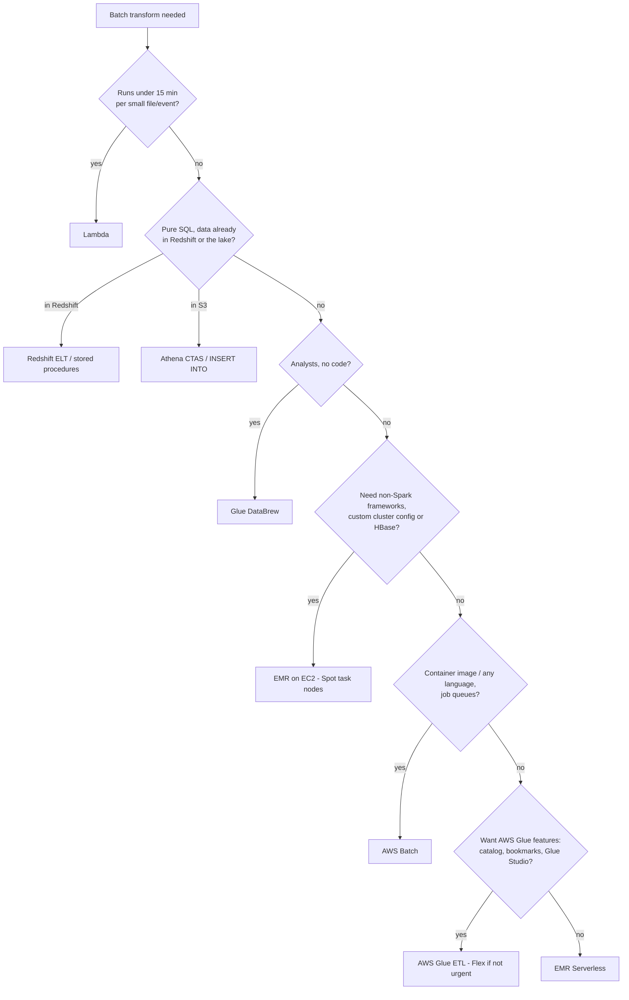
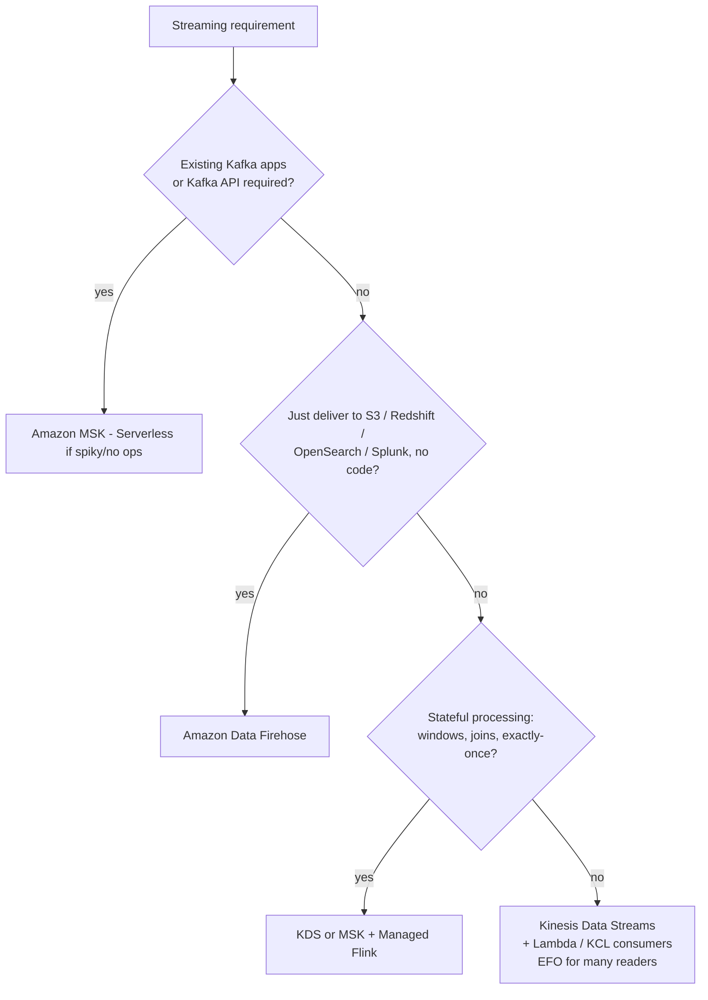
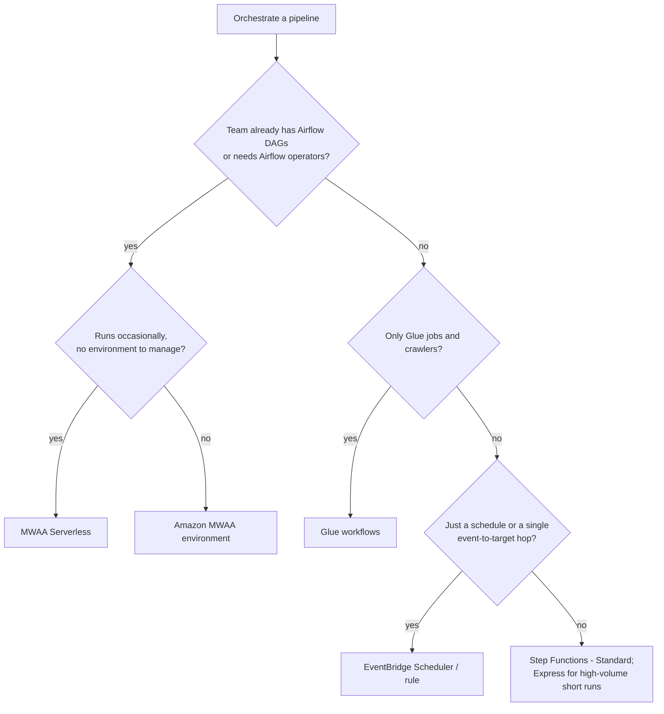
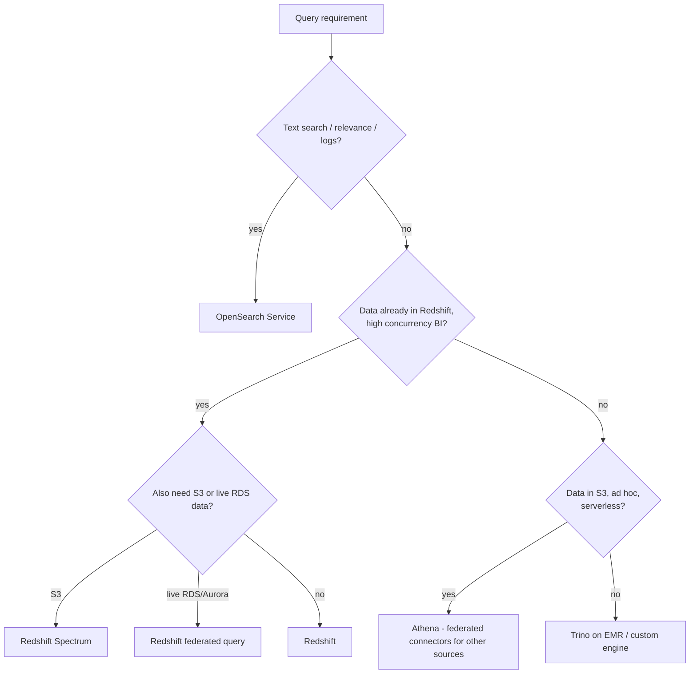

# 45 · Service Selection Decision Guide — the capstone "which service?" playbook

> **Exam map:** All domains (D1 · 1.1–1.3, D2 · 2.1–2.2, D3 · 3.1–3.3, D4 · 4.1–4.5) · **Skills:** 1.1.1, 1.1.2, 1.2.5, 1.3.1, 2.1.1, 2.1.2, 2.2.2, 3.2.5, 4.1.6, 4.2.4 (and the "which service" layer of most others) · **Weight:** 🔥🔥🔥 High · **Read time:** ~20 min

## The idea

Think of a **hardware store with a very good assistant**. You don't walk in asking for "a tool". You say *"I need to put a 10 cm hole through brick, once, and I hate maintaining equipment."* The assistant ignores 90% of the aisle at once. Brick rules out wood bits, once rules out buying a hammer drill, and hating maintenance points to the rental counter. Every DEA-C01 scenario works the same way. The question is a job description, and three or four **signal words** (source type, latency, volume, skill set, and a qualifier like *"least operational overhead"* or *"most cost-effective"*) eliminate everything except two finalists. Your job is to spot the one signal that breaks the tie.

This guide is the assistant's cheat sheet. For every stage of a pipeline (ingest, process, orchestrate, store, query, catalog, secure, monitor) it gives **signal → service** tables plus the **classic distractor**, followed by a **least-overhead ladder**, cost heuristics, four decision flowcharts, and the AWS Well-Architected lens for analytics. It doesn't re-teach the services. Each row points to the guide that owns the depth. Use it last, as the layer that ties everything together.

## The two tie-breaker qualifiers

**"Least operational overhead" ladder.** Climb as high as the requirements allow:

| Rung | Examples | You manage |
|---|---|---|
| **1. Fully managed / zero-ETL / no-code** | Zero-ETL integrations, Firehose, AppFlow, DataBrew, Glue crawlers, S3 event → EventBridge, Redshift auto-copy | Configuration only |
| **2. Serverless compute** | Lambda, Glue, EMR Serverless, Athena, Redshift Serverless, Step Functions, MWAA Serverless, MSK Serverless, KDS on-demand, OpenSearch Serverless, DynamoDB on-demand | Code and settings |
| **3. Managed clusters** | EMR on EC2, provisioned Redshift, MSK provisioned, OpenSearch domains, MWAA environments, RDS/Aurora provisioned | Sizing, scaling policies, versions |
| **4. Self-managed on EC2/containers** | Kafka, Airflow, Spark, Hive metastore on EC2; ECS/EKS without Fargate | Everything, including patching |

**THE trap:** "custom code on EC2" or "a Lambda that polls" is almost never the answer when a managed feature does the same job (zero-ETL, auto-copy, EventBridge rules, Firehose format conversion). The exam writes those as tempting DIY distractors.

**"Most cost-effective" heuristics:** don't move data you don't need to (query in place, zero-ETL, filter at the source). Store it **columnar, compressed and partitioned**. Go **serverless for spiky loads and provisioned + reservations for steady 24x7 loads**. Use **Spot** for fault-tolerant batch, **Glue Flex** for non-urgent jobs, and Graviton where offered. Tier storage with lifecycle rules. Choose **batch over streaming** whenever the latency requirement allows it. Depth: [Guide 44 — Cost Optimization](44-Cost-Optimization.md), [Guide 02](02-Data-Engineering-Fundamentals.md).

## Ingestion by source

| Source / signal | Answer | Classic distractor (why it loses) |
|---|---|---|
| **Relational DB → AWS, full load + ongoing changes (CDC)**, heterogeneous targets | **AWS DMS** (instances or DMS Serverless) ([Guide 10](10-DMS-Database-Ingestion.md)) | Nightly `mysqldump` scripts, Glue JDBC full reloads (no CDC) |
| **Aurora / RDS / DynamoDB → Redshift, near real time, no pipeline to build** | **Zero-ETL integration** | DMS or a Glue job (more to run) |
| **On-prem NFS/SMB/HDFS files → S3, online, scheduled, verified** | **AWS DataSync** ([Guide 11](11-DataSync-Transfer-Family-Snow-AppFlow.md)) | Custom `aws s3 sync` cron (no verification, retries or scheduling UI) |
| **Partners push files over SFTP/FTPS/AS2** | **AWS Transfer Family** (S3/EFS backed) | An SFTP server on EC2 |
| **Tens to hundreds of TB, poor bandwidth, offline** | **Snow Family** device ⚠️ | DataSync over a thin link (weeks) |
| **SaaS apps (Salesforce, SAP, ServiceNow, Zendesk…) → S3/Redshift, scheduled or on event** | **Amazon AppFlow**, or **Glue zero-ETL / SaaS connectors** into the lakehouse | Custom API-polling Lambdas |
| **High-throughput event stream, multiple consumers, replay, ordering per key** | **Kinesis Data Streams** ([Guide 06](06-Kinesis-Data-Streams.md)) | SQS (no replay, one consumer per message) |
| **Existing Kafka apps / Kafka APIs / open-source portability** | **Amazon MSK** (provisioned, Express brokers or Serverless) ([Guide 08](08-Amazon-MSK-Kafka.md)) | Rewriting producers for KDS |
| **Stream → S3/Redshift/OpenSearch/Splunk/Iceberg, no code** | **Amazon Data Firehose** (formerly Kinesis Data Firehose) ([Guide 07](07-Amazon-Data-Firehose.md)) | KDS + custom Lambda consumer |
| **Third-party REST API pull** on a schedule | **EventBridge Scheduler → Lambda** (or Glue for big pages) | An EC2 cron box |
| **Expose data or accept pushes as an API** | **API Gateway → Lambda / Kinesis / DynamoDB** ([Guide 36](36-Programming-IaC-CICD.md)) | A public ALB + EC2 fleet |
| **Application/service logs → S3 lake** | **CloudWatch Logs subscription filter → Firehose → S3** ([Guide 32](32-Monitoring-Logging-Troubleshooting.md)) | Scheduled CreateExportTask (batch, 12 h lag) |
| DynamoDB item changes → processing | **DynamoDB Streams → Lambda** (or KDS for DynamoDB for longer retention) ([Guide 27](27-DynamoDB.md)) | Scanning the table |
| New S3 object → start a pipeline | **S3 Event Notifications / EventBridge** ([Guide 22](22-EventBridge-SNS-SQS.md)) | Polling the bucket |

> ⚠️ **2026 status:** Snowball Edge devices have been closed to new customers since Nov 7, 2025, but Snow Family is still in scope. *"Offline, huge, no bandwidth"* → Snow remains a valid exam answer.

## Latency tiers — "how fresh must it be?"

| Requirement words | Typical answer |
|---|---|
| **Sub-second / milliseconds**, per-event reaction | **KDS + Managed Flink** (stateful) or **KDS/DynamoDB Streams + Lambda**; serve from **DynamoDB** or **MemoryDB** (microsecond reads) |
| **Seconds**, SQL analytics on streams | **Redshift streaming ingestion** from KDS/MSK into materialized views; KDS **enhanced fan-out** consumers; OpenSearch for search |
| **Near real time (seconds to ~minutes)**, land in S3/warehouse | **Firehose** (buffer 0–900 s; default 300 s / 5 MiB for S3; "zero buffering" delivers in seconds). Older questions assume ~60 s minimum |
| **Minutes**, micro-batches with Spark | **Glue streaming** / Spark Structured Streaming on EMR |
| **Hourly / daily batch** | **Glue** or **EMR** batch, **Athena CTAS**, **Redshift COPY/ELT**, orchestrated by Step Functions/MWAA |

**THE trap:** *"near real time"* usually means **Firehose** (or Redshift streaming ingestion), not a Flink application. Pay for stream processing only when the question needs **transformations with state, windows or sub-second reaction**.

## Processing engines

| Signal | Answer | Loses because |
|---|---|---|
| Small, event-driven transforms, **< 15 min**, per file/record | **Lambda** ([Guide 17](17-Lambda-for-Data-Pipelines.md)) | Glue: minute-scale startup and overkill |
| **Serverless Spark ETL**, catalog integration, bookmarks, *"no cluster management"* | **AWS Glue** ([Guide 12](12-AWS-Glue-ETL.md)) | EMR: cluster admin |
| **Full control of open-source frameworks** (Spark/Hive/Presto/HBase/Flink), custom configs, Spot, long-running, petabytes | **EMR on EC2** ([Guide 15](15-Amazon-EMR.md)) | Glue: fewer knobs, no HBase |
| EMR runtimes/frameworks **without managing clusters**, intermittent | **EMR Serverless** | EMR on EC2: idle cost |
| Spark on existing Kubernetes | **EMR on EKS** | A separate EMR cluster |
| **Containerized batch jobs**, any language, long runs, job queues, Spot | **AWS Batch** (on ECS/EKS/Fargate) ([Guide 18](18-Containers-Batch-EC2-Compute.md)) | Lambda's 15-minute limit |
| **SQL transforms inside the warehouse** (ELT), MERGE, stored procedures | **Redshift** (SQL, MVs, stored procs) | Exporting to Spark and back |
| **SQL transforms on the lake**, one-off or scheduled | **Athena CTAS / INSERT INTO / UNLOAD** (≤100 partitions per statement) | Standing up Glue for simple SQL |
| **Stateful streaming**: windows, joins, exactly-once, event time | **Managed Service for Apache Flink** ([Guide 09](09-Managed-Service-for-Apache-Flink.md)) | Lambda (stateless, per batch) |
| **No-code cleaning by analysts**, recipes, profiling | **Glue DataBrew** ([Guide 14](14-Glue-DataBrew-Data-Preparation.md)) | Writing PySpark |
| LLM enrichment (classify, summarize, extract) | **Bedrock** (batch inference for bulk, ~50% cheaper) ([Guide 19](19-GenAI-LLMs-Vectors.md)) | Training your own model |

## Streaming service choice

In short, **KDS** is the durable, replayable stream (24 h to 365 days) for custom consumers. **MSK** is the same idea with Kafka APIs. **Firehose** *delivers* into destinations and can't replay. **Managed Flink** *processes* streams with state.

**THE trap (record size):** older questions say *"records larger than 1 MB → MSK."* KDS now accepts records up to **10 MiB** (Oct 2025). Choose MSK today for **Kafka compatibility**, not record size, but recognize the legacy framing.

## Orchestration

| Signal | Answer | Loses because |
|---|---|---|
| **Serverless workflow of AWS services**, retries/catch, parallel branches, human approval, pay per transition | **Step Functions Standard** ([Guide 20](20-Step-Functions.md)) | MWAA: always-on environment |
| High-volume, short (< 5 min) event workflows | **Step Functions Express** | Standard: per-transition cost |
| **Apache Airflow DAGs**, existing Airflow code, open-source portability, complex cross-system dependencies | **Amazon MWAA** ([Guide 21](21-MWAA-Glue-Workflows.md)) | Rewriting DAGs as state machines |
| Airflow DAGs **without running an environment**, pay per task | **MWAA Serverless** (launched Nov 2025) | MWAA environment idle cost |
| **Only Glue jobs + crawlers** chained, simplest | **Glue workflows** (triggers) | Adds another service |
| **Cron / rate schedule** or **react to events** (S3 object created, job state change) | **EventBridge Scheduler / rules** ([Guide 22](22-EventBridge-SNS-SQS.md)) | Lambda cron on EC2 |

**THE trap:** AWS Data Pipeline is closed to new customers and out of scope. It's a distractor; the modern answer is Step Functions, MWAA or Glue workflows.

## Storage

| Signal | Answer | Classic distractor |
|---|---|---|
| **Cheap, durable, any format, data lake**, decouple storage/compute | **S3** (+ lifecycle) ([Guide 05](05-S3-Data-Lake-Storage.md)) | HDFS on EMR (dies with the cluster) |
| **Managed Apache Iceberg tables** with automatic compaction/snapshot cleanup | **S3 Tables** (table buckets) ([Guide 04](04-Open-Table-Formats-S3-Tables.md)) | Self-managed Iceberg maintenance jobs |
| **ACID upserts/deletes, time travel on the lake** | **Iceberg** (Athena/Glue/EMR) | Rewriting whole partitions |
| **Complex SQL analytics, BI concurrency, structured, petabyte warehouse** | **Redshift** ([Guide 23](23-Redshift-Architecture-Table-Design.md)) | RDS (OLTP, doesn't scale for scans) |
| **Key-value / single-digit-ms at any scale**, serverless | **DynamoDB** ([Guide 27](27-DynamoDB.md)) | RDS |
| **Microsecond** reads, durable in-memory, Valkey/Redis OSS API | **MemoryDB** ([Guide 28](28-RDS-Aurora-Purpose-Built-DBs.md)) | ElastiCache (cache, not the primary DB) |
| **Relational OLTP**, transactions, joins | **RDS / Aurora** | DynamoDB |
| **Full-text search, log analytics** | **OpenSearch Service** ([Guide 29](29-OpenSearch-Service.md)) | Athena `LIKE` scans |
| MongoDB API / Cassandra CQL / **graph traversals** | **DocumentDB** / **Keyspaces** / **Neptune** | Self-managing the engine on EC2; recursive SQL joins for graphs |
| **Vector similarity search** | **OpenSearch** (k-NN), **Aurora PostgreSQL pgvector** (HNSW/IVFFlat), **MemoryDB** (in-memory, fastest), **S3 Vectors** (cheapest at scale), **Neptune Analytics**, DocumentDB ([Guide 19](19-GenAI-LLMs-Vectors.md)) | A new DB when the data already sits in Aurora |

## Query engines

| Signal | Answer | Loses because |
|---|---|---|
| **Ad hoc SQL on S3, serverless, pay per TB scanned** | **Athena** ([Guide 26](26-Amazon-Athena.md)) | Loading into Redshift first |
| **Complex joins, high BI concurrency, sub-second dashboards on hot data** | **Redshift** | Athena (per-scan cost, less predictable at high concurrency) |
| Redshift **joining warehouse tables with S3 data** without loading | **Redshift Spectrum** ([Guide 24](24-Redshift-Loading-Integration-Sharing.md)) | COPY everything |
| Redshift querying **live RDS/Aurora PostgreSQL/MySQL** | **Redshift federated query** | DMS replication just to join |
| Athena querying **DynamoDB, RDS, CloudWatch Logs, on-prem JDBC…** | **Athena federated query** (connectors) | Exporting to S3 first |
| Share live warehouse data across accounts/Regions, no copies | **Redshift data sharing** | UNLOAD + COPY |
| Text search, relevance, log exploration | **OpenSearch** | Athena |
| Interactive SQL on EMR, existing Presto/Trino users | **Trino on EMR** | Athena (if they need custom Trino plugins/config) |

## Catalog

| Signal | Answer |
|---|---|
| **Technical metadata** (tables, schemas, partitions) for Athena/Glue/EMR/Spectrum; Hive-metastore compatible; crawlers | **AWS Glue Data Catalog** ([Guide 13](13-Glue-Data-Catalog-Crawlers.md)) |
| **Business catalog**: glossary, metadata forms, search, **publish/subscribe data products**, approvals, lineage | **Amazon SageMaker Catalog** (built on Amazon DataZone) ([Guide 41](41-SageMaker-Unified-Studio-Catalog-Governance.md)) 🆕 |
| Existing on-prem **Hive metastore**, EMR-only, must keep Hive semantics | **External Hive metastore** on RDS/Aurora (or migrate to the Glue Data Catalog for lowest overhead) |

> 🆕 **New in exam guide v1.1:** business data catalogs (2.2.6) and SageMaker Catalog projects (4.5.6) are new. *"Business users discover and request access to curated datasets"* → **SageMaker Catalog**, not the Glue Data Catalog.

## Security & governance

| Signal | Answer | Classic distractor |
|---|---|---|
| Who can call which AWS API / reach which bucket | **IAM** policies, roles, S3 bucket policies ([Guide 37](37-IAM-for-Data-Engineers.md)) | Lake Formation for non-catalog resources |
| **Table/column/row/cell permissions on the lake** for Athena, EMR, Glue, Spectrum; **tag-based (LF-Tags)** at scale; cross-account sharing | **Lake Formation** ([Guide 40](40-Lake-Formation.md)) | Hundreds of S3 prefix policies |
| Inside Redshift: users, roles, **RLS, column-level grants, dynamic data masking** | **Redshift GRANT/RBAC/RLS/DDM** ([Guide 25](25-Redshift-Performance-Operations-Security.md)) | IAM (doesn't see rows) |
| **Discover PII in S3** automatically | **Amazon Macie** ([Guide 42](42-Privacy-PII-Masking-Sovereignty.md)) | Glue crawler (schemas, not sensitivity) |
| PII detection/masking **inside ETL** | **Glue sensitive data detection / DataBrew** | Macie (doesn't transform data) |
| Governed data sharing via projects and subscriptions | **SageMaker Catalog / Unified Studio projects** | Manual LF grants per request |
| Rotating DB credentials | **Secrets Manager** (Parameter Store has no native rotation) | Parameter Store SecureString |
| Keep data in approved Regions org-wide | **SCPs** (`aws:RequestedRegion`) + restricting replication/copy configs | Per-user IAM policies |

## Audit & monitoring

| Signal | Answer |
|---|---|
| Metrics, alarms, application logs, dashboards | **CloudWatch / CloudWatch Logs** ([Guide 32](32-Monitoring-Logging-Troubleshooting.md)) |
| **Who did what, when** (API calls, including S3/Lambda data events) | **CloudTrail** ([Guide 43](43-Audit-Logging-CloudTrail-Config.md)) |
| **What a resource's configuration was and when it changed**; compliance rules | **AWS Config** |
| **SQL over CloudTrail events** centrally, with immutable storage | **CloudTrail Lake** ⚠️, or CloudTrail → S3 + **Athena** |
| Analyze logs | S3 → **Athena** (huge/custom → **EMR**); in CloudWatch → **Logs Insights**; search → **OpenSearch** |

> ⚠️ **2026 status:** CloudTrail Lake has been closed to new customers since May 31, 2026, and AWS points to CloudWatch for similar capability. It's still named in skill 4.4.3, so it remains a valid exam answer for *"centralized SQL queries over CloudTrail events."*

## Well-Architected: the Data Analytics Lens and the WA Tool

The **AWS Well-Architected Framework** has **six pillars**: Operational Excellence, Security, Reliability, Performance Efficiency, Cost Optimization and Sustainability. The **Data Analytics Lens** (current edition published Dec 2023) applies them to analytics workloads with analytics-specific questions and best practices. It's available as an **AWS-official lens in the Lens Catalog** of the Well-Architected Tool.

Here's how the pillars translate to analytics:
- **Operational excellence:** monitor freshness and quality; deploy pipelines with IaC/CI/CD.
- **Security:** classify data and protect PII; fine-grained least privilege (Lake Formation); encrypt; audit.
- **Reliability:** design for replay and idempotency; decouple stages; version and back up data.
- **Performance:** columnar, partitioned, right-sized files; the right engine per workload.
- **Cost:** serverless for spiky loads, reservations for steady ones; tier or delete data.
- **Sustainability:** minimize data movement and duplicate copies.

**AWS Well-Architected Tool** (free, in the console). You define a **workload**, apply **lenses** (the Framework, official lenses from the Lens Catalog such as Data Analytics or Serverless, or your own **custom lenses**), and answer the review questions. The tool flags **high- and medium-risk issues (HRIs/MRIs)**, produces an **improvement plan**, and lets you save **milestones** to track progress over time. It also offers profiles, review templates, sharing with other accounts, and integrations with Trusted Advisor and AppRegistry. Signal: *"review an analytics workload against AWS best practices and track remediation over time"* → **Well-Architected Tool with the Data Analytics Lens (milestones + improvement plan)**. Trusted Advisor checks individual resources, not architecture.

## Question patterns

> *"Replicate an Aurora MySQL OLTP database into Redshift for near-real-time analytics with the LEAST operational overhead."* → **Aurora zero-ETL integration with Redshift** (DMS works but is a pipeline you run; Glue JDBC has no CDC).

> *"A retail company must copy 200 TB of files from an on-prem NFS share to S3 over a 10 Gbps Direct Connect link within two weeks, with verification."* → **DataSync** (bandwidth is plenty; Snow is for weak links).

> *"Clickstream events must feed three independent applications, and one must be able to reprocess the last 3 days."* → **Kinesis Data Streams with ≥3-day retention (EFO for the readers)**. Firehose can't replay; SQS gives one consumer per message.

> *"An on-prem Kafka estate with dozens of producers moves to AWS; producers must not be rewritten."* → **Amazon MSK** (KDS would force client rewrites).

> *"IoT JSON must land in S3 as Parquet partitioned by device type, near real time, no servers or code."* → **Firehose with format conversion + dynamic partitioning** (Glue streaming is more to manage).

> *"Detect fraud from card-swipe streams using 5-minute sliding windows per card, with exactly-once state."* → **Managed Service for Apache Flink on KDS** (Lambda is stateless; Firehose doesn't do windows).

> *"A nightly transform of 5 TB with Spark; the team wants no cluster management and pays only for runtime; job isn't time-critical."* → **AWS Glue with Flex execution** (EMR on EC2 means cluster admin; Lambda has a 15-minute cap).

> *"A research team runs Spark, HBase and custom Hadoop libraries needing bootstrap actions, cost-sensitive, fault-tolerant."* → **EMR on EC2 with Spot task nodes** (Glue can't run HBase or custom bootstrap).

> *"Coordinate Glue, Lambda and a Redshift stored procedure with retries, error branches and a manual approval step, serverless."* → **Step Functions Standard** (Glue workflows can't call Redshift or approvals; MWAA runs an environment).

> *"The team has 300 existing Airflow DAGs and wants them on AWS with minimal changes; DAGs run only a few times a week."* → **MWAA Serverless** (MWAA environment if constant usage or plugins require it; Step Functions means a rewrite).

> *"Analysts run unpredictable ad hoc SQL on S3 logs a few times a week; minimize cost."* → **Athena on Parquet/partitioned data** (provisioned Redshift idles; Redshift Serverless is plausible but loading data adds work).

> *"Redshift dashboards must join a 10 TB fact table with 5 years of cold history kept in S3, without loading it."* → **Redshift Spectrum** (Athena can't join Redshift-local tables; COPY defeats the "without loading").

> *"Finance needs Redshift to join with the live orders table in Aurora PostgreSQL, with no replication."* → **Redshift federated query** (zero-ETL copies data; the question says no replication).

> *"Grant analysts in three accounts column-level access to lake tables queried through Athena and EMR, managed centrally by tags."* → **Lake Formation LF-Tags with cross-account grants** (IAM/S3 policies can't do columns).

> *"Business users must search a catalog of curated data products, see a glossary, and request access that data owners approve."* → **SageMaker Catalog (publish/subscribe) in SageMaker Unified Studio** (the Glue Data Catalog is technical metadata only).

> *"Leadership wants a formal review of the data platform against AWS analytics best practices, with tracked remediation."* → **Well-Architected Tool + Data Analytics Lens, improvement plan and milestones.**

## Pocket card

| Keyword / signal | Answer |
|---|---|
| DB → Redshift, no pipeline | Zero-ETL integration |
| DB migration + CDC | DMS (+ DMS Schema Conversion) |
| On-prem files online | DataSync |
| Huge data, no bandwidth | Snow Family ⚠️ (still exam-valid) |
| SaaS → S3/Redshift | AppFlow / Glue zero-ETL |
| Multiple consumers + replay | Kinesis Data Streams |
| Kafka compatibility | MSK |
| Stream → S3/Redshift, no code | Firehose |
| Windows, state, exactly-once | Managed Flink |
| < 15 min event transforms | Lambda |
| Serverless Spark ETL | Glue (Flex if not urgent) |
| Custom frameworks, Spot, HBase | EMR on EC2 |
| Containerized batch, any language | AWS Batch |
| SQL transforms in warehouse | Redshift ELT |
| SQL transforms on lake | Athena CTAS / INSERT INTO |
| Serverless workflow of AWS services | Step Functions |
| Existing Airflow DAGs | MWAA (Serverless if occasional) |
| Cron or event hop | EventBridge Scheduler / rule |
| Data lake storage | S3 (+ lifecycle) |
| Managed Iceberg tables | S3 Tables |
| Warehouse, BI concurrency | Redshift |
| Microsecond durable in-memory | MemoryDB |
| Vectors, data already in Postgres | Aurora PostgreSQL pgvector (HNSW) |
| Ad hoc SQL on S3 | Athena |
| Redshift + S3 join | Spectrum |
| Redshift + live RDS | Federated query |
| Technical catalog | Glue Data Catalog |
| Business catalog, subscribe | SageMaker Catalog |
| Lake fine-grained access | Lake Formation (LF-Tags) |
| Who called the API | CloudTrail |
| Architecture review | Well-Architected Tool + Data Analytics Lens |
| Data Pipeline / KDA for SQL | Distractors → Step Functions/MWAA; Managed Flink |

For the long tail of small services that show up as one-keyword answers (and the legacy services that show up as wrong ones), finish with [Guide 46 — Gap-Fill Services](46-GapFill-Services.md).
